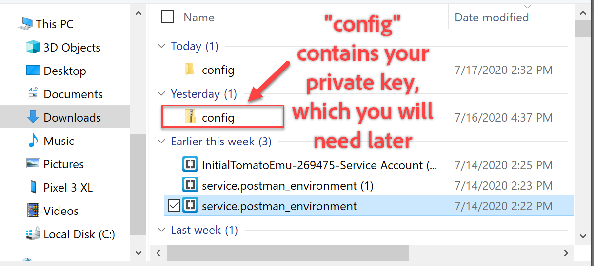
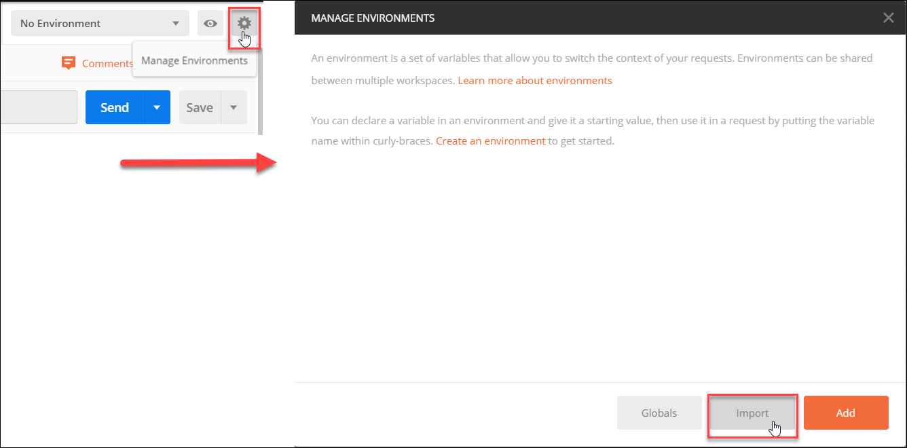
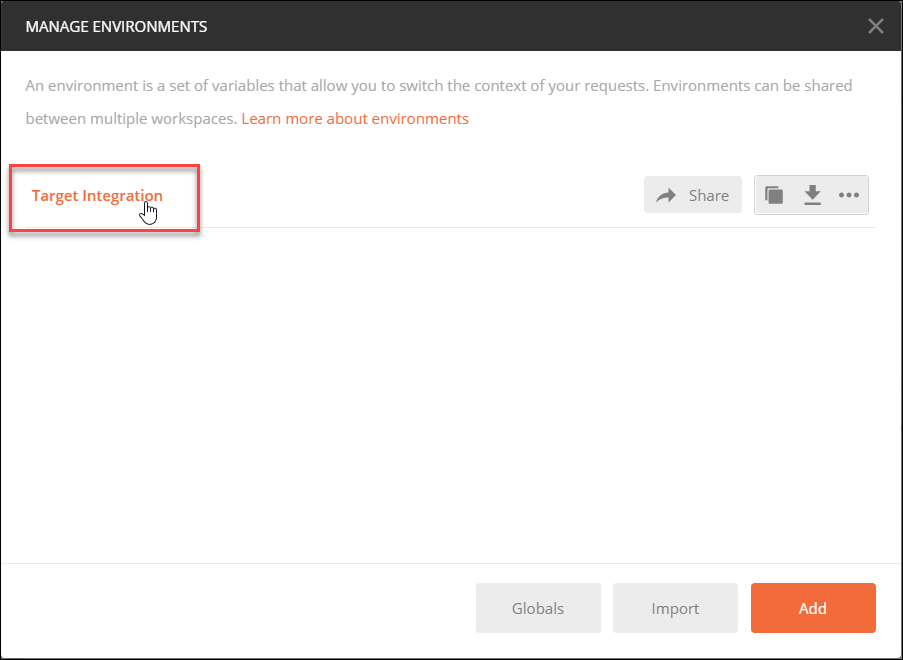
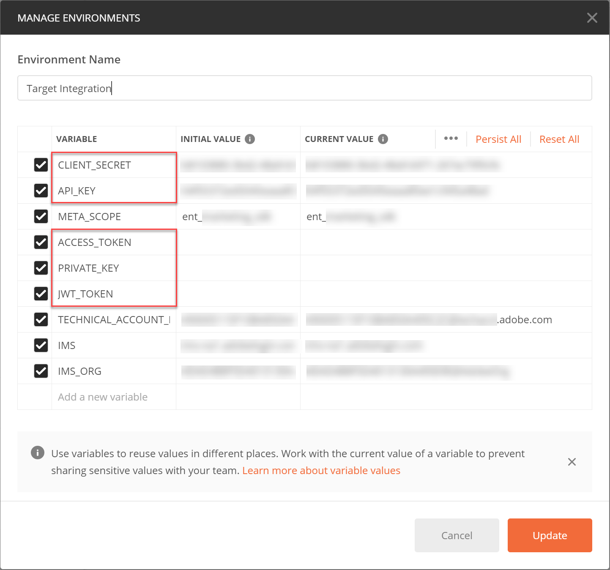
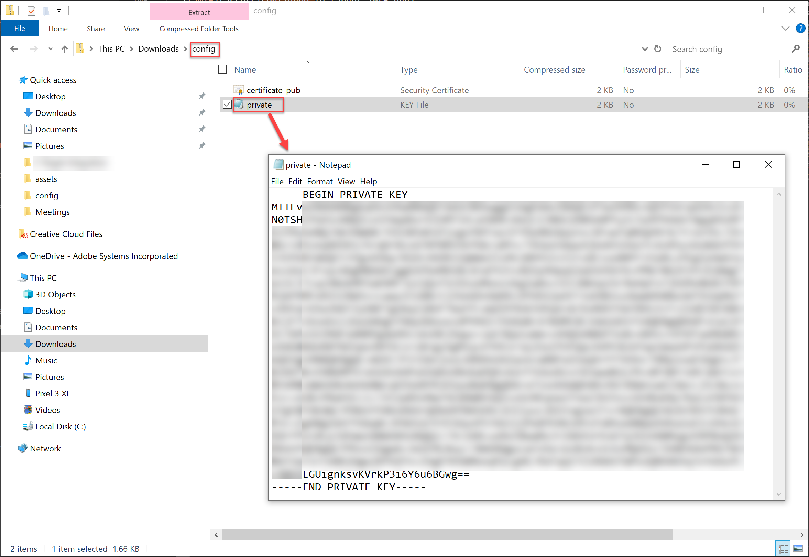
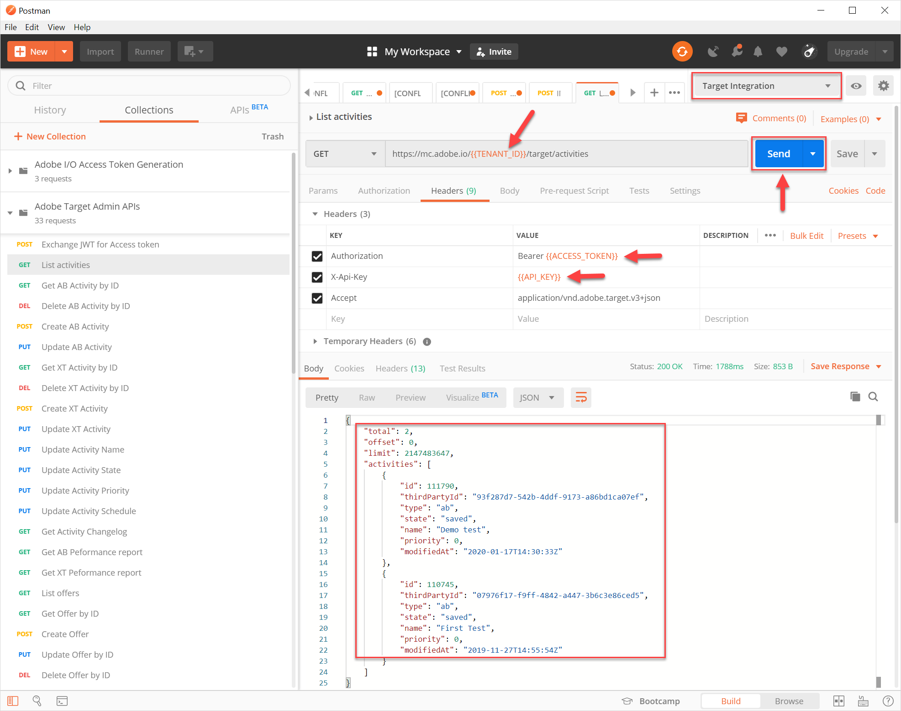

# Configuration de l’authentification pour les API Adobe Target

Les API d’administration Adobe Target, y compris les API [!DNL Recommendations] d’administration, sont sécurisées par l’authentification afin de garantir que seuls les utilisateurs autorisés les utilisent pour accéder à Adobe Target. Utilisez [Adobe Developer Console](https://console.adobe.io/) pour gérer cette authentification pour toutes les solutions Adobe Experience Cloud, y compris [!DNL Target].

Cette leçon décrit les étapes préliminaires nécessaires à la génération des jetons d’authentification nécessaires pour interagir avec les API Adobe Target. Dans les sections suivantes, vous allez :

1. Créez un projet (précédemment appelé intégration) dans la console de développement des Adobes.
2. Exportez les détails du projet vers Postman.
3. Générez un jeton d&#39;accès au porteur.
4. Testez le jeton d&#39;accès porteur.

## Conditions préalables

| Ressource | Détails |
| --- | --- |
| Postman | Pour réussir ces étapes, obtenez l&#39;application  Postman pour votre système d&#39;exploitation. Postman basique est gratuit avec la création de compte. Bien qu&#39;il ne soit pas nécessaire pour utiliser les API Adobe Target en général, Postman facilite les workflows d&#39;API et Adobe Target fournit plusieurs collections Postman pour aider à exécuter ses API et apprendre comment elles fonctionnent. Le reste de ce tutoriel suppose une connaissance pratique de Postman. Pour obtenir de l&#39;aide, veuillez consulter la documentation [de](https://learning.getpostman.com/)Postman. |
| Références | La connaissance des ressources suivantes est assurée tout au long du reste de ce didacticiel :<UL><li>[E/S Adobe Github](https://github.com/adobeio)</li><li>[Documentation sur les E/S cible Adobe](https://developers.adobetarget.com/api/#introduction)</li><li>[Documentation de l’API Recommendations](https://developers.adobetarget.com/api/recommendations/)</li></ul> |

## Créer un projet d&#39;E/S d&#39;Adobe

Dans cette section, vous accéderez à la console de développement des Adobes et créerez un projet pour [!DNL Adobe Target]. Pour plus d&#39;informations, consultez la [documentation sur les projets](https://www.adobe.io/apis/experienceplatform/console/docs.html#!AdobeDocs/adobeio-console/master/projects.md).

<!--1. Generate your private key and public certificate, per the [documentation on authentication](https://www.adobe.io/authentication/auth-methods.html#!AdobeDocs/adobeio-auth/master/JWT/JWTCertificate.md). //<!--as described in **Step 1** of [How to set up Adobe IO: Authentication - Step by Step](https://helpx.adobe.com/marketing-cloud-core/kb/adobe-io-authentication-step-by-step.html). After completing Step 1, return to this tutorial and resume with Step 2, below. // The outcome of this step should be the creation of a `private.key` file and a `certificate_pub.crt` file. Return to this tutorial once you have generated these two files.-->

1. Dans la [Adobe Admin Console](https://adminconsole.adobe.com/), assurez-vous que votre compte utilisateur d’Adobe a été autorisé à accéder aux niveaux Administrateur  de produit et [Développeur](https://helpx.adobe.com/enterprise/using/manage-developers.html) à [!DNL Target].

2. Dans la Console [développeur](https://console.adobe.io/)d&#39;Adobe, sélectionnez l&#39;organisation Experience Cloud pour laquelle vous souhaitez créer cette intégration. (Notez qu’il est probable que vous n’ayez accès qu’à une seule organisation Experience Cloud.)

   

3. Click **[!UICONTROL Create new project]**.

   

4. Cliquez sur **[!UICONTROL Ajouter l&#39;API]** pour ajouter une API REST à votre projet afin d&#39;accéder aux services et aux produits d&#39;Adobe.

   

5. Sélectionnez **[!DNL Adobe Target]** le service d’Adobe avec lequel vous souhaitez effectuer l’intégration. Cliquez sur le bouton **[!UICONTROL Suivant]** qui s’affiche.

   

6. Sélectionnez une option pour associer des clés publiques et privées à l’intégration du compte de service que vous créez pour la Cible. Pour ce didacticiel, sélectionnez **[!UICONTROL Option 1 : Générez une paire]** de clés et cliquez sur **[!UICONTROL Générer une paire de clés]**.
   

7. Notez les résultats ! Selon les instructions, notez le fichier de configuration (`config`) téléchargé automatiquement, qui contient votre clé privée. Cliquez sur **[!UICONTROL Suivant]**.
   
8. Dans votre système de fichiers, vérifiez l’emplacement de `config`, qui est le fichier de configuration compressé créé à l’étape précédente. Encore une fois, ce `config` fichier contient votre clé privée, dont vous aurez besoin ultérieurement. L&#39;emplacement exact dans votre système de fichiers peut différer de celui qui est illustré ici.
   
9. De retour dans la console de développement des Adobes, sélectionnez le ou les profils de [produits](https://helpx.adobe.com/enterprise/using/manage-products-and-profiles.html) correspondant aux propriétés dans lesquelles vous utilisez [!DNL Recommendations]. (Si vous n’utilisez pas de propriétés, sélectionnez l’option Espace de travail par défaut.) Cliquez sur **[!UICONTROL Enregistrer l’API]**configurée.
   

10. Cliquez sur **[!UICONTROL Créer une intégration]**. Vous devriez recevoir un message temporaire indiquant que votre API a été correctement configurée.

11. En guise de dernière étape, renommez votre projet en un nom plus significatif que l’original `Project 1`. Pour ce faire, accédez au projet à l&#39;aide du chemin de navigation tel qu&#39;il apparaît, cliquez sur **[!UICONTROL Modifier le projet]** pour accéder au module **[!UICONTROL Modifier le projet] , puis renommez le projet.

>[!NOTE]
> 
>Dans ce didacticiel, nous nommons notre projet &quot;Intégration de Cibles&quot;. Si vous prévoyez d’utiliser votre projet pour plus d’Adobe Target, vous pouvez lui attribuer un nom en conséquence. Par exemple, vous pouvez choisir de lui attribuer le nom &quot;API Adobe&quot; ou &quot;API Experience Cloud&quot;, car il peut être utilisé avec d’autres solutions dans Adobe Experience Cloud.

## Exporter les détails du projet

Maintenant que vous disposez d’un projet d’Adobe que vous pouvez utiliser pour accéder [!DNL Target]à, vous devez vous assurer d’envoyer les détails de ce projet avec vos demandes d’API d’Adobe. Ces détails sont requis pour interagir avec plusieurs API d’Adobe, y compris plusieurs [!DNL Target] API. Par exemple, les détails de l’intégration incluent les informations d’autorisation et d’authentification requises par les API [!DNL Target] d’administration. Par conséquent, pour utiliser les API avec Postman, vous devez envoyer ces détails à Postman.

Il y a plusieurs façons de préciser les détails de votre projet dans Postman, mais dans cette section, nous profitons de certaines fonctionnalités et collections préétablies. D&#39;abord (dans cette section), vous exporterez les détails de votre intégration dans un environnement Postman. Ensuite (dans la section suivante), vous allez générer un jeton d&#39;accès au porteur pour vous accorder l&#39;accès aux ressources d&#39;Adobe nécessaires.

>[!NOTE]
>
>Pour obtenir des instructions vidéo applicables à toute solution Experience Cloud, y compris [!DNL Target], voir [Utiliser Postman avec les API](https://docs.adobe.com/content/help/en/platform-learn/tutorials/apis/postman.html)Experience Platform. Les sections suivantes concernent les [!DNL Target] API :
>
> 1. Exporter les détails d&#39;intégration d&#39;E/S d&#39;Adobe vers Postman
> 2. Générer un Jeton d&#39;accès avec Postman

>
> 
Ces étapes sont également décrites ci-dessous.

1. Toujours dans la Console [développeur](https://console.adobe.io/)d’Adobe, accédez aux informations d’identification du compte de **[!UICONTROL service (JWT)]** de votre nouveau projet. Utilisez le volet de navigation de gauche ou la section **[!UICONTROL Informations d’identification]** comme indiqué.
   Dans les détails **[!UICONTROL des informations d’]** identification, notez que vous pouvez vue votre(s) **clé(s)** publique(s), votre ID **de**client et d’autres informations relatives à votre compte de service.
   
2. Cliquez sur pour accéder aux informations sur l’API **[!UICONTROL Adobe Target]** . Utilisez le volet de navigation de gauche ou la section Produits et services **** connectés, comme indiqué.
   
3. Cliquez sur **[!UICONTROL Télécharger pour Postman]** > Compte **[!UICONTROL de service (JWT)]** pour créer un fichier JSON qui capture vos informations d’authentification pour un environnement Postman.
   Notez le fichier JSON dans votre système de fichiers.
   
4. Dans Postman, cliquez sur l’icône représentant un engrenage pour gérer vos environnements, puis cliquez sur **Importer** pour importer le fichier JSON (environnement).
   
5. Choisissez votre fichier, puis cliquez sur **Ouvrir**.
   
6. Dans le mode **Gérer les Environnements** de Postman, cliquez sur le nom de l&#39;environnement nouvellement importé pour l&#39;inspecter. (Votre nom d&#39;environnement peut être différent de celui indiqué ici. Modifiez le nom selon vos besoins. Il n’est pas nécessaire de faire correspondre le nom du projet d’Adobe.)
   
7. Les valeurs des notes `CLIENT_SECRET` et `API_KEY` (ainsi que d’autres variables) sont prérenseignées, à partir de votre intégration, comme défini dans la console de développement des Adobes. (La `CLIENT_SECRET` variable Postman doit correspondre aux informations d’identification de l’ `CLIENT SECRET` Adobe affichées dans la Console développeur et `API_KEY` dans Postman doit également correspondre `CLIENT ID` dans la Console développeur.) En revanche, la remarque `PRIVATE_KEY`, `JWT_TOKEN`et `ACCESS_TOKEN` sont vides. Début en fournissant la `PRIVATE_KEY` valeur.
   

   >[!NOTE]
   >
   >**Surprise !**
   >
   >Quoique-nique ! Pouvez-vous vous souvenir où se trouve votre clé privée ?
   >C&#39;est exact, il se trouve dans le `config` fichier téléchargé plus tôt depuis la Console développeur de l&#39;Adobe !

8. A partir de votre système de fichiers, ouvrez votre `config` fichier et ouvrez le fichier de `private` clé.
   
9. Sélectionnez et copiez l&#39;intégralité du contenu du fichier de `private` clés.
   
10. Dans Postman, collez votre valeur de clé privée dans les champs VALEUR **** INITIALE et VALEUR **** ACTUELLE.
   
11. Cliquez sur **[!UICONTROL Mettre à jour]**, puis fermez le module Environnements.

## Générer le jeton d&#39;accès porteur

Dans cette section, vous générez votre jeton d&#39;accès au porteur, qui est nécessaire pour authentifier votre interaction avec les API Adobe Target. Pour générer votre jeton d&#39;accès au porteur, vous devez envoyer vos détails d&#39;intégration (établis dans les sections précédentes) à l&#39; [Adobe Identity Management Service (IMS)](https://www.adobe.io/authentication/auth-methods.html#!AdobeDocs/adobeio-auth/master/AuthenticationOverview/AuthenticationGuide.md). Il existe plusieurs façons de le faire, mais dans ce tutoriel, vous avez créé une demande de POST sur mesure à l&#39;API IMS. Je plaisante. Dans ce tutoriel, nous profitons d&#39;une collection Postman contenant un appel IMS préconstruit qui rend le processus direct et facile. Une fois la collection importée, vous pouvez la réutiliser au besoin, afin de générer de nouveaux jetons non seulement pour Adobe Target, mais également pour d’autres API d’Adobe.

1. Accédez aux exemples d’appels [de l’API](https://github.com/adobe/experience-platform-postman-samples/tree/master/apis/ims)Adobe Identity Management Service.
   
2. Cliquez sur l&#39; **Adobe E/S Jeton d&#39;accès Generation Postman collection**.
   
3. Obtenez le fichier JSON brut pour cette collection en cliquant sur **Brut**, puis en copiant le fichier JSON résultant dans le Presse-papiers. (Vous pouvez également enregistrer le fichier JSON brut dans un fichier .json.)
   
4. Dans Postman, importez la collection en collant et en envoyant le fichier JSON brut à partir du Presse-papiers. (Vous pouvez également télécharger le fichier .json que vous avez enregistré.) Cliquez sur **Continue** (Continuer).
   
5. Sélectionnez l&#39; **[!UICONTROL IMS : JWT Generate + Auth via User Token]** request dans la collection Postman de génération de Jetons d&#39;accès d&#39;E/S d&#39;Adobe, assurez-vous que votre environnement est sélectionné, puis cliquez sur **Envoyer** pour générer le jeton.

   

   >[!NOTE]
   >
   >Ce jeton d&#39;accès au porteur sera valable 24 heures. Envoyez de nouveau la demande chaque fois que vous devez générer un nouveau jeton.

6. Ouvrez à nouveau le module Gérer les Environnements, puis sélectionnez votre environnement.
   
7. Notez que les `ACCESS_TOKEN` valeurs et `JWT_TOKEN` sont maintenant renseignées.
   

>[!NOTE]
>
>Q : Dois-je utiliser la collection Postman de génération de Jetons d&#39;accès d&#39;E/S Adobe pour générer le JSON Web Token (JWT) et le jeton d&#39;accès porteur ?
>
>A : Non ! La collection Postman de la génération de Jetons d&#39;accès d&#39;E/S Adobe est disponible pour générer plus facilement le jeton d&#39;accès JWT et porteur dans Postman. Vous pouvez également utiliser les fonctionnalités de la console de développement Adobe pour générer manuellement le jeton d&#39;accès porteur.

## Testez le jeton d&#39;accès porteur

Dans cet exercice, vous utiliserez votre nouveau jeton d&#39;accès au porteur en envoyant une demande d’API qui récupère une liste d’activités de votre [!DNL Target] compte. Une réponse positive indique que votre projet d’Adobe et votre authentification fonctionnent comme prévu afin d’utiliser l’API.

1. Importez la collection [Postman des API](https://developers.adobetarget.com/api/#admin-postman-collection)Adobe Target Admin API. Suivez toutes les invites jusqu&#39;à ce que la collection soit importée dans Postman.
   
1. Développez la collection et notez la demande d’activités **** d’Liste.
   
1. Notez que les variables telles que `{{access_token}}` sont initialement non résolues. Vous pouvez résoudre ce problème de plusieurs manières différentes (par exemple, vous pouvez définir une nouvelle variable de collecte appelée `{{access_token}}`), mais dans ce didacticiel, vous allez plutôt modifier la demande d&#39;API pour tirer parti de l&#39;environnement Postman que vous utilisiez précédemment. Cela permettra à l’environnement de continuer à servir de consolidation unique et cohérente de toutes les variables communes aux API d’Adobe.
   
1. Tapez à remplacer `{{access_token}}` par `{{ACCESS_TOKEN}}`.
   
1. Tapez à remplacer `{{api_key}}` par `{{API_KEY}}`.
   
1. Tapez à remplacer `{{tenant}}` par `{{TENANT_ID}}`. La note `{{TENANT_ID}}` n&#39;est pas encore reconnue.
   
1. Ouvrez le module Gérer les Environnements, puis sélectionnez votre environnement.
   
1. Tapez pour ajouter une nouvelle variable `{{TENANT_ID}}` d&#39;environnement. Copiez et collez la valeur de votre ID de client dans les champs VALEUR **** INITIALE et VALEUR **** ACTUELLE pour votre nouvelle variable d’ `TENANT_ID` environnement.

   

   >[!NOTE]
   >
   >L&#39;ID du locataire est différent de votre [!DNL Target]`clientcode`. L&#39;ID de client existe dans l&#39;URL lorsque vous êtes connecté à [!DNL Target]. Pour obtenir votre ID de locataire, connectez-vous au [!DNL Adobe Experience Cloud], ouvrez [!DNL Target], puis cliquez sur la [!DNL Target] carte. Utilisez la valeur ID du client comme indiqué dans le sous-domaine URL.
   >
   >Par exemple, si votre URL lors de la connexion à Adobe Target est
   >
   >`<https://mycompany.experiencecloud.adobe.com/...>`
   >
   >votre ID de client est alors &quot;mycompany&quot;.

1. Envoyez votre demande, après avoir sélectionné l’environnement approprié. Vous devriez recevoir une réponse contenant votre liste d&#39;activités.
   

Félicitations ! Maintenant que vous avez vérifié votre authentification d&#39;Adobe, vous pouvez l&#39;utiliser pour interagir avec les API Adobe Target (ainsi qu&#39;avec d&#39;autres API d&#39;Adobe). Par exemple, vous pouvez [utiliser les API](https://docs.adobe.com/content/help/en/target-learn/recommendations-api-tutorial/recs-api-overview.html) Recommendations pour créer ou gérer des recommandations.
