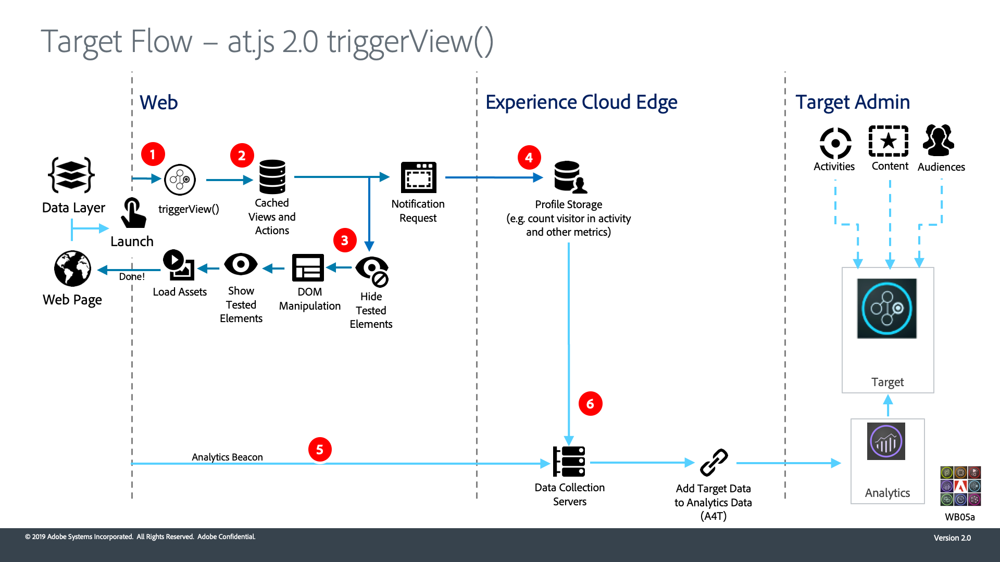

# Fonctionnement d’Adobe Target at.js 2.0

`at.js` La version 2.0 améliore la prise en charge d’Adobe Target pour les applications d’une seule page (SPA) et s’intègre à d’autres solutions Experience Cloud. Cette vidéo et les diagrammes qui l&#39;accompagnent expliquent comment tout s&#39;assemble.

>[!VIDEO](https://video.tv.adobe.com/v/26250?quality=12)

## Diagrammes d’architecture

1. L’appel renvoie un ID d’Experience Cloud (ECID). Si l’utilisateur est authentifié, un autre appel synchronise l’ID de client.

1. `at.js` La bibliothèque se charge de manière synchrone et masque le corps du document (`at.js` peut également être chargé de manière asynchrone avec un fragment de code de masquage préalable (facultatif implémenté sur la page).

1. La requête de chargement de page est effectuée, y compris tous les paramètres configurés, ECID, SDID et ID de client.

1. Les scripts de profil s’exécutent et sont introduits dans la variable [!UICONTROL Boutique de profils]. Le magasin demande des audiences qualifiées auprès du [!UICONTROL Bibliothèque d’audiences] (par exemple, les audiences partagées depuis [!DNL Analytics], Audience Manager, etc.). [!UICONTROL Attributs du client] sont envoyées à [!UICONTROL Boutique de profils] dans un traitement par lot.
1. En fonction de l’URL, des paramètres de requête et des données de profil, [!DNL Target] décide quelles activités et expériences renvoyer au visiteur pour la page active et les futures vues.

1. Contenu ciblé renvoyé à la page, comprenant éventuellement des valeurs de profil pour une personnalisation supplémentaire.

   Le contenu ciblé sur la page actuelle est affiché aussi rapidement que possible, sans scintillement du contenu par défaut.

   Le contenu ciblé pour les futures vues d’une application d’une seule page est mis en cache dans le navigateur. Il peut donc être appliqué instantanément sans appel au serveur supplémentaire lorsque les vues sont déclenchées. (Voir le diagramme suivant pour `triggerView()` comportement).

1. [!DNL Analytics] données envoyées de la page à la variable [!UICONTROL Collecte de données] Serveurs
1. [!DNL Target]Les données sont associées aux données par l’intermédiaire du SDID et sont traitées dans le magasin de rapports Analytics. [!DNL Analytics] [!DNL Analytics] Les données peuvent ensuite être visualisées dans les deux [!DNL Analytics] et [!DNL Target] via les rapports A4T.

1. `adobe.target.triggerView()` est appelé dans l’application d’une seule page
1. Le contenu ciblé pour la vue est lu à partir du cache

1. Le contenu ciblé s’affiche aussi rapidement que possible, sans scintillement du contenu par défaut

1. La demande de notification est envoyée au magasin de profils [!DNL Target] pour compter le visiteur dans l’activité et incrémenter les mesures
1. [!DNL Analytics] Les données sont envoyées du SPA à la variable [!UICONTROL Collecte de données] Serveurs

1. [!DNL Target] Les données sont envoyées à partir de la variable [!DNL Target] du serveur principal [!UICONTROL Collecte de données] Serveurs. Les données [!DNL Target] sont associées aux données [!DNL Analytics] par l’intermédiaire du SDID et sont traitées dans le magasin de rapports [!DNL Analytics]. [!DNL Analytics] Les données peuvent ensuite être visualisées dans les deux [!DNL Analytics] et [!DNL Target] via les rapports A4T.

## Ressources supplémentaires

* [Implémentation d’at.js 2.0 dans une application d’une seule page](implement-atjs-20-in-a-single-page-application.md)
* [Utilisation du compositeur d’expérience visuelle Adobe Target pour les applications d’une seule page (SPA VEC)](../experiences/use-the-visual-experience-composer-for-single-page-applications.md)
