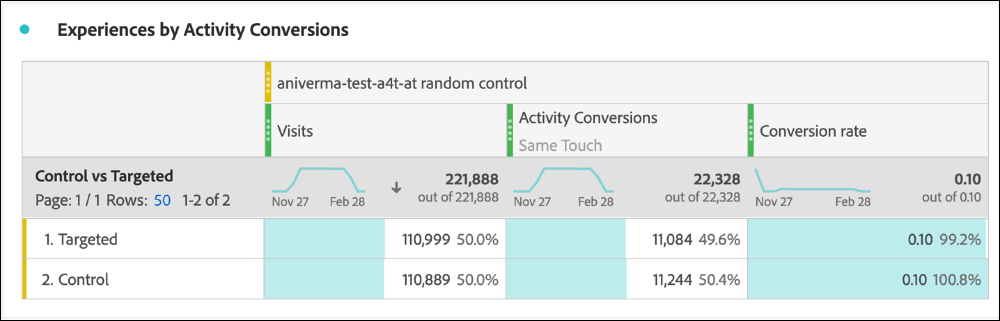

# Configuration de rapports A4T en Analysis Workspace pour [!DNL Auto-Target] activités

L’intégration d’Analytics pour la Cible (A4T) pour les activités [!DNL Auto-Target] utilise les algorithmes d’apprentissage automatique d’ensemble (ML) de Adobe Target pour choisir la meilleure expérience pour chaque visiteur en fonction de son profil, de son comportement et de son contexte, tout en utilisant une mesure d’objectif Adobe Analytics.

Bien que des capacités d’analyse enrichie soient disponibles dans Adobe Analytics Analysis Workspace, quelques modifications du panneau par défaut **[!UICONTROL Analytics pour Cible]** sont nécessaires pour interpréter correctement [!DNL Auto-Target] les activités, en raison de différences entre les activités d’expérimentation (A/B manuel et affectation automatique) et les activités de personnalisation ([!DNL Auto-Target]).

Ce didacticiel présente les modifications recommandées pour l’analyse des activités [!DNL Auto-Target] dans Workspace, qui reposent sur les concepts clés suivants :

* La dimension **[!UICONTROL Contrôle vs. Ciblé]** peut être utilisée pour distinguer entre les expériences de contrôle et celles fournies par l’algorithme ML d’ensemble [!DNL Auto-Target].
* Les visites doivent être utilisées comme mesure de normalisation lors de l’affichage des ventilations de performances au niveau de l’expérience. En outre, la méthodologie de comptabilisation par défaut de [Adobe Analytics peut inclure des visites pour lesquelles l’utilisateur ne voit pas réellement le contenu des activités](https://experienceleague.adobe.com/docs/target/using/integrate/a4t/a4t-faq/a4t-faq-viewing-reports.html?lang=en#metrics), mais ce comportement par défaut peut être modifié à l’aide d’un segment de portée appropriée (détails ci-dessous).
* L’attribution par portée de visite (également appelée &quot;fenêtre de recherche en amont des visites&quot; sur le modèle d’attribution prescrit) est utilisée par les modèles ML d’Adobe Target au cours de leurs phases de formation et le même modèle d’attribution (non par défaut) doit être utilisé lors de la ventilation de la mesure d’objectif.

## Création du panneau A4T pour [!DNL Auto-Target] dans Workspace

Pour créer un rapport A4T pour [!DNL Auto-Target], début avec le panneau **[!UICONTROL Analyses pour la Cible]** dans Workspace, comme illustré ci-dessous, ou commencer par un tableau à structure libre. Ensuite, effectuez les sélections suivantes :

1. **[!UICONTROL Expérience]** de contrôle : Vous pouvez choisir n’importe quelle expérience ; toutefois, vous remplacerez ce choix plus tard. Notez que pour les activités [!DNL Auto-Target], l&#39;expérience de contrôle est en fait une stratégie de contrôle, qui est soit : a) servir de façon aléatoire parmi toutes les expériences, soit b) diffuser une seule expérience (ce choix est fait au moment de la création de l&#39;activité dans Adobe Target). Même si vous optez pour le choix b), votre activité [!DNL Auto-Target] a désigné une expérience spécifique comme le contrôle, vous devez tout de même suivre l&#39;approche décrite dans ce didacticiel pour analyser A4T pour les activités [!DNL Auto-Target].
2. **[!UICONTROL Mesure]** de normalisation : Sélectionnez Visites.
3. **[!UICONTROL Mesures]** de réussite : Bien que vous puissiez sélectionner une ou plusieurs mesures sur lesquelles générer un rapport, vous devez généralement vue des rapports sur la même mesure qui a été choisie pour l’optimisation lors de la création d’activités dans Adobe Target.

*pngFigure 1 : Configuration du panneau Analyses pour la Cible pour les  [!DNL Auto-Target] activités.*

>[!NOTE]
>
>Pour configurer le panneau Analytics pour la Cible pour les activités à Cible automatique, choisissez une expérience de contrôle, choisissez Visites comme mesure de normalisation et choisissez la mesure d’objectif choisie pour l’optimisation lors de la création d’activités de Cible.

## Utilisez la dimension Control vs. Targeted pour comparer le modèle ML d’ensemble d’Adobe Target à votre contrôle.

Le panneau A4T par défaut est conçu pour les tests A/B classiques (manuels) ou les activités d’affectation automatique dans le but de comparer les performances des expériences individuelles à l’expérience de contrôle. Dans les activités [!DNL Auto-Target], cependant, la première comparaison doit être entre la stratégie de contrôle *stratégie* et la stratégie *ciblée* (en d&#39;autres termes, déterminer l&#39;effet élévateur des performances globales du modèle [!DNL Auto-Target] ensemble ML sur la stratégie de contrôle).

Pour effectuer cette comparaison, utilisez la dimension **[!UICONTROL Contrôle/Ciblé (Analytics pour la Cible)]**. Faites glisser et déposez pour remplacer la dimension **[!UICONTROL Expériences de Cible]** dans le rapport A4T par défaut.

Notez que ce remplacement invalide les calculs Effet élévateur et Degré de confiance par défaut sur le panneau A4T. Pour éviter toute confusion, vous pouvez supprimer ces mesures du panneau par défaut, en laissant le rapport suivant :

*pngFigure 2 : Rapport de référence recommandé pour les  [!DNL Auto-Target] activités. Ce rapport a été configuré pour comparer le trafic ciblé (fourni par le modèle ML d&#39;ensemble) à votre trafic de contrôle.*

>[!NOTE]
>
>Actuellement, les numéros Effet élévateur et Degré de confiance ne sont pas disponibles pour les dimensions Contrôle par rapport aux dimensions Ciblé pour les rapports A4T pour la Cible automatique. Tant que la prise en charge n&#39;est pas ajoutée, l&#39;effet élévateur et le degré de confiance peuvent être calculés manuellement en téléchargeant le [calculateur de fiabilité](https://experienceleague.adobe.com/docs/target/assets/complete_confidence_calculator.xlsx?lang=en).

## Ajouter des ventilations de mesures au niveau de l’expérience

Pour en savoir plus sur les performances du modèle ML d’ensemble, vous pouvez examiner les ventilations au niveau de l’expérience de la dimension **[!UICONTROL Contrôle par rapport à Ciblé]**. Dans Workspace, faites glisser la dimension **[!UICONTROL Expériences de Cible]** sur votre rapport, puis ventilez séparément chacune des dimensions de contrôle et de ciblage.

*pngFigure 3 : Ventilation de la dimension ciblée par expérience de Cible*

Vous trouverez ici un exemple du rapport résultant.

*pngFigure 4 : Un  [!DNL Auto-Target] rapport standard avec des ventilations au niveau de l’expérience. Notez que votre mesure d&#39;objectif peut être différente et que votre stratégie de contrôle peut avoir une seule expérience.*

>[!TIP]
>
>Dans Workspace, cliquez sur l’icône d’engrenage pour masquer les pourcentages dans la colonne Taux de conversion, afin de vous concentrer sur les taux de conversion d’expérience. Notez que les taux de conversion seront ensuite formatés en décimales, mais interprétez-les comme des pourcentages en conséquence.

## Pourquoi &quot;Visites&quot; est la mesure de normalisation correcte pour les activités [!DNL Auto-Target]

Lors de l’analyse d’une activité [!DNL Auto-Target], choisissez toujours Visites comme mesure de normalisation par défaut. [!DNL Auto-Target] la personnalisation sélectionne une expérience pour un visiteur une fois par visite (officiellement, une fois par session Adobe Target), ce qui signifie que l’expérience présentée à un utilisateur peut changer à chaque visite. Par conséquent, si vous utilisez des Visiteurs uniques comme mesure de normalisation, le fait qu’un utilisateur unique puisse voir plusieurs expériences (au cours de différentes visites) peut entraîner des taux de conversion déroutants.

Voici un exemple simple : envisagez un scénario dans lequel deux visiteurs entrent dans une campagne qui ne comporte que deux expériences. Le premier visiteur visite deux fois. Ils sont affectés à l’expérience A au cours de la première visite, mais à l’expérience B au cours de la seconde visite (en raison du changement de leur état de profil au cours de cette deuxième visite). Après la deuxième visite, le visiteur effectue une conversion en passant une commande. La conversion est attribuée à l’expérience la plus récemment affichée (Expérience B). Le deuxième visiteur effectue également deux visites et affiche l’expérience B à chaque fois, mais ne effectue jamais de conversion.

Comparons les rapports au niveau des visiteurs et des visites :

| Expérience | Visiteurs uniques | Visites | Conversions | norme visiteuse. Conv. clics publicitaires | Norme de visite. Conv. clics publicitaires |
| --- | --- | --- | --- | --- | --- |
| Une | 1 | 3 | - | 0% | 0 % |
| B | 2 | 3 | 3 | 50 % | 33,3 % |
| Totaux | 2 | 4 | 1 | 50 % | 25 % |
*Tableau 1 : Exemple de comparaison de rapports normalisés par visiteur et de rapports normalisés par visite pour un scénario dans lequel les décisions sont collantes à une visite (et non à un visiteur, comme dans le cas de tests A/B réguliers). Les mesures normalisées par visiteur sont déroutantes dans ce scénario.*

Comme le montre le tableau ci-dessous, il existe une incongruité évidente de chiffres de niveau visiteur. Bien qu&#39;il y ait deux visiteurs uniques au total, il ne s&#39;agit pas d&#39;une somme de visiteurs uniques individuels pour chaque expérience. Bien que le taux de conversion au niveau du visiteur ne soit pas nécessairement erroné, lorsqu&#39;on compare des expériences individuelles, les taux de conversion au niveau des visites ont sans doute beaucoup plus de sens. Officiellement, l’unité d’analyse (&quot;visites&quot;) est la même que l’unité d’adhérence de la décision, ce qui signifie que les ventilations au niveau de l’expérience des mesures peuvent être ajoutées et comparées.

## Filtrer les visites réelles à l’activité

La méthodologie de comptabilisation par défaut d’Adobe Analytics pour les visites dans une activité de Cible peut inclure les visites pour lesquelles l’utilisateur n’a pas interagi avec l’activité de Cible. Cela est dû à la manière dont les affectations d’activité de Cible sont conservées dans le contexte du visiteur Analytics. En conséquence, le nombre de visites à l&#39;activité de Cible peut parfois être gonflé, ce qui entraîne une dépression des taux de conversion.

Si vous préférez créer un rapport sur les visites au cours desquelles l’utilisateur a réellement interagi avec l’activité de Cible automatique (soit par l’entrée dans l’activité, soit par un événement d’affichage/de visite, soit par une conversion), vous pouvez :

1. Créez un segment spécifique qui comprend les accès à partir de l’activité de Cible en question, puis
1. Filtrez la mesure Visites à l’aide de ce segment.

**Pour créer le segment :**

1. Sélectionnez l’option **[!UICONTROL Composants > Créer un segment]** dans la barre d’outils Espace de travail.
2. Entrez un **[!UICONTROL titre]** pour votre segment. Dans l’exemple ci-dessous, le segment est nommé [!DNL "Hit with specific Auto-Target activity"].
3. Faites glisser la dimension **[!UICONTROL Activités d&#39;Cible]** vers la section de segment **[!UICONTROL Définition]**.
4. Utilisez l&#39;opérateur **[!UICONTROL égal]**.
5. Recherchez votre activité de Cible spécifique.
6. Sélectionnez l’icône d’engrenage, puis **[!UICONTROL Modèle d’attribution > Instance]** comme illustré dans la figure ci-dessous.
7. Cliquez sur **[!UICONTROL Enregistrer]**.

*pngFigure 5 : Utilisez un segment tel que celui présenté ici pour filtrer la mesure Visites dans votre  [!DNL Auto-Target] rapport A4T pour*

Une fois le segment créé, utilisez-le pour filtrer la mesure Visites, de sorte que la mesure Visites ne comprend que les visites pour lesquelles l’utilisateur a interagi avec l’activité de Cible.

**Pour filtrer les visites à l’aide de ce segment :**

1. Faites glisser le segment nouvellement créé à partir de la barre d’outils des composants, puis passez la souris sur la base de l’étiquette de mesure **[!UICONTROL Visites]** jusqu’à ce qu’une invite bleue **[!UICONTROL Filtrer par]** apparaisse.
2. Libérez le segment. Le filtre sera appliqué à cette mesure.

Le panneau final s&#39;affiche comme suit.

*pngFigure 6 : Panneau rapports avec le segment &quot;Accès avec une Activité d’Cible automatique spécifique&quot; appliqué à la mesure   Visites. Ainsi, seules les visites où un utilisateur a réellement interagi avec l&#39;activité de Cible en question sont incluses dans le rapport.*

## Aligner l’attribution entre la formation au modèle ML et la génération de mesures d’objectif

L’intégration A4T permet au modèle ML de [!DNL Auto-Target] d’être *formé* en utilisant les mêmes données de événement de conversion que celles utilisées par Adobe Analytics pour *générer des rapports de performances*. Cependant, certaines hypothèses doivent être utilisées pour interpréter ces données lors de la formation des modèles ML, qui diffèrent des hypothèses par défaut faites pendant la phase de rapports en Adobe Analytics.

En particulier, les modèles ML d’Adobe Target utilisent un modèle d’attribution à portée de visite. En d’autres termes, ils supposent qu’une conversion doit se produire au cours de la même visite qu’un affichage du contenu pour l’activité, afin que la conversion soit &quot;attribuée&quot; à la décision prise par le modèle ML. Cela est nécessaire pour que la Cible garantisse la formation en temps voulu de ses modèles ; La cible ne peut pas attendre jusqu’à 30 jours pour une conversion (la fenêtre d’attribution par défaut pour les rapports dans Adobe Analytics), avant de l’inclure dans les données de formation de ses modèles.

Ainsi, la différence entre l’attribution utilisée par les modèles de Cible (pendant la formation) et l’attribution par défaut utilisée dans l’interrogation des données (pendant la génération du rapport) peut entraîner des incohérences. Il peut même sembler que les modèles ML sont peu performants, alors qu&#39;en fait le problème réside dans l&#39;attribution.

>[!TIP]
>
>Si les modèles ML sont optimisés pour une mesure qui est attribuée différemment des mesures que vous affichez dans un rapport, il se peut que les modèles ne fonctionnent pas comme prévu ! Pour éviter cela, veillez à ce que les mesures d’objectif de votre rapport utilisent la même attribution que celle utilisée par les modèles ML de Cible.

Pour vue les mesures d’objectif qui ont la même méthodologie d’attribution utilisée par les modèles XML Adobe Target, procédez comme suit :

1. Passez la souris sur l’icône d’engrenage de la mesure d’objectif :
   
1. Dans le menu qui s&#39;affiche, faites défiler l&#39;écran jusqu&#39;à **[!UICONTROL Paramètres des données]**.
1. Sélectionnez **[!UICONTROL Utiliser un modèle d’attribution autre que par défaut]** (si ce n’est pas déjà fait) :
   
1. Cliquez sur **[!UICONTROL Modifier]**.
1. Sélectionnez **[!UICONTROL Modèle]** : **[!UICONTROL Participation]** et **[!UICONTROL fenêtre de recherche]** : **[!UICONTROL Visite]**.
   
1. Cliquez sur **[!UICONTROL Appliquer]**.

Ces étapes garantissent que votre rapport attribuera la mesure d’objectif à l’affichage de l’expérience, si le événement de mesure d’objectif s’est produit *à tout moment* (&quot;participation&quot;) au cours de la même visite qu’une expérience.

## Étape finale : Créer un taux de conversion qui capture la magie ci-dessus

Avec les modifications apportées aux mesures de visites et d’objectif dans les sections précédentes, la dernière modification que vous devez apporter à votre panneau de rapports A4T par défaut pour [!DNL Auto-Target] consiste à créer des taux de conversion présentant le bon rapport (celui d’une mesure d’objectif avec la bonne attribution) à une mesure &quot;Visites&quot; correctement filtrée.

Pour ce faire, créez une mesure calculée en procédant comme suit :

1. Sélectionnez l’option **[!UICONTROL Composants > Créer une mesure]** dans la barre d’outils Espace de travail.
1. Entrez un **[!UICONTROL titre]** pour votre mesure. Par exemple, &quot;Taux de conversion corrigé des visites pour l’Activité XXX&quot;.
1. Sélectionnez **[!UICONTROL Format]** = Pourcentage et **[!UICONTROL Nombre de décimales]** = 2.
1. Faites glisser la mesure d’objectif appropriée pour votre activité (par exemple, Conversions d’Activité) dans la définition et utilisez l’icône d’engrenage sur cette mesure d’objectif pour ajuster le modèle d’attribution à (Participation|Visite), comme décrit précédemment.
1. Sélectionnez **[!UICONTROL Ajouter > Conteneur]** dans le coin supérieur droit de la section **[!UICONTROL Définition]**.
1. Sélectionnez l’opérateur de division ( ) entre les deux conteneurs.
1. Faites glisser le segment précédemment créé (nommé &quot;Accès avec une [!DNL Auto-Target] activité spécifique&quot; dans ce didacticiel) pour cette activité [!DNL Auto-Target] spécifique.
1. Faites glisser la mesure **[!UICONTROL Visites]** dans le conteneur de segments.
1. Cliquez sur **[!UICONTROL Enregistrer]**.

La définition de mesure calculée complète est présentée ici.

*pngFigure 7 : Définition de la mesure de taux de conversion de modèle corrigée pour les visites et les attributions. (Notez que cette mesure dépend de votre mesure d’objectif et de votre activité. En d’autres termes, cette définition de mesure n’est pas réutilisable entre les activités.)*

>[!IMPORTANT]
>
>La mesure de Taux de conversion du panneau A4T n’est pas liée au événement de conversion ou à la mesure de normalisation du tableau. Lorsque vous apportez les modifications suggérées dans ce didacticiel, le Taux de conversion ne s’adapte pas automatiquement aux modifications. Par conséquent, si vous apportez la modification à l’une (ou aux deux) attribution du événement de conversion et à la mesure de normalisation, vous devez vous souvenir d’une étape finale pour modifier également le Taux de conversion, comme indiqué ci-dessus.

## Résumé : Exemple final de panneau Espace de travail pour les rapports [!DNL Auto-Target]

En combinant toutes les étapes ci-dessus en un seul panneau, la figure ci-dessous présente une vue complète du rapport recommandé pour les activités [!DNL Auto-Target] A4T. Ce rapport est identique à celui utilisé par les modèles d’apprentissage automatique des Cibles pour optimiser la mesure de vos objectifs. Il incorpore toutes les nuances et recommandations abordées dans ce didacticiel. Ce rapport est également le plus proche des méthodes de comptage utilisées dans les activités traditionnelles fondées sur le rapports de Cible [!DNL Auto-Target].

*pngFigure 8 : Le dernier  [!DNL Auto-Target] rapport A4T dans Adobe Analytics Workspace, qui combine tous les ajustements aux définitions de mesure décrits dans les sections précédentes de ce document.*
