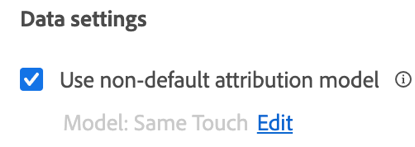
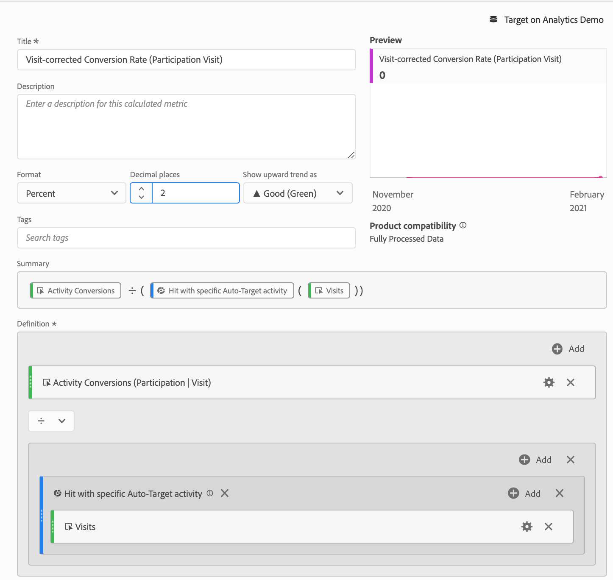

# Configurer des rapports A4T dans [!DNL Analysis Workspace] pour les activités [!DNL Auto-Target]

>[!IMPORTANT]
>
>Pour les activités de [!UICONTROL ciblage automatique], vous devez vérifier les rapports dans [!DNL Analytics Workspace] et créer manuellement un panneau A4T.

L’intégration [!UICONTROL Analytics for Target] (A4T) pour les activités [!DNL Auto-Target] utilise les algorithmes de machine learning (ML) d’[!DNL Adobe Target] ensemble pour choisir la meilleure expérience pour chaque visiteur en fonction de son profil, de son comportement et de son contexte, tout en utilisant une mesure d’objectif [!DNL Adobe Analytics].

Bien que des fonctionnalités d’analyse riches soient disponibles dans [!DNL Adobe Analytics] [!DNL Analysis Workspace], quelques modifications sont nécessaires dans le panneau par défaut **[!UICONTROL Analytics for Target]** pour interpréter correctement les activités de [!DNL Auto-Target], en raison des différences entre les activités d’expérimentation (test A/B manuel et [!UICONTROL affectation automatique]) et les activités de personnalisation ( ciblage automatique).

Ce tutoriel décrit les modifications recommandées pour l’analyse des activités de [!UICONTROL ciblage automatique] dans [!DNL Analysis Workspace], qui reposent sur les concepts clés suivants :

* La dimension **[!UICONTROL Contrôle par rapport à ciblé]** peut être utilisée pour faire la distinction entre les expériences [!UICONTROL Contrôle] et celles servies par l’algorithme de ML d’ensemble [!UICONTROL Ciblage automatique].
* Les visites doivent être utilisées comme mesure de normalisation lors de l’affichage des répartitions de performances au niveau de l’expérience. En outre, la méthodologie de comptage par défaut d’[Adobe Analytics peut inclure des visites où l’utilisateur ne voit pas réellement le contenu de l’activité](https://experienceleague.adobe.com/docs/target/using/integrate/a4t/a4t-faq/a4t-faq-viewing-reports.html#metrics){target=_blank} mais ce comportement par défaut peut être modifié en utilisant un segment de portée appropriée (détails ci-dessous).
* L’attribution étendue de la recherche en amont des visites, également appelée « fenêtre de recherche en amont des visites » sur le modèle d’attribution prescrit, est utilisée par les modèles ML [!DNL Adobe Target] pendant leurs phases d’entraînement. Le même modèle d’attribution (autre que celui par défaut) doit être utilisé lors de la répartition de la mesure d’objectif.

## Créez le panneau A4T pour [!UICONTROL ciblage automatique] dans [!DNL Analysis Workspace]

Pour créer un rapport A4T pour [!UICONTROL ciblage automatique], commencez par le panneau **[!UICONTROL Analytics for Target]** dans [!DNL Analysis Workspace], comme illustré ci-dessous, ou commencez par un tableau à structure libre. Effectuez ensuite les sélections suivantes :

1. **[!UICONTROL Expérience de contrôle]** : vous pouvez choisir n’importe quelle expérience ; toutefois, vous remplacerez ce choix ultérieurement. Notez que pour les activités de [!UICONTROL ciblage automatique], l’expérience de contrôle est en fait une stratégie de contrôle, qui consiste soit à a) proposer une expérience de manière aléatoire parmi toutes les expériences, soit b) proposer une expérience unique (ce choix est fait au moment de la création de l’activité dans [!DNL Adobe Target]). Même si vous avez opté pour le choix (b), votre activité de [!UICONTROL ciblage automatique] a désigné une expérience spécifique comme contrôle. Vous devez toujours suivre l’approche décrite dans ce tutoriel pour analyser A4T pour les activités de [!UICONTROL ciblage automatique].
2. **[!UICONTROL Mesure de normalisation]** : sélectionnez [!UICONTROL Visites].
3. **[!UICONTROL Mesures de succès]** : bien que vous puissiez sélectionner n’importe quelle mesure pour laquelle créer des rapports, vous devez généralement afficher les rapports sur la même mesure que celle choisie pour l’optimisation lors de la création de l’activité dans [!DNL Target].

   ![[!UICONTROL Analytics for Target] configuration de panneau pour les activités de [!UICONTROL ciblage automatique].](assets/Figure1.png)

   *Figure 1 : [!UICONTROL Analytics for Target] configuration de panneau pour les activités de [!UICONTROL ciblage automatique].*

>[!TIP]
>
>Pour configurer votre panneau [!UICONTROL Analytics for Target] pour les activités de [!UICONTROL ciblage automatique], choisissez n’importe quelle expérience de contrôle, choisissez [!UICONTROL Visites] comme mesure de normalisation et choisissez la même mesure d’objectif qui a été choisie pour l’optimisation lors de la création de l’activité de [!DNL Target].

## Utilisez la comparaison [!UICONTROL Contrôle ouDimension ciblée] pour comparer le modèle ML d’ensemble [!DNL Target] à votre contrôle

Le panneau A4T par défaut est conçu pour les activités classiques (manuelles) [!UICONTROL Test A/B] ou [!UICONTROL Affectation automatique] où l’objectif est de comparer les performances des expériences individuelles à l’expérience de contrôle. Toutefois, dans les activités de [!UICONTROL ciblage automatique], la comparaison de premier ordre doit porter sur le contrôle *stratégie* et la *stratégie* ciblée. En d’autres termes, la détermination de l’effet élévateur de la performance globale du modèle de ML d’ensemble de [!UICONTROL ciblage automatique] sur la stratégie de contrôle.

Pour effectuer cette comparaison, utilisez la dimension **[!UICONTROL Contrôle ou ciblé (Analytics for Target)]**. Effectuez un glisser-déposer pour remplacer la dimension **[!UICONTROL Expériences Target]** dans le rapport A4T par défaut.

Notez que ce remplacement invalide les calculs par défaut [!UICONTROL Effet élévateur et Degré de confiance] dans le panneau A4T. Pour éviter toute confusion, vous pouvez supprimer ces mesures du panneau par défaut et conserver le rapport suivant :

Panneau ![[!UICONTROL Expériences par conversion d’activité] dans [!DNL Analysis Workspace]](assets/Figure2.png)

*Figure 2 : rapport de référence recommandé pour les activités [!DNL Auto-Target]. Ce rapport a été configuré pour comparer le trafic ciblé (fourni par le modèle ML d’ensemble) à votre trafic de contrôle.*

>[!NOTE]
>
>Actuellement, les nombres [!UICONTROL Effet élévateur et Degré de confiance] ne sont pas disponibles pour les dimensions [!UICONTROL Contrôle ou ciblé] des rapports A4T pour [!UICONTROL Ciblage automatique]. Jusqu’à ce que la prise en charge soit ajoutée, l’effet élévateur et le degré de confiance [!UICONTROL Lift and Confidence] peuvent être calculés manuellement en téléchargeant le [calculateur de confiance](https://experienceleague.adobe.com/docs/target/assets/complete_confidence_calculator.xlsx).

## Ajout de répartitions de mesures au niveau de l’expérience

Pour mieux comprendre les performances d’insight, vous pouvez examiner les répartitions au niveau de l’expérience de la dimension **[!UICONTROL Contrôle par rapport à ciblé]**. Dans [!DNL Analysis Workspace], faites glisser la dimension **[!UICONTROL Expériences Target]** sur votre rapport, puis répartissez séparément chacune des dimensions de contrôle et des dimensions ciblées.

Panneau ![[!UICONTROL Expériences par conversion d’activité] dans [!DNL Analysis Workspace]](assets/Figure3.png)

*Figure 3 : Répartition de la dimension ciblée par expériences cible*

Un exemple du rapport obtenu est illustré ici.

Panneau ![[!UICONTROL Expériences par conversion d’activité] dans [!DNL Analysis Workspace]](assets/Figure4.png)

*Figure 4 : rapport standard [!UICONTROL Ciblage automatique] avec répartitions au niveau de l’expérience. Notez que votre mesure d’objectif peut être différente et votre stratégie de contrôle peut avoir une seule expérience.*

>[!TIP]
>
>Dans [!DNL Analysis Workspace], cliquez sur l’icône en forme d’engrenage pour masquer les pourcentages dans la colonne [!UICONTROL Taux de conversion] afin de rester concentré sur les taux de conversion de l’expérience. Les taux de conversion seront alors formatés en décimales, mais interprétés comme des pourcentages en conséquence.

## Pourquoi « [!UICONTROL &#x200B; Visites &#x200B;] » est-il la mesure de normalisation correcte pour les activités de [!UICONTROL ciblage automatique] ?

Lors de l’analyse d’une activité de [!UICONTROL ciblage automatique], choisissez toujours [!UICONTROL Visites] comme mesure de normalisation par défaut. La personnalisation [!UICONTROL Ciblage automatique] sélectionne une expérience pour un visiteur une fois par visite (officiellement, une fois par session de [!DNL Target]), ce qui signifie que l’expérience présentée à un visiteur peut changer à chaque visite. Ainsi, si vous utilisez la mesure [!UICONTROL Visiteurs uniques] comme mesure de normalisation, le fait qu’un seul utilisateur ou une seule utilisatrice puisse voir plusieurs expériences (sur différentes visites) conduirait à des taux de conversion déroutants.

Un exemple simple illustre ce point : prenons l’exemple d’un scénario dans lequel deux visiteurs rejoignent une campagne qui ne comporte que deux expériences. Le premier visiteur visite deux fois. Ils sont affectés à l’expérience A lors de la première visite, mais à l’expérience B lors de la deuxième visite (en raison de la modification de l’état de leur profil lors de cette deuxième visite). Après la deuxième visite, le visiteur effectue une conversion en passant une commande. La conversion est attribuée à l’expérience la plus récemment affichée (expérience B). Le deuxième visiteur visite également deux fois et voit l’expérience B les deux fois, mais ne se convertit jamais.

Comparons les rapports au niveau des visiteurs et au niveau des visites :

| Expérience | Visiteurs uniques | Visites | Conversions | Taux de conversion normalisé par le visiteur | Taux de conversion normalisé par les visites |
| --- | --- | --- | --- | --- | --- |
| A | 1 | 1 | - | 0% | 0% |
| B | 2 | 3 | 1 | 50 % | 33.3% |
| Totaux | 2 | 4 | 1 | 50 % | 25 % |

*Tableau 1 : exemple de comparaison des rapports normalisés par le visiteur et normalisés par les visites pour un scénario dans lequel les décisions sont liées à une visite (et non à un visiteur, comme avec les tests A/B réguliers). Les mesures normalisées par le visiteur prêtent à confusion dans ce scénario.*

Comme le montre le tableau, il existe une incohérence évidente entre les nombres au niveau des visiteurs. Bien qu’il y ait au total deux visiteurs uniques, il ne s’agit pas d’une somme de visiteurs uniques individuels pour chaque expérience. Bien que le taux de conversion au niveau du visiteur ou de la visiteuse ne soit pas nécessairement faux, lorsqu’on compare des expériences individuelles, les taux de conversion au niveau des visites ont sans doute beaucoup plus de sens. Formellement, l’unité d’analyse (« visites ») est identique à l’unité de finesse des décisions, ce qui signifie que des répartitions de mesures au niveau de l’expérience peuvent être ajoutées et comparées.

## Filtrer les visites réelles sur l’activité

La méthodologie de comptage par défaut [!DNL Adobe Analytics] pour les visites d’une activité [!DNL Target] peut inclure des visites au cours desquelles l’utilisateur ou l’utilisatrice n’a pas interagi avec l’activité [!DNL Target]. Cela est dû à la manière dont les affectations d’activités [!DNL Target] sont conservées dans le contexte du visiteur [!DNL Analytics]. Par conséquent, le nombre de visites de l’activité [!DNL Target] peut parfois être exagéré, ce qui entraîne une baisse des taux de conversion.

Si vous préférez créer des rapports sur les visites au cours desquelles l’utilisateur a réellement interagi avec l’activité de [!UICONTROL ciblage automatique] (soit par le biais d’une entrée dans l’activité, d’un événement d’affichage ou de visite, ou d’une conversion), vous pouvez :

1. Créez un segment spécifique qui inclut les accès de l’activité de [!DNL Target] en question, puis
1. Filtrez la mesure [!UICONTROL Visites] à l’aide de ce segment.

**Pour créer le segment, procédez comme suit**

1. Sélectionnez l’option **[!UICONTROL Composants > Créer un segment]** dans la barre d’outils [!DNL Analysis Workspace].
2. Spécifiez un **[!UICONTROL titre]** pour votre segment. Dans l’exemple illustré ci-dessous, le segment est nommé [!DNL "Hit with specific Auto-Target activity"].
3. Faites glisser la dimension **[!UICONTROL Activités cibles]** vers la section segment **[!UICONTROL Définition]**.
4. Utilisez l’opérateur **[!UICONTROL equals]**.
5. Recherchez votre activité de [!DNL Target] spécifique.
6. Cliquez sur l’icône en forme d’engrenage, puis sélectionnez **[!UICONTROL Modèle d’attribution > Instance]** comme illustré dans la figure ci-dessous.
7. Cliquez sur **[!UICONTROL Enregistrer]**.

![Segment dans [!DNL Analysis Workspace]](assets/Figure5.png)

*Figure 5 : utilisez un segment tel que celui illustré ici pour filtrer la mesure [!UICONTROL Visites] dans votre rapport A4T pour [!UICONTROL ciblage automatique]*

Une fois le segment créé, utilisez-le pour filtrer la mesure [!UICONTROL Visites] afin que la mesure [!UICONTROL Visites] inclue uniquement les visites pour lesquelles l’utilisateur a interagi avec l’activité de [!DNL Target].

**Pour filtrer [!UICONTROL Visites] à l’aide de ce segment :**

1. Faites glisser le segment nouvellement créé à partir de la barre d’outils des composants, puis passez le curseur sur la base du libellé de la mesure **[!UICONTROL Visites]** jusqu’à ce qu’une invite bleue **[!UICONTROL Filtrer par]** s’affiche.
2. Libérez le segment. Le filtre est appliqué à cette mesure.

Le dernier panneau se présente comme suit :

Panneau ![[!UICONTROL Expériences par conversion d’activité] dans [!DNL Analysis Workspace]](assets/Figure6.png)

*Figure 6 : Panneau de création de rapports avec le segment « Accès avec une activité de ciblage automatique spécifique » appliqué à la mesure [!UICONTROL &#x200B; Visites &#x200B;]. Ce segment permet de s’assurer que seules les visites au cours desquelles un utilisateur ou une utilisatrice a réellement interagi avec l’activité de [!DNL Target] en question sont incluses dans le rapport.*

## Assurez-vous que la mesure d’objectif et l’attribution sont alignées avec votre critère d’optimisation

L’intégration A4T permet au modèle ML de [!UICONTROL ciblage automatique] d’être *entraîné* à l’aide des mêmes données d’événement de conversion que celles utilisées par [!DNL Adobe Analytics] pour *générer des rapports de performances*. Cependant, certaines hypothèses doivent être utilisées pour interpréter ces données lors de l’entraînement des modèles ML, qui diffèrent des hypothèses par défaut faites pendant la phase de création de rapports en [!DNL Adobe Analytics].

Plus précisément, les modèles ML [!DNL Adobe Target] utilisent un modèle d’attribution à l’échelle des visites. En d’autres termes, les modèles ML supposent qu’une conversion doit se produire au cours de la même visite qu’un affichage du contenu de l’activité afin que la conversion soit « attribuée » à la décision prise par le modèle ML. Cela est nécessaire pour que [!DNL Target] garantisse une formation rapide de ses modèles. [!DNL Target] ne pouvez pas attendre jusqu’à 30 jours pour une conversion (la fenêtre d’attribution par défaut pour les rapports en [!DNL Adobe Analytics]) avant de l’inclure dans les données de formation de ses modèles.

Ainsi, la différence entre l’attribution utilisée par les modèles de [!DNL Target] (pendant l’entraînement) et l’attribution par défaut utilisée dans les requêtes de données (pendant la génération du rapport) peut entraîner des incohérences. Il peut même sembler que les modèles de ML ont de mauvaises performances, alors qu’en fait le problème réside dans l’attribution.

>[!TIP]
>
>Si les modèles ML effectuent une optimisation pour une mesure qui est attribuée différemment de celle des mesures que vous consultez dans un rapport, les modèles peuvent ne pas fonctionner comme prévu. Pour éviter cela, assurez-vous que les mesures d’objectif de votre rapport utilisent la même définition de mesure et la même attribution que celles utilisées par les modèles ML [!DNL Target].

La définition exacte de la mesure et les paramètres d’attribution dépendent du [critère d’optimisation](https://experienceleague.adobe.com/docs/target/using/integrate/a4t/a4t-at-aa.html#supported){target=_blank} que vous avez spécifié lors de la création de l’activité.

### Conversions définies par Target ou mesures [!DNL Analytics] avec *Maximiser la valeur de mesure par visite*

Lorsque la mesure est une conversion [!DNL Target] ou une mesure [!DNL Analytics] avec **Maximiser la valeur de la mesure par visite**, la définition de la mesure d’objectif permet à plusieurs événements de conversion de se produire au cours de la même visite.

Pour afficher les mesures d’objectif avec la même méthodologie d’attribution que celle utilisée par les modèles ML [!DNL Target], procédez comme suit :

1. Pointez sur l’icône d’engrenage de la mesure d’objectif :

   

1. Dans le menu qui s’affiche, faites défiler l’écran jusqu’à **[!UICONTROL Paramètres des données]**.
1. Sélectionnez **[!UICONTROL Utiliser un modèle d’attribution autre que celui par défaut]** (s’il n’est pas déjà sélectionné).

   

1. Cliquez sur **[!UICONTROL Modifier]**.
1. Sélectionnez **[!UICONTROL Modèle]** : **[!UICONTROL Participation]** et **[!UICONTROL Intervalle de recherche en amont]** : **[!UICONTROL Visite]**.

   

1. Cliquez sur **[!UICONTROL Appliquer]**.

Ces étapes garantissent que votre rapport attribue la mesure d’objectif à l’affichage de l’expérience, si l’événement de mesure d’objectif s’est produit *à tout moment* (« participation ») au cours de la même visite qu’une expérience a été affichée.

### [!DNL Analytics] des mesures avec des *taux de conversion de visites uniques*

**Définir la visite avec un segment de mesure positive**

Dans le scénario où vous avez sélectionné *Maximiser le taux de conversion des visites uniques* comme critère d’optimisation, la définition correcte du taux de conversion est la fraction des visites pour lesquelles la valeur de la mesure est positive. Pour ce faire, créez un segment en filtrant les visites sur une valeur positive de la mesure, puis en filtrant la mesure des visites.

1. Comme précédemment, sélectionnez l’option **[!UICONTROL Composants > Créer un segment]** dans la barre d’outils [!DNL Analysis Workspace].
2. Spécifiez un **[!UICONTROL titre]** pour votre segment.

   Dans l’exemple illustré ci-dessous, le segment est nommé [!DNL "Visits with an order"].

3. Faites glisser dans le segment la mesure de base que vous avez utilisée dans votre objectif d’optimisation.

   Dans l’exemple illustré ci-dessous, nous utilisons la mesure **commandes** afin que le taux de conversion mesure la fraction de visites où une commande est enregistrée.

4. Dans la partie supérieure gauche du conteneur de définition de segment, sélectionnez **[!UICONTROL Inclure]** **Visiter**.
5. Utilisez l’opérateur **[!UICONTROL est supérieur à]** et définissez la valeur sur 0.

   La définition de la valeur sur 0 signifie que ce segment inclut les visites pour lesquelles la mesure Commandes est positive.

6. Cliquez sur **[!UICONTROL Enregistrer]**.

*Figure 7 : filtrage de la définition de segment pour les visites avec un ordre positif. Selon la mesure d’optimisation de votre activité, vous devez remplacer les commandes par une mesure appropriée*

**Appliquer cette mesure aux visites dans la mesure filtrée par activité**

Ce segment peut désormais être utilisé pour filtrer les visites avec un nombre positif de commandes et l’endroit où l’activité de [!DNL Auto-Target] a eu un accès. La procédure de filtrage d’une mesure est similaire à la précédente. Après avoir appliqué le nouveau segment à la mesure de visite déjà filtrée, le panneau de rapport doit ressembler à la figure 8

*Figure 8 : panneau de rapport contenant la mesure de conversion de visite unique correcte : le nombre de visites pour lesquelles un accès à l’activité a été enregistré et pour lesquelles la mesure de conversion (commandes dans cet exemple) était différente de zéro.*

## Étape finale : créez un taux de conversion qui capture la magie ci-dessus

Compte tenu des modifications apportées aux mesures [!UICONTROL Visite] et d’objectif dans les sections précédentes, la dernière modification que vous devez apporter à votre A4T par défaut pour [!DNL Auto-Target] panneau de création de rapports consiste à créer des taux de conversion correspondant au ratio correct (celui de la mesure d’objectif corrigée) par rapport à une mesure « Visites » filtrée de manière appropriée.

Pour ce faire, créez une [!UICONTROL mesure calculée] en procédant comme suit :

1. Sélectionnez l’option **[!UICONTROL Composants > Créer une mesure]** dans la barre d’outils [!DNL Analysis Workspace].
1. Spécifiez un **[!UICONTROL titre]** pour votre mesure. Par exemple, « Taux de conversion corrigé de la visite pour l’activité XXX ».
1. Sélectionnez **[!UICONTROL Format]** = Pourcentage et **[!UICONTROL Décimales]** = 2.
1. Faites glisser la mesure d’objectif appropriée pour votre activité (par exemple, [!UICONTROL Conversions d’activité]) dans la définition, puis utilisez l’icône d’engrenage de cette mesure d’objectif pour ajuster le modèle d’attribution sur (Participation|Visite), comme décrit précédemment.
1. Sélectionnez **[!UICONTROL Ajouter > Conteneur]** dans le coin supérieur droit de la section **[!UICONTROL Définition]**.
1. Sélectionnez l’opérateur de division (÷) entre les deux conteneurs.
1. Faites glisser le segment créé précédemment et nommé « Accès avec une activité de ciblage automatique [!UICONTROL &#x200B; spécifique &#x200B;] » dans ce tutoriel pour cette activité de [!DNL Auto-Target] spécifique.
1. Faites glisser la mesure **[!UICONTROL Visites]** dans le conteneur de segments.
1. Cliquez sur **[!UICONTROL Enregistrer]**.

>[!TIP]
>
> Vous pouvez également créer cette mesure à l’aide de la [fonctionnalité de mesure calculée rapide](https://experienceleague.adobe.com/docs/analytics-learn/tutorials/components/calculated-metrics/quick-calculated-metrics-in-analysis-workspace.html).

La définition complète de la mesure calculée s’affiche ici.

*Figure 7 : définition de la mesure de taux de conversion du modèle corrigée de la visite et corrigée de l’attribution. (Notez que cette mesure dépend de votre mesure d’objectif et de votre activité. En d’autres termes, cette définition de mesure n’est pas réutilisable dans toutes les activités.)*

>[!IMPORTANT]
>
>La mesure de taux [!UICONTROL Conversion] du panneau A4T n’est pas liée à l’événement de conversion ou à la mesure de normalisation dans le tableau. Lorsque vous apportez les modifications suggérées dans ce tutoriel, le taux de [!UICONTROL conversion] ne s’adapte pas automatiquement aux modifications. Par conséquent, si vous apportez la modification à l’attribution de l’événement de conversion ou à la mesure de normalisation (ou les deux), vous devez vous rappeler que vous devez effectuer une dernière étape pour modifier également le taux [!UICONTROL Conversion], comme illustré ci-dessus.

## Résumé : panneau d’[!DNL Analysis Workspace] type final pour les rapports de [!UICONTROL ciblage automatique]

En combinant toutes les étapes ci-dessus dans un seul panneau, la figure ci-dessous présente une vue complète du rapport recommandé pour les activités A4T de [!UICONTROL ciblage automatique]. Ce rapport est identique à celui utilisé par les modèles ML [!DNL Target] pour optimiser votre mesure d’objectif. Le rapport intègre toutes les nuances et recommandations abordées dans ce tutoriel. Ce rapport est également le plus proche des méthodologies de comptage utilisées dans les activités traditionnelles de [!DNL Target] pilotées par les rapports [!UICONTROL ciblage automatique].

Cliquez pour développer l’image.

![Rapport A4T final dans [!DNL Analysis Workspace]](assets/Figure10.png "Rapport A4T dans Analysis Workspace"){width="600" zoomable="yes"}

*Figure 10 : rapport A4T [!UICONTROL ciblage automatique] final de [!DNL Adobe Analytics] [!DNL Workspace], qui combine tous les ajustements des définitions de mesures décrits dans les sections précédentes de ce tutoriel.*
