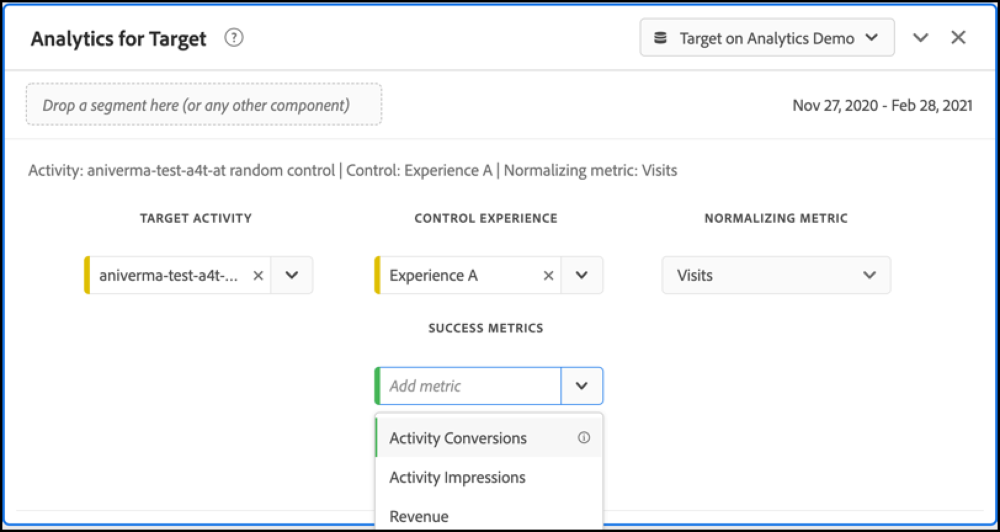

# Configuration de rapports A4T dans Analysis Workspace pour les activités [!DNL Auto-Target]

L’intégration Analytics for Target (A4T) pour les activités [!DNL Auto-Target] utilise les algorithmes d’apprentissage automatique (ML) d’ensemble d’Adobe Target pour choisir la meilleure expérience pour chaque visiteur en fonction de son profil, de son comportement et de son contexte, tout en utilisant une mesure d’objectif Adobe Analytics.

Bien que des fonctionnalités d’analyse riches soient disponibles dans Adobe Analytics Analysis Workspace, quelques modifications du panneau par défaut **[!UICONTROL Analytics for Target]** sont nécessaires pour interpréter correctement les activités [!DNL Auto-Target], en raison des différences entre les activités d’expérimentation (A/B manuel et l’affectation automatique) et les activités de personnalisation ([!DNL Auto-Target]).

Ce tutoriel décrit les modifications recommandées pour l’analyse des activités [!DNL Auto-Target] dans Workspace, basées sur les concepts clés suivants :

* La dimension **[!UICONTROL Contrôle ou Ciblé]** peut être utilisée pour faire la distinction entre les expériences de contrôle et celles diffusées par l’algorithme d’ensemble ML [!DNL Auto-Target].
* Les visites doivent être utilisées comme mesure de normalisation lors de l’affichage des ventilations de performances au niveau de l’expérience. En outre, la méthodologie de comptage par défaut d’ [Adobe Analytics peut inclure les visites pour lesquelles l’utilisateur ne voit pas réellement le contenu de l’activité](https://experienceleague.adobe.com/docs/target/using/integrate/a4t/a4t-faq/a4t-faq-viewing-reports.html?lang=en#metrics), mais ce comportement par défaut peut être modifié à l’aide d’un segment de portée appropriée (détails ci-dessous).
* L’attribution portée sur la recherche en amont des visites (également appelée &quot;intervalle de recherche en amont des visites&quot; sur le modèle d’attribution prescrit) est utilisée par les modèles ML d’Adobe Target pendant leurs phases de formation, et le même modèle d’attribution (autre que celui par défaut) doit être utilisé lors de la ventilation de la mesure d’objectif.

## Création d’A4T pour le panneau [!DNL Auto-Target] dans Workspace

Pour créer un rapport A4T pour [!DNL Auto-Target], commencez par le panneau **[!UICONTROL Analytics for Target]** dans Workspace, comme illustré ci-dessous, ou commencez par un tableau à structure libre. Effectuez ensuite les sélections suivantes :

1. **[!UICONTROL Expérience de contrôle]** : Vous pouvez choisir n’importe quelle expérience ; toutefois, vous remplacerez ce choix ultérieurement. Notez que pour les activités [!DNL Auto-Target], l’expérience de contrôle est en fait une stratégie de contrôle, qui consiste soit à : a) diffuser de manière aléatoire parmi toutes les expériences, soit b) diffuser une seule expérience (ce choix est effectué au moment de la création de l’activité dans Adobe Target). Même si vous avez choisi le choix (b), votre activité [!DNL Auto-Target] a désigné une expérience spécifique comme contrôle, vous devez tout de même suivre l’approche décrite dans ce tutoriel pour l’analyse d’A4T pour les activités [!DNL Auto-Target].
2. **[!UICONTROL Mesure de normalisation]** : Sélectionnez Visites.
3. **[!UICONTROL Mesures de succès]** : Bien que vous puissiez sélectionner une ou plusieurs mesures sur lesquelles générer des rapports, vous devez généralement afficher les rapports sur la même mesure que celle choisie pour l’optimisation lors de la création de l’activité dans Adobe Target.

*pngFigure 1 : Configuration du panneau Analytics for Target pour les  [!DNL Auto-Target] activités.*

>[!NOTE]
>
>Pour configurer le panneau Analytics for Target pour les activités de ciblage automatique, choisissez n’importe quelle expérience de contrôle, choisissez Visites comme mesure de normalisation et choisissez la même mesure d’objectif que celle choisie pour l’optimisation lors de la création de l’activité Target.

## Utilisez la dimension Contrôle / Ciblé pour comparer le modèle ML d’ensemble d’Adobe Target à votre contrôle.

Le panneau A4T par défaut est conçu pour les tests A/B classiques (manuels) ou les activités d’affectation automatique dans le but de comparer les performances de chaque expérience par rapport à l’expérience de contrôle. Toutefois, dans les activités [!DNL Auto-Target], la première comparaison de commande doit être entre la *stratégie* de contrôle et la *stratégie* ciblée (c’est-à-dire déterminer l’effet élévateur des performances globales du [!DNL Auto-Target] modèle d’ensemble ML par rapport à la stratégie de contrôle).

Pour effectuer cette comparaison, utilisez la dimension **[!UICONTROL Contrôle par rapport à la dimension ciblée (Analytics for Target)]** . Effectuez un glisser-déposer pour remplacer la dimension **[!UICONTROL Expériences cibles]** dans le rapport A4T par défaut.

Notez que ce remplacement invalide les calculs de l’effet élévateur et du degré de confiance par défaut sur le panneau A4T. Pour éviter toute confusion, vous pouvez supprimer ces mesures du panneau par défaut, en laissant le rapport suivant :

*pngFigure 2 : Rapport de base recommandé pour les  [!DNL Auto-Target] activités. Ce rapport a été configuré pour comparer le trafic ciblé (traité par le modèle ML d’ensemble) à votre trafic de contrôle.*

>[!NOTE]
>
>Actuellement, les numéros Effet élévateur et Degré de confiance ne sont pas disponibles pour les dimensions de contrôle et les dimensions ciblées des rapports A4T pour le ciblage automatique. Tant que la prise en charge n’est pas ajoutée, l’effet élévateur et le degré de confiance peuvent être calculés manuellement en téléchargeant le [calculateur de confiance](https://experienceleague.adobe.com/docs/target/assets/complete_confidence_calculator.xlsx?lang=en).

## Ajout de ventilations de mesures au niveau de l’expérience

Pour mieux comprendre les performances du modèle ML d’ensemble, vous pouvez examiner les ventilations au niveau de l’expérience de la dimension **[!UICONTROL Contrôle par rapport à la dimension ciblée]**. Dans Workspace, faites glisser la dimension **[!UICONTROL Expériences cibles]** sur votre rapport, puis ventilez séparément chacune des dimensions de contrôle et de ciblage.

*pngFigure 3 : Ventilation de la dimension ciblée par expérience Target*

Un exemple du rapport obtenu est présenté ici.

*pngFigure 4 : Rapport standard  [!DNL Auto-Target] avec ventilations au niveau de l’expérience. Notez que votre mesure d’objectif peut être différente et que votre stratégie de contrôle peut comporter une seule expérience.*

>[!TIP]
>
>Dans Workspace, cliquez sur l’icône d’engrenage pour masquer les pourcentages dans la colonne Taux de conversion afin de vous concentrer sur les taux de conversion de l’expérience. Notez que les taux de conversion seront alors formatés sous forme de décimales, mais interprétés comme des pourcentages en conséquence.

## Pourquoi &quot;Visites&quot; est la mesure de normalisation correcte pour les activités [!DNL Auto-Target]

Lors de l’analyse d’une activité [!DNL Auto-Target], sélectionnez toujours Visites comme mesure de normalisation par défaut. [!DNL Auto-Target] la personnalisation sélectionne une expérience pour un visiteur une fois par visite (officiellement, une fois par session Adobe Target), ce qui signifie que l’expérience présentée à un utilisateur peut changer à chaque visite. Par conséquent, si vous utilisez Visiteurs uniques comme mesure de normalisation, le fait qu’un seul utilisateur puisse voir plusieurs expériences (au cours de différentes visites) peut entraîner des taux de conversion déroutants.

Voici un exemple simple : imaginez un scénario dans lequel deux visiteurs entrent dans une campagne qui ne comporte que deux expériences. Le premier visiteur effectue deux visites. Elles sont affectées à l’expérience A lors de la première visite, mais à l’expérience B lors de la seconde visite (en raison de la modification de leur état de profil lors de cette deuxième visite). Après la deuxième visite, le visiteur effectue une conversion en passant une commande. La conversion est attribuée à l’expérience la plus récemment affichée (expérience B). Le deuxième visiteur se rend également deux fois sur le site et affiche l’expérience B à chaque fois, mais ne procède jamais à une conversion.

Comparons les rapports au niveau des visiteurs et des visites :

| Expérience | Visiteurs uniques | Visites | Conversions | Norme du visiteur. Conv. clics publicitaires | Standard des visites. Conv. clics publicitaires |
| --- | --- | --- | --- | --- | --- |
| Une | 1 | 1 | - | 0% | 0 % |
| B | 2 | 3 | 1 | 50 % | 33,3 % |
| Totaux | 2 | 4 | 1 | 50 % | 25 % |
*Tableau 1 : Exemple de comparaison des rapports normalisés par les visiteurs et normalisés par les visites pour un scénario dans lequel les décisions sont liées à une visite (et non aux visiteurs, comme avec les tests A/B standard). Les mesures normalisées par les visiteurs sont déroutantes dans ce scénario.*

Comme le montre le tableau, les nombres au niveau du visiteur présentent une incongruité évidente. Bien qu’il existe deux visiteurs uniques au total, il ne s’agit pas de la somme des visiteurs uniques individuels pour chaque expérience. Bien que le taux de conversion au niveau du visiteur ne soit pas nécessairement incorrect, lorsqu’on compare des expériences individuelles, les taux de conversion au niveau du visiteur ont sans doute beaucoup plus de sens. Officiellement, l’unité d’analyse (&quot;visites&quot;) est identique à l’unité d’attractivité de décision, ce qui signifie que des ventilations de mesures au niveau de l’expérience peuvent être ajoutées et comparées.

## Filtrage des visites réelles de l’activité

La méthodologie de comptage par défaut d’Adobe Analytics pour les visites d’une activité Target peut inclure les visites pour lesquelles l’utilisateur n’a pas interagi avec l’activité Target. Cela est dû à la manière dont les affectations d’activité Target sont conservées dans le contexte du visiteur Analytics. Par conséquent, le nombre de visites de l’activité Target peut parfois être exagéré, ce qui entraîne une dépression des taux de conversion.

Si vous préférez créer un rapport sur les visites au cours desquelles l’utilisateur a réellement interagi avec l’activité de ciblage automatique (soit par l’entrée de l’activité, soit par un événement d’affichage/de visite, soit par une conversion), vous pouvez :

1. Créez un segment spécifique qui comprend les accès provenant de l’activité Target en question, puis
1. Filtrez la mesure Visites à l’aide de ce segment.

**Pour créer le segment :**

1. Sélectionnez l’option **[!UICONTROL Composants > Créer un segment]** dans la barre d’outils Workspace.
2. Saisissez un **[!UICONTROL titre]** pour votre segment. Dans l’exemple ci-dessous, le segment est nommé [!DNL "Hit with specific Auto-Target activity"].
3. Faites glisser la dimension **[!UICONTROL Activités cibles]** vers la section **[!UICONTROL Définition]** du segment.
4. Utilisez l’opérateur **[!UICONTROL equals]** .
5. Recherchez votre activité Target spécifique.
6. Sélectionnez l’icône d’engrenage, puis **[!UICONTROL Modèle d’attribution > Instance]** comme illustré dans la figure ci-dessous.
7. Cliquez sur **[!UICONTROL Enregistrer]**.

*pngFigure 5 : Utilisez un segment tel que celui illustré ici pour filtrer la mesure Visites dans votre  [!DNL Auto-Target] rapport A4T.*

Une fois le segment créé, utilisez-le pour filtrer la mesure Visites. Par conséquent, la mesure Visites inclut uniquement les visites où l’utilisateur a interagi avec l’activité Target.

**Pour filtrer les Visites à l’aide de ce segment :**

1. Faites glisser le segment nouvellement créé à partir de la barre d’outils des composants, puis survolez la base du libellé de la mesure **[!UICONTROL Visites]** jusqu’à ce qu’une invite bleue **[!UICONTROL Filtrer par]** apparaisse.
2. Relâchez le segment. Le filtre sera appliqué à cette mesure.

Le panneau final s’affiche comme suit.

*pngFigure 6 : Panneau de création de rapports avec le segment &quot;Accès avec activité de ciblage automatique spécifique&quot; appliqué à la mesure   Visites. Ainsi, seules les visites où un utilisateur a réellement interagi avec l’activité Target en question sont incluses dans le rapport.*

## Aligner l’attribution entre la formation de modèle ML et la génération de mesure d’objectif

L’intégration A4T permet au modèle ML de [!DNL Auto-Target] d’être *entraîné* en utilisant les mêmes données d’événement de conversion qu’Adobe Analytics utilise pour *générer des rapports de performances*. Cependant, certaines hypothèses doivent être utilisées pour interpréter ces données lors de la formation des modèles ML, qui diffèrent des hypothèses par défaut faites lors de la phase de création de rapports dans Adobe Analytics.

Plus précisément, les modèles ML d’Adobe Target utilisent un modèle d’attribution à portée de visite. En d’autres termes, ils supposent qu’une conversion doit avoir lieu au cours de la même visite qu’un affichage du contenu pour l’activité, afin que la conversion soit &quot;attribuée&quot; à la décision prise par le modèle ML. Cela est nécessaire pour que Target puisse garantir une formation rapide de ses modèles. Target ne peut pas attendre jusqu’à 30 jours pour une conversion (la fenêtre d’attribution par défaut des rapports dans Adobe Analytics) avant de l’inclure dans les données d’entraînement de ses modèles.

Ainsi, la différence entre l’attribution utilisée par les modèles de Target (pendant la formation) et l’attribution par défaut utilisée dans l’interrogation des données (pendant la génération du rapport) peut entraîner des incohérences. Il peut même sembler que les modèles ML sont peu performants, alors qu&#39;en fait le problème réside dans l&#39;attribution.

>[!TIP]
>
>Si les modèles ML optimisent une mesure attribuée différemment des mesures que vous affichez dans un rapport, les modèles peuvent ne pas fonctionner comme prévu. Pour éviter cela, assurez-vous que les mesures d’objectif de votre rapport utilisent la même attribution utilisée par les modèles ML de Target.

Pour afficher les mesures d’objectif qui ont la même méthodologie d’attribution utilisée par les modèles ML Adobe Target, procédez comme suit :

1. Passez la souris sur l’icône d’engrenage de la mesure d’objectif :
   
1. Dans le menu qui s’affiche, faites défiler l’écran jusqu’à **[!UICONTROL Paramètres des données]**.
1. Sélectionnez **[!UICONTROL Utiliser un modèle d’attribution différent du modèle par défaut]** (s’il n’est pas déjà sélectionné) :
   
1. Cliquez sur **[!UICONTROL Modifier]**.
1. Sélectionnez **[!UICONTROL Modèle]** : **[!UICONTROL Participation]** et **[!UICONTROL Intervalle de recherche en amont]** : **[!UICONTROL Visite]**.
   
1. Cliquez sur **[!UICONTROL Appliquer]**.

Ces étapes garantissent que votre rapport attribuera la mesure d’objectif à l’affichage de l’expérience, si l’événement de mesure d’objectif s’est produit *à tout moment* (&quot;participation&quot;) au cours de la même visite qu’une expérience a été affichée.

## Étape finale : Créer un taux de conversion qui capture la magie ci-dessus

Avec les modifications apportées aux mesures Visite et Objectif des sections précédentes, la dernière modification que vous devez apporter à votre panneau de création de rapports A4T par défaut pour [!DNL Auto-Target] est de créer des taux de conversion qui sont le bon rapport (celui d’une mesure d’objectif avec la bonne attribution) à une mesure &quot;Visites&quot; correctement filtrée.

Pour ce faire, créez une mesure calculée en procédant comme suit :

1. Sélectionnez l’option **[!UICONTROL Composants > Créer une mesure]** dans la barre d’outils Workspace.
1. Saisissez un **[!UICONTROL titre]** pour votre mesure. Par exemple, &quot;Taux de conversion corrigé des visites pour l’activité XXX&quot;.
1. Sélectionnez **[!UICONTROL Format]** = Pourcentage et **[!UICONTROL Nombre de décimales]** = 2.
1. Faites glisser la mesure d’objectif appropriée pour votre activité (par exemple, Conversions d’activité) dans la définition, puis utilisez l’icône en forme d’engrenage sur cette mesure d’objectif pour ajuster le modèle d’attribution à (Participation|Visite), comme décrit précédemment.
1. Sélectionnez **[!UICONTROL Ajouter > Conteneur]** dans le coin supérieur droit de la section **[!UICONTROL Définition]**.
1. Sélectionnez l&#39;opérateur de division (÷) entre les deux conteneurs.
1. Faites glisser le segment précédemment créé (nommé &quot;Accès avec une activité [!DNL Auto-Target] spécifique&quot; dans ce tutoriel) pour cette activité [!DNL Auto-Target] spécifique.
1. Faites glisser la mesure **[!UICONTROL Visites]** dans le conteneur de segments.
1. Cliquez sur **[!UICONTROL Enregistrer]**.

La définition de mesure calculée complète s’affiche ici.

*pngFigure 7 : Définition de la mesure de taux de conversion de modèle corrigée pour les visites et l’attribution. (Notez que cette mesure dépend de votre mesure d’objectif et de votre activité. En d’autres termes, cette définition de mesure n’est pas réutilisable entre les activités.)*

>[!IMPORTANT]
>
>La mesure Taux de conversion du panneau A4T n’est pas liée à l’événement de conversion ou à la mesure de normalisation dans le tableau. Lorsque vous effectuez les modifications suggérées dans ce tutoriel, le taux de conversion ne s’adapte pas automatiquement aux modifications. Par conséquent, si vous apportez la modification à l’une (ou aux deux) des attributions d’événement de conversion et à la mesure de normalisation, vous devez vous souvenir d’une étape finale pour modifier également le taux de conversion, comme illustré ci-dessus.

## Résumé : Exemple final de panneau Workspace pour les rapports [!DNL Auto-Target]

En combinant toutes les étapes ci-dessus dans un seul panneau, la figure ci-dessous présente une vue complète du rapport recommandé pour les activités [!DNL Auto-Target] A4T. Ce rapport est identique à celui utilisé par les modèles d’apprentissage automatique de Target pour optimiser la mesure de vos objectifs. Il incorpore toutes les nuances et recommandations abordées dans ce tutoriel. Ce rapport est également le plus proche des méthodologies de comptage utilisées dans les activités [!DNL Auto-Target] traditionnelles pilotées par les rapports Target.

*pngFigure 8 : Le dernier  [!DNL Auto-Target] rapport A4T dans Adobe Analytics Workspace, qui combine tous les ajustements aux définitions de mesures décrits dans les sections précédentes de ce document.*
