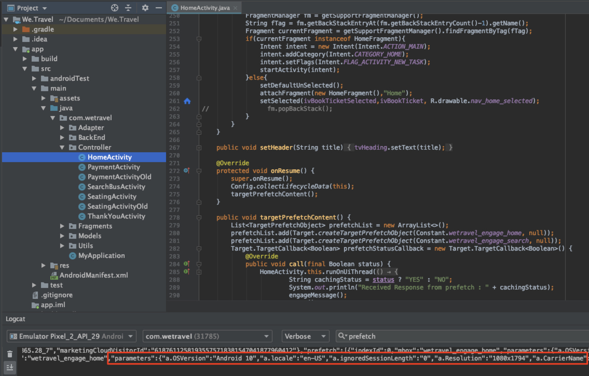
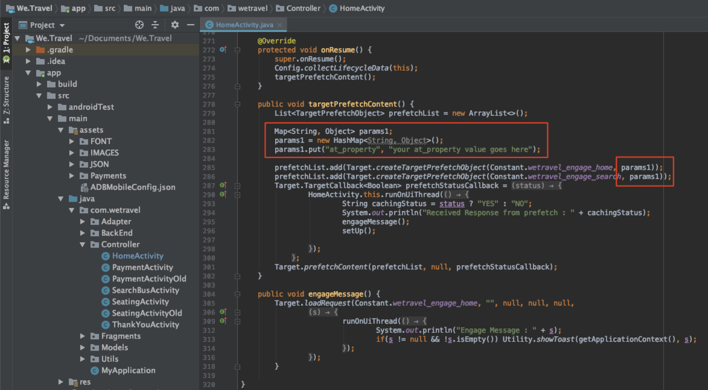
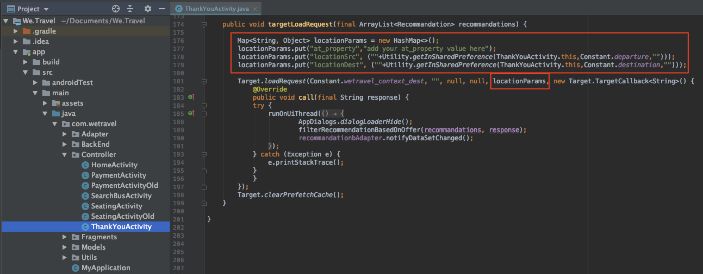

# Ajouter des paramètres aux requêtes

Dans cette leçon, nous allons ajouter des mesures de cycle de vie d&#39;Adobe et des paramètres personnalisés aux demandes [!DNL Target] ajoutées dans la leçon précédente. Ces mesures et paramètres seront utilisés pour créer des audiences personnalisées plus loin dans le didacticiel.

## Objectifs d&#39;apprentissage

À la fin de cette leçon, vous pourrez :

* Ajouter les mesures de cycle de vie des dispositifs portables Adobe
* Ajouter des paramètres à une requête de prérécupération
* Ajouter des paramètres à un emplacement de production
* Valider les paramètres des deux requêtes

## Ajouter les paramètres de cycle de vie

Activez les [mesures de cycle de vie des dispositifs portables ](https://docs.adobe.com/content/help/en/mobile-services/android/metrics.html) Adobe. Ceci ajoute des paramètres aux requêtes d’emplacement contenant des informations riches sur l’appareil de l’utilisateur et son engagement dans l’application. Nous créerons des audiences dans la leçon suivante en utilisant les données fournies par la demande de cycle de vie.

Pour activer les mesures de cycle de vie, ouvrez de nouveau le contrôleur HomeActivity et ajoutez `Config.collectLifecycleData(this);` à la fonction onResume() :


### Validation des paramètres de cycle de vie pour la demande de prérécupération

Exécutez l&#39;émulateur et utilisez Logcat pour valider les paramètres de cycle de vie. Filtrer pour &quot;prérécupérer&quot; pour rechercher la réponse de prérécupération et rechercher les nouveaux paramètres :


Bien que nous ayons seulement ajouté `Config.collectLifecycleData()` au contrôleur HomeActivity, vous devriez également voir les mesures de cycle de vie envoyées avec la demande de Cible sur votre écran de remerciement.

## Ajouter le paramètre at_property à la demande de prérécupération

Les propriétés Adobe Target sont définies dans l&#39;interface [!DNL Target] et servent à définir des limites pour la personnalisation des applications et des sites Web. Le paramètre at_property identifie la propriété spécifique dans laquelle vos offres et activités sont consultées et conservées. Nous allons ajouter une propriété aux demandes d&#39;emplacement prérécupéré et actif.

>[!NOTE]
>
>Selon votre licence, vous pouvez voir ou non les options Propriétés dans l&#39;interface [!DNL Target]. Si vous n&#39;avez pas ces options, ou si vous n&#39;utilisez pas Propriétés dans votre société, passez directement à la section suivante de cette leçon.

Vous pouvez récupérer votre valeur at_property dans l&#39;interface [!DNL Target] sous [!UICONTROL Configuration] > [!UICONTROL Propriétés].  Passez la souris sur la propriété, sélectionnez l’icône de fragment de code et copiez la valeur `at_property` :


Ajoutez-le en tant que paramètre pour chaque emplacement dans la requête de prérécupération comme suit :

Voici le code mis à jour pour la fonction `targetPrefetchContent()` (veillez à mettre à jour la valeur _[!UICONTROL de votre propriété at_property ici]_ texte d&#39;espace réservé !) :

```java
public void targetPrefetchContent() {
        List<TargetPrefetchObject> prefetchList = new ArrayList<>();

        Map<String, Object> params1;
        params1 = new HashMap<String, Object>();
        params1.put("at_property", "your at_property value goes here");

        prefetchList.add(Target.createTargetPrefetchObject(Constant.wetravel_engage_home, params1));
        prefetchList.add(Target.createTargetPrefetchObject(Constant.wetravel_engage_search, params1));
        Target.TargetCallback<Boolean> prefetchStatusCallback = new Target.TargetCallback<Boolean>() {
            @Override
            public void call(final Boolean status) {
                HomeActivity.this.runOnUiThread(new Runnable() {
                    @Override
                    public void run() {
                        String cachingStatus = status ? "YES" : "NO";
                        System.out.println("Received Response from prefetch : " + cachingStatus);
                        engageMessage();
                        setUp();

                    }
                });
            }};
        Target.prefetchContent(prefetchList, null, prefetchStatusCallback);
    }
```

### Remarque concernant les paramètres

Pour les futurs projets, vous pouvez implémenter des paramètres supplémentaires. La méthode `createTargetPrefetchObject()` permet trois types de paramètres : `locationParams`, `orderParams` et `productParams`. Consultez la documentation [pour plus d&#39;informations sur l&#39;ajout de ces paramètres à la requête de prérécupération](https://docs.adobe.com/content/help/en/mobile-services/android/target-android/c-mob-target-prefetch-android.html).

Notez également que différents paramètres d’emplacement peuvent être ajoutés à chaque emplacement dans la demande de prérécupération. Par exemple, vous pouvez créer un autre mappage appelé param2, y placer un nouveau paramètre, puis définir param2 à un emplacement et param1 à un autre emplacement. Voici un exemple :

```java
prefetchList.add(Target.createTargetPrefetchObject(location1_name, params1);
prefetchList.add(Target.createTargetPrefetchObject(location2_name, params2);
```

## Validez le paramètre at_property dans la demande de prérécupération.

Exécutez maintenant l&#39;émulateur et utilisez Logcat pour vérifier que la propriété at_property s&#39;affiche sur la requête et la réponse de prérécupération pour les deux emplacements :


## Ajouter des paramètres personnalisés à la demande d’emplacement dynamique

La demande d&#39;emplacement en direct (wetravel_context_dest) a été ajoutée à la leçon précédente afin que nous puissions afficher une promotion pertinente sur l&#39;écran de confirmation finale du processus de réservation. Nous aimerions personnaliser la promotion en fonction de la destination de l&#39;utilisateur et pour ce faire, nous ajouterons cela comme paramètre à la demande. Nous ajouterons également un paramètre pour l&#39;origine trop et la valeur at_property.

Ajoutez les paramètres suivants à la fonction targetLoadRequest() dans le contrôleur ThankYouActivity :

Voici le code mis à jour pour la fonction targetLoadRequest() (veillez à mettre à jour le texte d’espace réservé &quot;ajouter votre valeur at_property ici&quot;) :

```java
public void targetLoadRequest(final ArrayList<Recommandation> recommandations) {
    Map<String, Object> locationParams = new HashMap<>();
    locationParams.put("at_property","add your at_property value here");
    locationParams.put("locationSrc", (""+Utility.getInSharedPreference(ThankYouActivity.this,Constant.departure,"")));
    locationParams.put("locationDest", (""+Utility.getInSharedPreference(ThankYouActivity.this,Constant.destination,"")));

    Target.loadRequest(Constant.wetravel_context_dest, "", null, null, locationParams, new Target.TargetCallback<String>() {
        @Override
        public void call(final String response) {
        try {
            runOnUiThread(new Runnable() {
                @Override
                public void run() {
                    AppDialogs.dialogLoaderHide();
                    filterRecommendationBasedOnOffer(recommandations, response);
                    recommandationbAdapter.notifyDataSetChanged();
                }
            });
        } catch (Exception e) {
            e.printStackTrace();
        }
        }
    });
    Target.clearPrefetchCache();
}
```

### Validation des paramètres personnalisés dans la demande d’emplacement dynamique

Exécutez l&#39;émulateur et ouvrez Logcat. Filtrez l’un des paramètres pour vérifier que la requête contient les paramètres nécessaires :


>[!NOTE]
>
>Demandes et paramètres de confirmation de commande : Bien qu&#39;elle ne soit pas utilisée dans ce projet de démonstration, les détails de la commande sont généralement capturés dans une implémentation réelle. [!DNL Target] peut donc utiliser les détails de la commande comme mesures/dimensions. Consultez la documentation pour savoir comment [mettre en oeuvre la demande de confirmation de commande et les paramètres](https://docs.adobe.com/content/help/en/mobile-services/android/target-android/c-target-methods.html).

>[!NOTE]
>
>Analytics pour la Cible (A4T) : Adobe Analytics peut être configuré comme source de rapports pour [!DNL Target]. Cela permet à toutes les mesures/dimensions collectées par le SDK de Cible d’être consultées dans Adobe Analytics. Pour plus d’informations, consultez la section [Présentation d’A4T](https://docs.adobe.com/content/help/en/target/using/integrate/a4t/a4t.html).

Bon travail ! Maintenant que les paramètres sont en place, nous sommes prêts à utiliser ces paramètres pour créer des audiences et des offres dans Adobe Target.

**[SUIVANT : &quot;Créer des Audiences et des Offres&quot; >](create-audiences-and-offers.md)**
