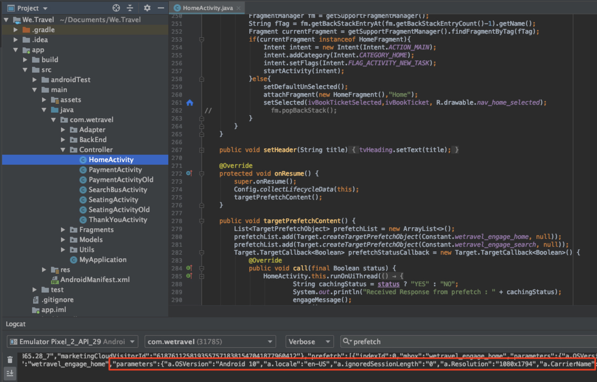
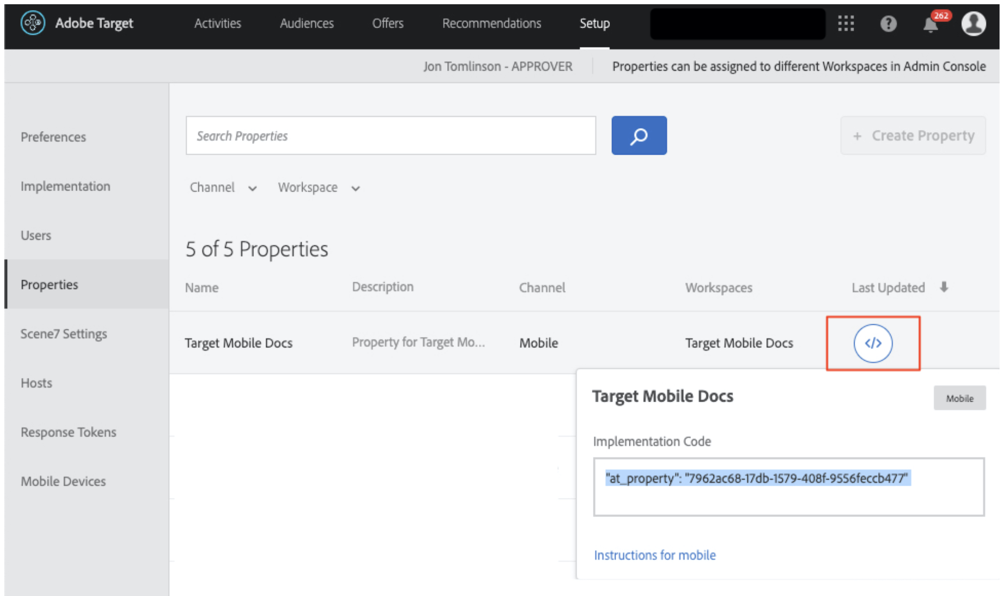
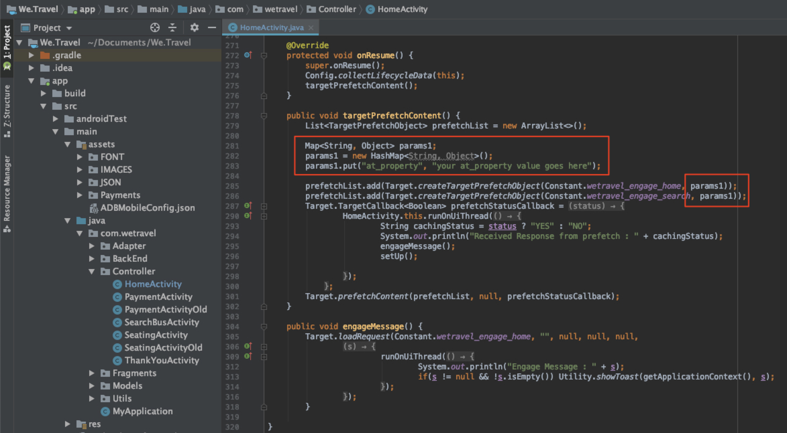
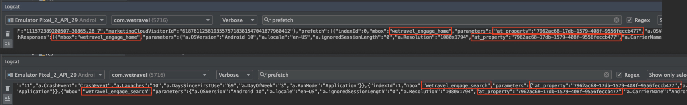
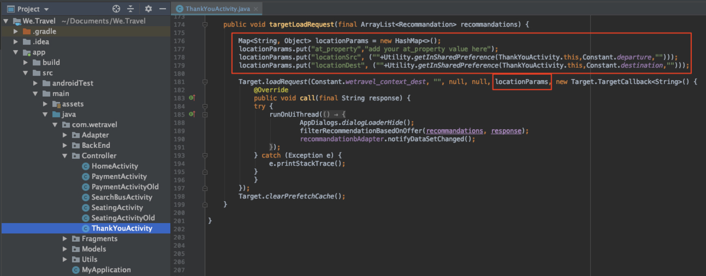

# Ajouter des paramètres aux requêtes

Dans cette leçon, nous allons ajouter des mesures de cycle de vie Adobe et des paramètres personnalisés aux requêtes [!DNL Target] ajoutées dans la leçon précédente. Ces mesures et paramètres seront utilisés pour créer des audiences personnalisées plus loin dans le tutoriel.

## Objectifs d’apprentissage

À la fin de cette leçon, vous serez en mesure de :

* Ajout des mesures de cycle de vie mobile Adobe
* Ajout de paramètres à une requête de prérécupération
* Ajouter des paramètres à un emplacement dynamique
* Validez les paramètres des deux requêtes.

## Ajout des paramètres de cycle de vie

Activons les [mesures de cycle de vie mobile &#x200B;](https://experienceleague.adobe.com/docs/mobile-services/android/metrics.html?lang=en). Des paramètres seront ainsi ajoutés aux requêtes d’emplacement contenant des informations riches sur l’appareil de l’utilisateur et l’engagement dans l’application. Dans la leçon suivante, nous allons créer des audiences à l’aide des données fournies par la requête de cycle de vie.

Pour activer les mesures de cycle de vie, ouvrez à nouveau le contrôleur HomeActivity et ajoutez des `Config.collectLifecycleData(this);` à la fonction onResume() :


### Validation des paramètres de cycle de vie de la requête de prérécupération

Exécutez l’émulateur et utilisez Logcat pour valider les paramètres du cycle de vie. Filtrez pour « prefetch » afin de trouver la réponse de prérécupération et de rechercher les nouveaux paramètres :


Même si nous n’avons ajouté que des `Config.collectLifecycleData()` au contrôleur HomeActivity, vous devriez également voir les mesures de cycle de vie envoyées avec la requête Target sur votre écran de remerciement.

## Ajoutez le paramètre at_property à la requête de prérécupération

Les propriétés Adobe Target sont définies dans l’interface [!DNL Target] et sont utilisées pour établir des limites afin de personnaliser les applications et les sites Web. Le paramètre at_property identifie la propriété spécifique dans laquelle vos offres et activités sont accessibles et gérées. Nous ajouterons une propriété aux requêtes de prérécupération et d’emplacement actif.

>[!NOTE]
>
>Les options Propriétés peuvent s’afficher ou non dans l’interface [!DNL Target], selon votre licence. Si vous ne disposez pas de ces options ou si vous n’utilisez pas Propriétés dans votre entreprise, passez simplement à la section suivante de cette leçon.

Vous pouvez récupérer votre valeur at_property dans l’interface [!DNL Target] sous [!UICONTROL Configuration] > [!UICONTROL Propriétés].  Pointez sur la propriété, sélectionnez l’icône Extrait de code et copiez la valeur `at_property` :



Ajoutez-le en tant que paramètre pour chaque emplacement de la requête de prérécupération comme suit :

Voici le code mis à jour pour la fonction `targetPrefetchContent()` (veillez à mettre à jour le _[!UICONTROL votre valeur at_property se trouve ici]_ texte d’espace réservé !) :

```java
public void targetPrefetchContent() {
        List<TargetPrefetchObject> prefetchList = new ArrayList<>();

        Map<String, Object> params1;
        params1 = new HashMap<String, Object>();
        params1.put("at_property", "your at_property value goes here");

        prefetchList.add(Target.createTargetPrefetchObject(Constant.wetravel_engage_home, params1));
        prefetchList.add(Target.createTargetPrefetchObject(Constant.wetravel_engage_search, params1));
        Target.TargetCallback<Boolean> prefetchStatusCallback = new Target.TargetCallback<Boolean>() {
            @Override
            public void call(final Boolean status) {
                HomeActivity.this.runOnUiThread(new Runnable() {
                    @Override
                    public void run() {
                        String cachingStatus = status ? "YES" : "NO";
                        System.out.println("Received Response from prefetch : " + cachingStatus);
                        engageMessage();
                        setUp();

                    }
                });
            }};
        Target.prefetchContent(prefetchList, null, prefetchStatusCallback);
    }
```

### Remarque Sur Les Paramètres

Pour les projets futurs, vous pouvez implémenter des paramètres supplémentaires. La méthode `createTargetPrefetchObject()` autorise trois types de paramètres : `locationParams`, `orderParams` et `productParams`. Consultez la documentation pour [plus d’informations sur l’ajout de ces paramètres à la requête de prérécupération](https://experienceleague.adobe.com/docs/mobile-services/android/target-android/c-mob-target-prefetch-android.html?lang=en).

Notez également que différents paramètres d’emplacement peuvent être ajoutés à chaque emplacement dans la requête de prérécupération. Par exemple, vous pouvez créer une autre Map appelée param2, y placer un nouveau paramètre, puis définir param2 à un emplacement et param1 à l’autre emplacement. Voici un exemple :

```java
prefetchList.add(Target.createTargetPrefetchObject(location1_name, params1);
prefetchList.add(Target.createTargetPrefetchObject(location2_name, params2);
```

## Valider le paramètre at_property dans la requête de prérécupération

Exécutez maintenant l’émulateur et utilisez Logcat pour vérifier que at_property s’affiche dans la requête de prérécupération et la réponse pour les deux emplacements :


## Ajouter des paramètres personnalisés à la demande d’emplacement dynamique

La demande de localisation en direct (wetravel_context_dest) a été ajoutée dans la leçon précédente afin que nous puissions afficher une promotion pertinente sur l’écran de confirmation final du processus de réservation. Nous aimerions personnaliser la promotion en fonction de la destination de l’utilisateur ou de l’utilisatrice et nous l’ajouterons en tant que paramètre à la requête. Nous ajouterons également un paramètre pour la trop grande origine et la valeur at_property.

Ajoutez les paramètres suivants à la fonction targetLoadRequest() du contrôleur ThanksYouActivity :

Voici le code mis à jour pour la fonction targetLoadRequest() (veillez à mettre à jour le texte de l’espace réservé « ajoutez votre valeur at_property ici ») :

```java
public void targetLoadRequest(final ArrayList<Recommandation> recommandations) {
    Map<String, Object> locationParams = new HashMap<>();
    locationParams.put("at_property","add your at_property value here");
    locationParams.put("locationSrc", (""+Utility.getInSharedPreference(ThankYouActivity.this,Constant.departure,"")));
    locationParams.put("locationDest", (""+Utility.getInSharedPreference(ThankYouActivity.this,Constant.destination,"")));

    Target.loadRequest(Constant.wetravel_context_dest, "", null, null, locationParams, new Target.TargetCallback<String>() {
        @Override
        public void call(final String response) {
        try {
            runOnUiThread(new Runnable() {
                @Override
                public void run() {
                    AppDialogs.dialogLoaderHide();
                    filterRecommendationBasedOnOffer(recommandations, response);
                    recommandationbAdapter.notifyDataSetChanged();
                }
            });
        } catch (Exception e) {
            e.printStackTrace();
        }
        }
    });
    Target.clearPrefetchCache();
}
```

### Valider les paramètres personnalisés dans la demande d’emplacement dynamique

Exécutez l’émulateur et ouvrez Logcat. Filtrez l’un des paramètres pour vérifier que la requête contient les paramètres nécessaires :


>[!NOTE]
>
>Demandes et paramètres de confirmation de commande : bien que n’étant pas utilisés dans ce projet de démonstration, les détails des commandes sont généralement capturés dans une implémentation réelle, de sorte que [!DNL Target] pouvez utiliser les détails des commandes en tant que mesures/dimensions. Reportez-vous à la documentation pour obtenir des instructions sur la [implémentation de la demande et des paramètres de confirmation de commande](https://experienceleague.adobe.com/docs/mobile-services/android/target-android/c-target-methods.html?lang=en).

>[!NOTE]
>
>Analytics for Target (A4T) : Adobe Analytics peut être configuré comme source de création de rapports pour [!DNL Target]. Cela permet à toutes les mesures/dimensions collectées par le SDK cible d’être affichées dans Adobe Analytics. Voir la [Présentation d’A4T](https://experienceleague.adobe.com/docs/target/using/integrate/a4t/a4t.html?lang=en) pour plus d’informations.

Beau travail ! Maintenant que les paramètres sont en place, nous sommes prêts à les utiliser pour créer des audiences et des offres dans Adobe Target.

**[SUIVANT : « Créer des audiences et des offres » >](create-audiences-and-offers.md)**
