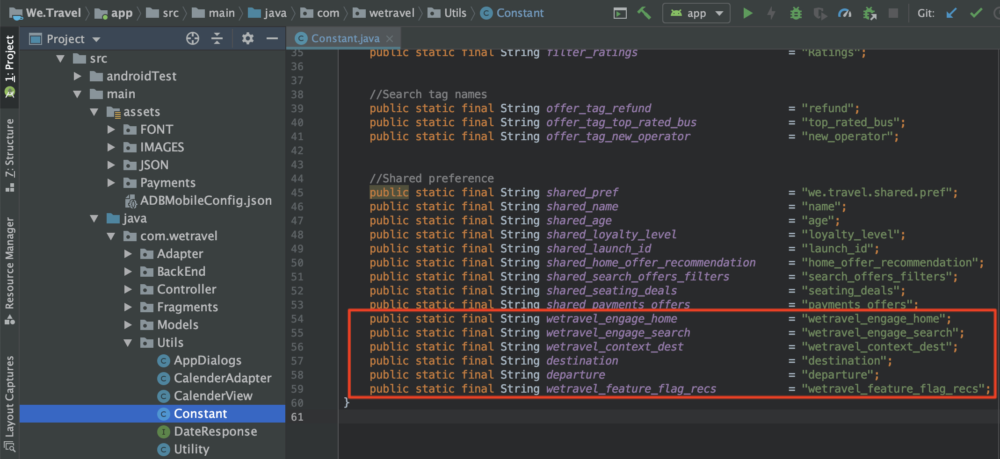
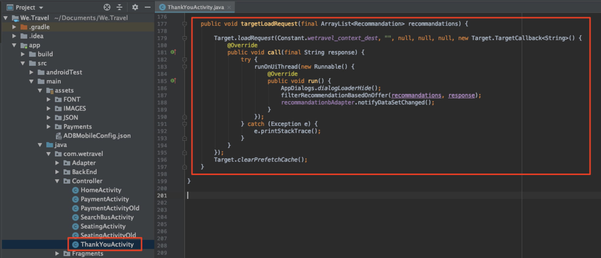
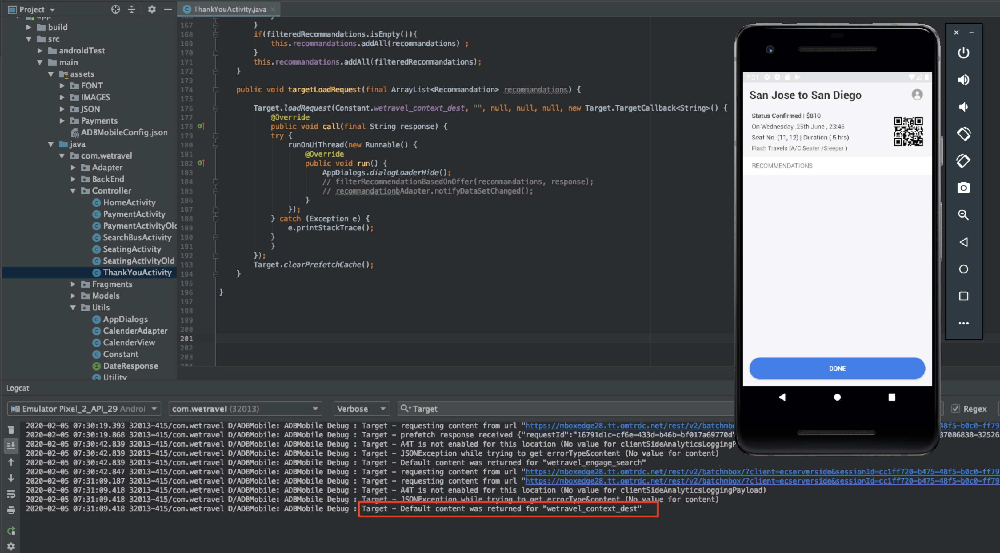

# Ajout de requêtes Adobe Target

Adobe Mobile Services SDK (v4) fournit des méthodes et des fonctionnalités Adobe Target qui vous permettent de personnaliser votre application avec différentes expériences pour différents utilisateurs. En règle générale, une ou plusieurs requêtes sont effectuées de l’application vers Adobe Target pour récupérer le contenu personnalisé et mesurer l’impact de ce contenu.

Dans cette leçon, vous allez préparer l’application We.Travel à la personnalisation en implémentant des demandes [!DNL Target].

## Conditions préalables

Veillez à [télécharger et mettre à jour l’exemple d’application](download-and-update-the-sample-app.md).

## Objectifs d’apprentissage

À la fin de cette leçon, vous serez en mesure de :

* Mettre en cache plusieurs offres [!DNL Target] (contenu personnalisé) à l’aide d’une requête de prérécupération par lots
* Charger les emplacements de [!DNL Target] prérécupérés
* Chargement d’un emplacement [!DNL Target] en temps réel (non prérécupéré)
* Effacer les emplacements prérécupérés du cache
* Validation des requêtes prérécupérées et en temps réel

## Terminologie 

Vous trouverez ci-dessous certains termes clés de Target que nous utiliserons dans la suite de ce tutoriel.

* **Requête :** une requête réseau aux serveurs Adobe Target
* **Offre :** un fragment de code ou un autre contenu textuel, défini dans l’interface utilisateur [!DNL Target] (ou avec l’API), fourni dans la réponse. Généralement JSON lorsque [!DNL Target] est utilisé dans les applications mobiles natives.
* **Emplacement :** nom défini par l’utilisateur attribué à une requête et utilisé dans l’interface [!DNL Target] pour associer des offres à des requêtes spécifiques
* **Requête par lots :** une requête unique qui comprend plusieurs emplacements
* **Requête de prérécupération :** une requête unique qui récupère les offres et les met en mémoire cache pour une utilisation ultérieure dans l’application
* **Requête de prérécupération par lots :** une seule requête qui prérécupère des offres pour plusieurs emplacements
* **Audience :** un groupe de visiteurs défini dans l’interface [!DNL Target] ou partagé avec des [!DNL Target] d’autres applications Adobe (par exemple, « visiteurs iPhone X », « visiteurs en Californie », « Première application ouverte »)
* **Activité :** une construction de [!DNL Target], définie dans l’interface utilisateur [!DNL Target] (ou avec l’API) qui relie les emplacements, les offres et les audiences afin de créer une expérience personnalisée

## Ajout d’une requête de prérécupération par lots

La première demande que nous allons implémenter dans We.Travel est une demande de prérécupération par lots avec deux emplacements [!DNL Target] sur l’écran d’accueil. Dans une leçon ultérieure, nous allons configurer des offres pour ces emplacements qui affichent des messages pour aider les nouveaux utilisateurs à passer par le processus de réservation.

Une requête de prérécupération récupère [!DNL Target] contenu aussi minimalement que possible en mettant en cache la réponse du serveur Adobe Target (offre). Une requête de prérécupération par lots récupère et met en cache plusieurs offres, chacune associée à un emplacement différent. Tous les emplacements prérécupérés sont mis en cache sur l’appareil pour une utilisation ultérieure dans la session utilisateur. En prérécupérant plusieurs emplacements sur l’écran d’accueil, nous pouvons récupérer les offres à utiliser ultérieurement lorsque le visiteur navigue dans l’application. Reportez-vous à la [documentation de prérécupération](https://experienceleague.adobe.com/docs/mobile-services/android/target-android/c-mob-target-prefetch-android.html?lang=en) pour plus d’informations sur les méthodes de prérécupération.

### Ajout de la requête de prérécupération par lot

Mettons à jour le contrôleur HomeActivity (le code source de l’écran d’accueil), qui se trouve sous app > main > java > com.wetravel > Controller. Nous allons ajouter les deux blocs de code affichés en rouge :

Nous allons commencer par le contrôleur HomeActivity (le code source de l’écran d’accueil), qui se trouve sous app > main > java > com.wetravel > Controller.

Nous allons ajouter les deux blocs de code affichés en rouge :


Faites défiler jusqu’à la fin du code de HomeActivity et ajoutez le code fourni ci-dessous après la fonction `setHeader()` et *en remplaçant* la fonction `onResume()` actuelle :

```java
@Override
protected void onResume() {
    super.onResume();
    targetPrefetchContent();
}

public void targetPrefetchContent() {
    List<TargetPrefetchObject> prefetchList = new ArrayList<>();
    prefetchList.add(Target.createTargetPrefetchObject(Constant.wetravel_engage_home, null));
    prefetchList.add(Target.createTargetPrefetchObject(Constant.wetravel_engage_search, null));
    Target.TargetCallback<Boolean> prefetchStatusCallback = new Target.TargetCallback<Boolean>() {
        @Override
        public void call(final Boolean status) {
            HomeActivity.this.runOnUiThread(new Runnable() {
                @Override
                public void run() {
                    String cachingStatus = status ? "YES" : "NO";
                    System.out.println("Received Response from prefetch : " + cachingStatus);
                    setUp();

                }
            });
        }};
    Target.prefetchContent(prefetchList, null, prefetchStatusCallback);
}
```

Votre IDE vous avertira probablement que les classes [!DNL Target] ne sont pas importées dans le fichier . Veillez à importer les classes [!DNL Target] en haut du contrôleur HomeActivity, comme illustré en rouge ci-dessous :

```java
import com.adobe.mobile.Target;
import com.adobe.mobile.TargetPrefetchObject;
```


Vous verrez probablement également des erreurs pour « impossible de trouver la variable de symbole wetravel_engage_home » et « impossible de trouver la variable de symbole wetravel_engage_search ». Ajoutez-les au fichier `Constant.java` (dans app > src > main > java > com > wetravel > Utils) :

```java
public static final String wetravel_engage_home = "wetravel_engage_home";
public static final String wetravel_engage_search = "wetravel_engage_search";
```



### Explication Du Code De Demande De Prérécupération Par Lot

| Code | Description |
|--- |--- |
| `targetPrefetchContent()` | Fonction définie par l’utilisateur (ne faisant pas partie du SDK) qui utilise des méthodes [!DNL Target] pour récupérer et mettre en cache deux emplacements [!DNL Target]. |
| `prefetchContent()` | Méthode SDK [!DNL Target] qui envoie la requête de prérécupération |
| `Constant.wetravel_engage_home` | Nom de l’emplacement [!DNL Target] prérécupéré qui affichera le contenu de son offre sur l’écran d’accueil. |
| `Constant.wetravel_engage_search` | Nom de l’emplacement [!DNL Target] prérécupéré qui affichera le contenu de son offre sur l’écran des résultats de recherche. Puisqu’il s’agit d’un second emplacement dans la prérécupération, cette requête de prérécupération est appelée « requête de lot de prérécupération ». |
| setUp() | Fonction définie par l’utilisateur qui effectue le rendu de l’écran d’accueil de l’application après la prérécupération des offres [!DNL Target] |

### À propos des modes asynchrone et synchrone

Avec le code que nous venons d’implémenter, la requête de prérécupération est effectuée sous la forme d’un appel de blocage synchrone, juste avant le rendu de l’écran d’accueil. Lorsque nous avons collé le nouveau code dans le contrôleur HomeActivity, nous avons déplacé l’exécution de la fonction `setUp()` de la fonction `onResume()` jusqu’à après la requête Target. Cela peut s’avérer bénéfique dans les scénarios où vous souhaitez personnaliser le contenu lors de la première ouverture de l’application, car cela garantit que le contenu personnalisé des serveurs Target est renvoyé (ou a expiré) avant le rendu du premier écran. Pour permettre aux requêtes de se charger de manière asynchrone (en arrière-plan), appelez simplement `setUp()` dans la fonction `onCreate()` .

### Validation de la demande de prérécupération par lots

Recréez l’application et ouvrez l’émulateur Android. (Les captures d’écran suivantes utilisent le Pixel 2 sur Android Q version 9+, niveau API 29). La réponse de prérécupération doit indiquer « réponse de prérécupération reçue » :

Lors du rendu de l’écran d’accueil , la requête de prérécupération doit être chargée. Avec Logcat, filtrez les [!DNL "Target"] pour afficher la requête et la réponse :


Si aucune réponse réussie ne s’affiche, vérifiez les paramètres du fichier `ADBMobileConfig.json` et la syntaxe du code dans le fichier HomeActivity.

Deux emplacements sont désormais mis en cache sur l’appareil. Les noms des emplacements seront bientôt chargés en différé dans l’interface [!DNL Target], où ils peuvent être sélectionnés dans divers menus déroulants lorsque vous les utilisez dans une activité.

### Ajout de requêtes de chargement pour chaque emplacement mis en cache

Maintenant que les emplacements sont prérécupérés et leurs réponses mises en cache sur l’appareil, ajoutons la méthode `Target.loadRequest()` qui récupère le contenu de l’offre à partir du cache afin que vous puissiez l’utiliser pour mettre à jour votre application. Nous allons ajouter une nouvelle méthode personnalisée appelée `engageMessage()` qui s’exécutera avec la requête de prérécupération. `engageMessage()` appellera `Target.loadRequest()`. `engageMessage()` s’exécute avant `setUp()` pour s’assurer que la demande de chargement est appelée avant la configuration de l’écran.

Tout d’abord, ajoutez la méthode et l’appel `engageMessage()` pour l’emplacement wetravel_engage_home dans HomeActivity :


Voici le code mis à jour :

```java
    public void targetPrefetchContent() {
        List<TargetPrefetchObject> prefetchList = new ArrayList<>();
        Map<String, Object> params1;
        params1 = new HashMap<String, Object>();
        params1.put("at_property", "your at_property value goes here");
        prefetchList.add(Target.createTargetPrefetchObject(Constant.wetravel_engage_home, params1));
        prefetchList.add(Target.createTargetPrefetchObject(Constant.wetravel_engage_search, params1));
        Target.TargetCallback<Boolean> prefetchStatusCallback = new Target.TargetCallback<Boolean>() {
            @Override
            public void call(final Boolean status) {
                HomeActivity.this.runOnUiThread(new Runnable() {
                    @Override
                    public void run() {
                        String cachingStatus = status ? "YES" : "NO";
                        System.out.println("Received Response from prefetch : " + cachingStatus);
                        engageMessage();
                        setUp();
                    }
                });
            }};
        Target.prefetchContent(prefetchList, null, prefetchStatusCallback);
    }
    public void engageMessage() {
        Target.loadRequest(Constant.wetravel_engage_home, "", null, null, null,
            new Target.TargetCallback<String>(){
                @Override
                public void call(final String s) {
                    runOnUiThread(new Runnable() {
                        @Override
                        public void run() {
                            System.out.println("Engage Message : " + s);
                            if(s != null && !s.isEmpty()) Utility.showToast(getApplicationContext(), s);
                        }
                    });
                }
            });
    }
```

Ajoutez maintenant l’appel `engageMessage()` et la méthode pour l’emplacement wetravel_engage_search dans SearchBusActivity. Notez que l’appel `engageMessage()` est défini dans la méthode `onResume()` avant l’appel à `setUpSearch()` afin qu’il s’exécute avant la configuration de l’écran :


Voici le code mis à jour :

```java
    @Override
    public void onResume() {
        super.onResume();
        engageMessage();
        setUpSearch();
    }
    public void engageMessage() {
        Target.loadRequest(Constant.wetravel_engage_search, "", null, null, null,
                new Target.TargetCallback<String>(){
                    @Override
                    public void call(final String s) {
                        runOnUiThread(new Runnable() {
                            @Override
                            public void run() {
                                System.out.println("Engage Message : " + s);
                                if(s != null && !s.isEmpty()) Utility.showToast(getApplicationContext(), s);
                            }
                        });
                    }
                });
    }
```

Puisque vous venez d’ajouter des méthodes Target à SearchBusActivity, veillez à importer les classes [!DNL Target] :

```java
import com.adobe.mobile.Target;
import com.adobe.mobile.TargetPrefetchObject;
```

## Ajouter une requête en temps réel

La prochaine demande que nous ajouterons à l’application sera une demande en temps réel sur l’écran de remerciement. Par « temps réel », nous voulons dire que la requête sera effectuée et que la réponse sera appliquée immédiatement (et non mise en cache pour une utilisation ultérieure). Dans une leçon ultérieure, nous allons créer une expérience à l’aide de cette requête, qui est personnalisée en fonction de la destination du voyage de l’utilisateur.

Ajoutons donc une requête en temps réel à l’écran de remerciement. Dans le fichier ThanksYouActivity, nous apporterons les modifications indiquées en rouge :


Faites défiler l’écran jusqu’à la fin du fichier ThanksYouActivity. Commentez les trois lignes de la fonction `getRecommandations()` et ajoutez l’appel de la fonction `targetLoadRequest()` :

```java
// AppDialogs.dialogLoaderHide();
// recommandations.addAll(recommandation.recommandations);
// recommandationbAdapter.notifyDataSetChanged();
```

Ajoutez cette ligne de code à la fonction `getRecommandations()` :

```java
targetLoadRequest(recommandation.recommandations);
```

Maintenant, nous devons définir la fonction `targetLoadRequest()` :


Ajoutez ce bloc de code après la fonction `filterRecommendationBasedOnOffer()` :

```java
public void targetLoadRequest(final ArrayList<Recommandation> recommandations) {
    Target.loadRequest(Constant.wetravel_context_dest, "", null, null, null, new Target.TargetCallback<String>() {
        @Override
        public void call(final String response) {
            try {
                runOnUiThread(new Runnable() {
                    @Override
                    public void run() {
                        AppDialogs.dialogLoaderHide();
                        filterRecommendationBasedOnOffer(recommandations, response);
                        recommandationbAdapter.notifyDataSetChanged();
                    }
                });
            } catch (Exception e) {
                e.printStackTrace();
            }
        }
    });
}
```

Puisque vous venez d’ajouter des méthodes Target à l’activité Merci, veillez à importer les classes Target :

```java
import com.adobe.mobile.Target;
import com.adobe.mobile.TargetPrefetchObject;
```

### Explication du code targetLoadRequest()

| Code | Description |
|--- |--- |
| `targetLoadRequest()` | Fonction définie par l’utilisateur (ne faisant pas partie du SDK) qui déclenche `Target.loadRequest()` qui charge et affiche l’emplacement wetravel_context_dest |
| `Target.loadRequest()` | Méthode SDK qui effectue la requête au serveur Target |
| Constant.wetravel_context_dest | Nom de l’emplacement attribué à la demande que nous utiliserons ultérieurement lorsque nous créerons l’activité dans l’interface [!DNL Target] |
| `filterRecommendationBasedOnOffer()` | Fonction définie par l’utilisateur dans l’application qui extrait l’offre de l’emplacement de la réponse de Target et décide de la manière dont l’application doit changer en fonction du contenu de l’offre |
| `recommandations.addAll()` | Fonction définie par l’utilisateur dans l’application qui s’exécutait par défaut lors du chargement de l’écran de remerciement, mais qui s’exécute maintenant après la réception et l’analyse de la réponse Target par `filterRecommendationBasedOnOffer()` |

Il s’agissait d’une mise à jour plus sophistiquée de l’application, ajoutée à la demande sur l’écran d’accueil. Prenons quelques instants pour examiner ce que nous avons fait :

1. Nous avons interrompu le comportement précédent de l’application qui affichait trois promotions par défaut en commentant les lignes de code
1. Nous avons demandé à l’application d’exécuter une nouvelle fonction, que nous avons arbitrairement nommée targetLoadRequest
1. Nous avons défini la fonction `targetLoadRequest` pour envoyer une requête à Target à l’aide de la méthode Target.loadRequest et exécuter immédiatement la fonction `filterRecommendationBasedOnOffer()` lors de la réception de la réponse d’offre [!DNL Target]
1. La fonction `filterRecommendationBasedOnOffer()` interprète la réponse et décide quelles promotions doivent être appliquées à l’écran

Il s’agit d’un modèle d’utilisation très courant lors de l’utilisation de [!DNL Target] dans les applications mobiles.  Il est à la fois très puissant, dans la mesure où vous pouvez personnaliser presque tous les aspects de votre application mobile. Il nécessite également une coordination entre le code de l&#39;application et les offres que nous définirons ultérieurement dans l&#39;interface [!DNL Target]. En raison de cette coordination, certains cas d’utilisation de la personnalisation peuvent nécessiter que vous mettiez à jour votre application dans l’App Store pour lancer l’activité.

### Valider la requête en temps réel

Ouvrez l’émulateur Android et suivez toutes les étapes pour réserver un voyage : Accueil > Résultats de la recherche de bus > Sélection des places, Options de paiement (toute option de paiement avec des données vides fonctionnera).

Sur le dernier écran de remerciement, regardez Logcat pour la réponse. La réponse doit indiquer « Le contenu par défaut a été renvoyé pour « wetravel_context_dest » :



## Effacement des emplacements prérécupérés du cache

Dans certains cas, les emplacements prérécupérés doivent être effacés au cours d’une session. Par exemple, lorsqu’une réservation se produit, il est logique d’effacer les emplacements mis en cache, car l’utilisateur est désormais « engagé » et comprend le processus de réservation. S&#39;ils réservent un autre voyage au cours de leur session, ils n&#39;auront pas besoin des emplacements d&#39;origine sur l&#39;écran d&#39;accueil et l&#39;écran des résultats de recherche pour guider leur réservation. Il serait plus logique de vider les emplacements du cache et de prérécupérer de nouvelles offres pour peut-être une deuxième réservation à prix réduit ou un autre scénario pertinent. Une logique peut être ajoutée à l’écran d’accueil et à l’écran des résultats de recherche pour prérécupérer de nouveaux emplacements si une réservation a eu lieu au cours de la session.

Pour cet exemple, nous allons simplement effacer les emplacements prérécupérés pour la session lorsqu’une réservation a lieu. Pour ce faire, appelez la fonction `Target.clearPrefetchCache()` . Définissez la fonction dans la fonction `targetLoadRequest()` comme illustré ci-dessous :

```java
Target.clearPrefetchCache()
```


Félicitations ! Votre application dispose désormais du framework pour la personnalisation. Dans la leçon suivante, nous allons améliorer nos fonctionnalités de personnalisation en ajoutant des paramètres à ces emplacements.

**[NEXT : « Ajouter des paramètres » >](add-parameters.md)**
