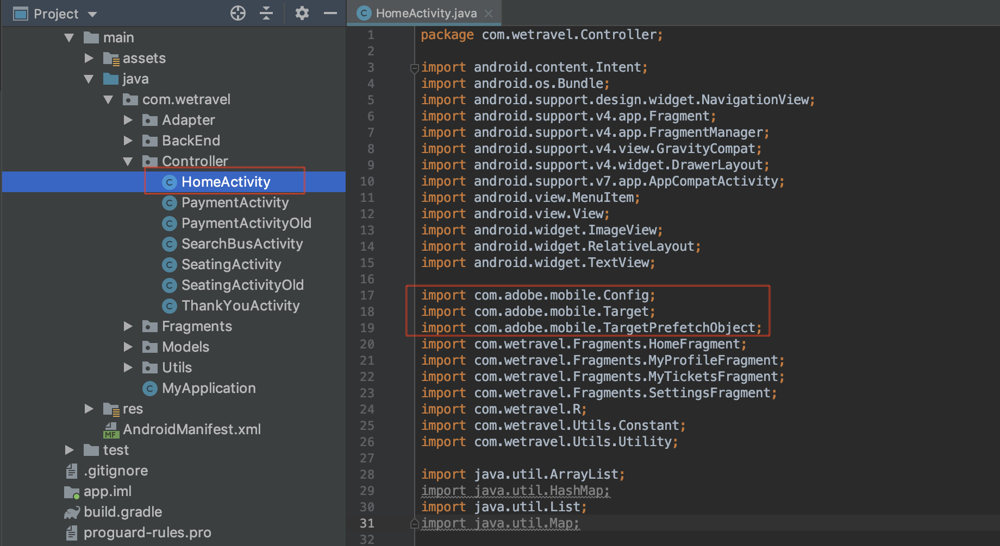

# Ajouter des demandes d&#39;Adobe Target

Le Adobe Mobile Services SDK (v4) fournit des méthodes et fonctionnalités d’Adobe Target qui vous permettent de personnaliser votre application avec différentes expériences pour différents utilisateurs. En règle générale, une ou plusieurs requêtes sont envoyées de l’application à l’Adobe Target pour récupérer le contenu personnalisé et mesurer l’impact de ce contenu.

Dans cette leçon, vous préparerez l’application We.Travel pour la personnalisation en implémentant [!DNL Target] des requêtes.

## Conditions préalables

Veillez à [télécharger et à mettre à jour l’exemple d’application](download-and-update-the-sample-app.md).

## Objectifs d&#39;apprentissage

À la fin de cette leçon, vous pourrez :

* Mettre en cache plusieurs [!DNL Target] offres (c’est-à-dire le contenu personnalisé) à l’aide d’une demande de prérécupération par lot
* Charger les [!DNL Target] emplacements prérécupérés
* Charger un [!DNL Target] emplacement en temps réel (non prérécupéré)
* Effacer les emplacements prérécupérés du cache
* Validation des requêtes prérécupérées et en temps réel

## Terminologie 

Vous trouverez ci-dessous quelques-uns des principaux termes de Cible que nous utiliserons dans le reste de ce didacticiel.

* **Demande :**  une requête réseau aux serveurs d&#39;Adobe Target
* **Offre :**  extrait de code ou autre contenu texte, défini dans l’interface [!DNL Target] utilisateur (ou avec l’API), qui est fourni dans la réponse. Généralement, JSON [!DNL Target] est utilisé dans les applications mobiles natives.
* **Emplacement :**  nom défini par l’utilisateur attribué à une requête, utilisé dans l’ [!DNL Target] interface pour associer des offres à des requêtes spécifiques.
* **Demande de lot :**  une seule requête incluant plusieurs emplacements
* **Prérécupérer la demande :**  une requête unique qui récupère les offres et les met en cache dans la mémoire pour une utilisation ultérieure dans l’application.
* **Demande de prérécupération par lot :**  une requête unique qui prérécupère des offres pour plusieurs emplacements
* **Audience :**  un groupe de visiteurs défini dans l&#39; [!DNL Target] interface ou partagé avec [!DNL Target] d&#39;autres applications Adobe (ex. &quot;visiteurs iPhone X&quot;, &quot;visiteurs in the California&quot;, &quot;First App Open&quot;)
* **Activité :**  un [!DNL Target] concept, défini dans l’interface [!DNL Target] utilisateur (ou avec l’API) qui lie les emplacements, les offres et les Audiences pour créer une expérience personnalisée.

## Ajouter une demande de prérécupération de lot

La première requête que nous allons implémenter dans We.Travel est une requête de prérécupération par lot avec deux [!DNL Target] emplacements sur l&#39;écran d&#39;accueil. Dans une leçon ultérieure, nous allons configurer des offres pour ces emplacements qui affichent des messages pour aider les nouveaux utilisateurs à travers le processus de réservation.

Une requête de prérécupération récupère [!DNL Target] le contenu le moins possible en mettant en cache la réponse du serveur d’Adobes Target (offre). Une requête de prérécupération par lot récupère et met en cache plusieurs offres, chacune étant associée à un emplacement différent. Tous les emplacements prérécupérés sont mis en cache sur le périphérique pour une utilisation ultérieure dans la session utilisateur. En prérécupérant plusieurs emplacements sur l’écran d’accueil, nous pouvons récupérer les offres à utiliser ultérieurement lorsque le visiteur navigue dans l’application. Pour plus d&#39;informations sur les méthodes de prérécupération, reportez-vous à la documentation [de](https://docs.adobe.com/content/help/en/mobile-services/android/target-android/c-mob-target-prefetch-android.html) prérécupération.

### Ajouter la demande de prérécupération du lot

Mettons à jour le contrôleur HomeActivity (le code source de l’écran d’accueil), qui se trouve sous application > main > java > com.wetravel > Controller. Nous allons ajouter les deux blocs de code en rouge :

Nous allons début avec le contrôleur HomeActivity (le code source de l’écran d’accueil), qui est situé sous application > main > java > com.wetravel > Controller.

Nous allons ajouter les deux blocs de code en rouge :


Faites défiler l’écran jusqu’à la fin du code de HomeActivity et ajoutez le code fourni ci-dessous après la `setHeader()` fonction et *remplacez* la `onResume()` fonction active :

```java
@Override
protected void onResume() {
    super.onResume();
    targetPrefetchContent();
}

public void targetPrefetchContent() {
    List<TargetPrefetchObject> prefetchList = new ArrayList<>();
    prefetchList.add(Target.createTargetPrefetchObject(Constant.wetravel_engage_home, null));
    prefetchList.add(Target.createTargetPrefetchObject(Constant.wetravel_engage_search, null));
    Target.TargetCallback<Boolean> prefetchStatusCallback = new Target.TargetCallback<Boolean>() {
        @Override
        public void call(final Boolean status) {
            HomeActivity.this.runOnUiThread(new Runnable() {
                @Override
                public void run() {
                    String cachingStatus = status ? "YES" : "NO";
                    System.out.println("Received Response from prefetch : " + cachingStatus);
                    setUp();

                }
            });
        }};
    Target.prefetchContent(prefetchList, null, prefetchStatusCallback);
}
```

Votre IDE vous avertira probablement que vous n&#39;avez pas les [!DNL Target] classes importées dans le fichier. Veillez à importer les [!DNL Target] classes en haut du contrôleur HomeActivity, comme indiqué en rouge ci-dessous :

```java
import com.adobe.mobile.Target;
import com.adobe.mobile.TargetPrefetchObject;
```



Vous verrez probablement également des erreurs pour &quot;Impossible de trouver la variable de symbole wetravel_engage_home&quot; et &quot;Impossible de trouver la variable de symbole wetravel_engage_search&quot;. Ajoutez-les au `Constant.java` fichier (dans l’application > src > main > java > com > wetravel > Utils) :

```java
public static final String wetravel_engage_home = "wetravel_engage_home";
public static final String wetravel_engage_search = "wetravel_engage_search";
```


### Explication du code de demande de prérécupération du lot

| Code | Description |
|--- |--- |
| `targetPrefetchContent()` | Fonction définie par l’utilisateur (ne faisant pas partie du SDK) qui utilise [!DNL Target] des méthodes pour récupérer et mettre en cache deux [!DNL Target] emplacements. |
| `prefetchContent()` | Méthode [!DNL Target] SDK qui envoie la demande de prérécupération |
| `Constant.wetravel_engage_home` | Nom de l’ [!DNL Target] emplacement prérécupéré qui affiche son contenu d’offre sur l’écran d’accueil |
| `Constant.wetravel_engage_search` | Nom de [!DNL Target] l’emplacement prérécupéré qui affiche son contenu d’offre sur l’écran des résultats de la recherche. Comme il s’agit d’un second emplacement dans la prérécupération, cette requête de prérécupération est appelée &quot;requête de prérécupération par lot&quot;. |
| setUp() | Fonction définie par l’utilisateur qui effectue le rendu de l’écran d’accueil de l’application une fois les [!DNL Target] offres prérécupérées |

### A propos de l&#39;asynchrone ou du synchrone

Avec le code que nous venons d&#39;implémenter, la demande de prérécupération est effectuée en tant qu&#39;appel de blocage synchrone, juste avant le rendu de l&#39;écran d&#39;accueil. Lorsque nous avons collé le nouveau code dans le contrôleur HomeActivity, nous avons déplacé l&#39;exécution de la `setUp()` fonction de la `onResume()` fonction jusqu&#39;à la demande de Cible. Cela peut s’avérer bénéfique dans les cas où vous souhaitez personnaliser le contenu lors de la première ouverture de l’application, car cela garantit que le contenu personnalisé provenant des serveurs de Cible a été renvoyé (ou dépassé) avant le rendu du premier écran. Pour autoriser le chargement asynchrone des requêtes (en arrière-plan), appelez simplement `setUp()` dans la `onCreate()` fonction.

### Valider la demande de prérécupération du lot

Recréez l’application et ouvrez l’émulateur Android. (Les captures d’écran suivantes utilisent le Pixel 2 sur Android Q version 9+, API niveau 29). La réponse de prérécupération doit se lire comme suit : &quot;réponse de prérécupération reçue&quot; :

Lors du rendu de l’écran d’accueil, la demande de prérécupération doit être chargée. Avec Logcat, filtrez pour [!DNL "Target"] afficher la demande et la réponse :


Si vous ne voyez pas de réponse positive, vérifiez les paramètres du `ADBMobileConfig.json` fichier et la syntaxe du code dans le fichier HomeActivity.

Deux emplacements sont désormais mis en cache sur le périphérique. Les noms des emplacements seront bientôt chargés à l’ [!DNL Target] interface, où ils peuvent être sélectionnés dans divers menus déroulants lorsque vous les utilisez dans une activité.

### Ajouter des requêtes de chargement pour chaque emplacement mis en cache

Maintenant que les emplacements sont prérécupérés et que leurs réponses sont mises en cache sur le périphérique, ajoutons la `Target.loadRequest()` méthode qui récupère le contenu de l&#39;offre du cache afin que vous puissiez l&#39;utiliser pour mettre à jour votre application. Nous allons ajouter une nouvelle méthode personnalisée appelée `engageMessage()` qui s&#39;exécutera avec la demande de prérécupération. `engageMessage()` appellera `Target.loadRequest()`. `engageMessage()` s’exécute avant `setUp()` de s’assurer que la demande de chargement est appelée avant la configuration de l’écran.

Tout d’abord, ajoutez l’ `engageMessage()` appel &amp; méthode pour l’emplacement wetravel_engage_home dans HomeActivity :


Voici le code mis à jour :

```java
    public void targetPrefetchContent() {
        List<TargetPrefetchObject> prefetchList = new ArrayList<>();
        Map<String, Object> params1;
        params1 = new HashMap<String, Object>();
        params1.put("at_property", "your at_property value goes here");
        prefetchList.add(Target.createTargetPrefetchObject(Constant.wetravel_engage_home, params1));
        prefetchList.add(Target.createTargetPrefetchObject(Constant.wetravel_engage_search, params1));
        Target.TargetCallback<Boolean> prefetchStatusCallback = new Target.TargetCallback<Boolean>() {
            @Override
            public void call(final Boolean status) {
                HomeActivity.this.runOnUiThread(new Runnable() {
                    @Override
                    public void run() {
                        String cachingStatus = status ? "YES" : "NO";
                        System.out.println("Received Response from prefetch : " + cachingStatus);
                        engageMessage();
                        setUp();
                    }
                });
            }};
        Target.prefetchContent(prefetchList, null, prefetchStatusCallback);
    }
    public void engageMessage() {
        Target.loadRequest(Constant.wetravel_engage_home, "", null, null, null,
            new Target.TargetCallback<String>(){
                @Override
                public void call(final String s) {
                    runOnUiThread(new Runnable() {
                        @Override
                        public void run() {
                            System.out.println("Engage Message : " + s);
                            if(s != null && !s.isEmpty()) Utility.showToast(getApplicationContext(), s);
                        }
                    });
                }
            });
    }
```

Ajoutez maintenant l&#39; `engageMessage()` appel &amp; méthode pour l&#39;emplacement wetravel_engage_search dans SearchBusActivity. Notez que l’ `engageMessage()` appel est défini dans la `onResume()` méthode avant l’appel à `setUpSearch()` afin qu’il s’exécute avant la configuration de l’écran :


Voici le code mis à jour :

```java
    @Override
    public void onResume() {
        super.onResume();
        engageMessage();
        setUpSearch();
    }
    public void engageMessage() {
        Target.loadRequest(Constant.wetravel_engage_search, "", null, null, null,
                new Target.TargetCallback<String>(){
                    @Override
                    public void call(final String s) {
                        runOnUiThread(new Runnable() {
                            @Override
                            public void run() {
                                System.out.println("Engage Message : " + s);
                                if(s != null && !s.isEmpty()) Utility.showToast(getApplicationContext(), s);
                            }
                        });
                    }
                });
    }
```

Puisque vous venez d&#39;ajouter des méthodes de Cible à SearchBusActivity, veillez à importer les [!DNL Target] classes :

```java
import com.adobe.mobile.Target;
import com.adobe.mobile.TargetPrefetchObject;
```

## Ajouter une requête en temps réel

La prochaine requête que nous ajouterons à l&#39;application sera une requête en temps réel sur l&#39;écran de remerciement. Par &quot;temps réel&quot;, nous voulons dire que la demande sera faite et que la réponse sera appliquée immédiatement (et non mise en cache pour plus tard). Dans une leçon ultérieure, nous créerons une expérience à l’aide de cette demande, qui est personnalisée en fonction de la destination du voyage de l’utilisateur.

Alors ajoutons une requête en temps réel sur l&#39;écran de remerciement. Dans le fichier ThankYouActivity, nous apporterons les modifications indiquées en rouge :


Accédez à la fin du fichier ThankYouActivity. Mettez en commentaire les trois lignes de la `getRecommandations()` fonction et ajoutez l’appel de la `targetLoadRequest()` fonction :

```java
// AppDialogs.dialogLoaderHide();
// recommandations.addAll(recommandation.recommandations);
// recommandationbAdapter.notifyDataSetChanged();
```

Ajoutez cette ligne de code à la `getRecommandations()` fonction :

```java
targetLoadRequest(recommandation.recommandations);
```

Maintenant, nous devons définir la `targetLoadRequest()` fonction :


Ajoutez ce bloc de code après la `filterRecommendationBasedOnOffer()` fonction :

```java
public void targetLoadRequest(final ArrayList<Recommandation> recommandations) {
    Target.loadRequest(Constant.wetravel_context_dest, "", null, null, null, new Target.TargetCallback<String>() {
        @Override
        public void call(final String response) {
            try {
                runOnUiThread(new Runnable() {
                    @Override
                    public void run() {
                        AppDialogs.dialogLoaderHide();
                        filterRecommendationBasedOnOffer(recommandations, response);
                        recommandationbAdapter.notifyDataSetChanged();
                    }
                });
            } catch (Exception e) {
                e.printStackTrace();
            }
        }
    });
}
```

Puisque vous venez d&#39;ajouter des méthodes de Cible à l&#39;activité ThankYouActivity, veillez à importer les classes de Cible :

```java
import com.adobe.mobile.Target;
import com.adobe.mobile.TargetPrefetchObject;
```

### Explication du code targetLoadRequest()

| Code | Description |
|--- |--- |
| `targetLoadRequest()` | Fonction définie par l’utilisateur (ne faisant pas partie du SDK) qui déclenche `Target.loadRequest()` le chargement et affiche l’emplacement wetravel_context_dest. |
| `Target.loadRequest()` | Méthode du SDK qui envoie la requête au serveur de Cible. |
| Constant.wetravel_context_dest | Nom de l’emplacement affecté à la demande que nous utiliserons ultérieurement lors de la création de l’activité dans l’ [!DNL Target] interface. |
| `filterRecommendationBasedOnOffer()` | Fonction définie par l’utilisateur dans l’application qui extrait l’offre de l’emplacement de la réponse de la Cible et décide comment l’application doit changer en fonction du contenu de l’offre. |
| `recommandations.addAll()` | Fonction définie par l&#39;utilisateur dans l&#39;application qui s&#39;exécutait par défaut lors du chargement de l&#39;écran de remerciement, mais qui s&#39;exécute désormais après réception et analyse de la réponse de Cible par `filterRecommendationBasedOnOffer()` |

Il s&#39;agissait d&#39;une mise à jour plus sophistiquée que nous avons faite à l&#39;application à l&#39;époque avec la demande que nous avons ajoutée à l&#39;écran d&#39;accueil, donc prenons un moment pour revoir ce que nous avons fait :

1. Nous avons interrompu le comportement précédent de l&#39;application consistant à afficher trois promotions par défaut, en commentant les lignes de code.
1. Nous avons plutôt demandé à l&#39;application d&#39;exécuter une nouvelle fonction, que nous avons arbitrairement appelée targetLoadRequest
1. Nous avons défini la `targetLoadRequest` fonction pour envoyer une requête à la Cible à l&#39;aide de la méthode Cible.loadRequest et nous avons immédiatement exécuté la `filterRecommendationBasedOnOffer()` fonction lorsque la réponse de l&#39; [!DNL Target] offre est reçue.
1. La `filterRecommendationBasedOnOffer()` fonction interprète la réponse et décide quelles promotions doivent être appliquées à l&#39;écran.

Il s’agit d’un modèle d’utilisation très courant lors de l’utilisation [!DNL Target] dans les applications mobiles.  Il est à la fois très puissant, en ce sens que vous pouvez personnaliser presque tous les aspects de votre application mobile. Il nécessite également une coordination entre le code de l&#39;application et les offres que nous définirons plus tard dans l&#39; [!DNL Target] interface. En raison de cette coordination, certains cas d’utilisation de la personnalisation peuvent nécessiter que vous mettiez à jour votre application dans la boutique d’applications afin de lancer l’activité.

### Valider la requête en temps réel

Ouvrez l’émulateur Android et suivez toutes les étapes pour réserver un voyage : Accueil > Résultats de la recherche de bus > Sélection de sièges, options de paiement (toute option de paiement avec des données vides fonctionnera).

Sur l’écran de remerciement final, regardez Logcat pour la réponse. La réponse doit se lire comme suit : &quot;Le contenu par défaut a été renvoyé pour &quot;wetravel_context_dest&quot; :


## Suppression des emplacements prérécupérés du cache

Il peut arriver que des emplacements prérécupérés doivent être effacés pendant une session. Par exemple, lorsqu’une réservation se produit, il est logique d’effacer les emplacements mis en cache puisque l’utilisateur est maintenant &quot;engagé&quot; et comprend le processus de réservation. S&#39;ils réservent un autre voyage au cours de leur session, ils n&#39;auront pas besoin des emplacements d&#39;origine sur l&#39;écran d&#39;accueil et l&#39;écran des résultats de recherche pour guider leur réservation. Il serait plus logique d&#39;effacer les emplacements du cache et de prérécupérer les nouvelles offres pour peut-être une deuxième réservation à rabais ou un autre scénario pertinent. La logique peut être ajoutée à l’écran d’accueil et à l’écran des résultats de la recherche pour prévisualiser de nouveaux emplacements si une réservation a eu lieu au cours de la session.

Pour cet exemple, nous allons simplement effacer les emplacements prédéfinis de la session lors de la réservation. Pour ce faire, appelez la `Target.clearPrefetchCache()` fonction. Définissez la fonction à l’intérieur de la `targetLoadRequest()` fonction comme indiqué ci-dessous :

```java
Target.clearPrefetchCache()
```


Félicitations ! Votre application dispose désormais de la structure de personnalisation. Dans la leçon suivante, nous améliorerons nos capacités de personnalisation en ajoutant des paramètres à ces emplacements.

**[SUIVANT : &quot;Ajouter les paramètres&quot; >](add-parameters.md)**
