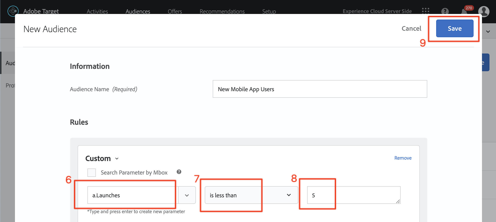

# Création d’audiences et d’offres dans Adobe Target

Dans cette leçon, nous allons nous intéresser à l&#39;interface [!DNL Target] et créer des audiences et des offres pour les trois emplacements que nous avons implémentés dans les leçons précédentes.

## Objectifs d’apprentissage

À la fin de cette leçon, vous serez en mesure de :

* Création d’audiences dans Adobe Target
* Création d’offres dans Adobe Target

Plus précisément, dans cette leçon, nous allons créer les audiences et les offres nécessaires pour réaliser les cas d’utilisation de la personnalisation définis au début du tutoriel. Nous voulons utiliser les écrans Accueil et Recherche pour aider les utilisateurs de l&#39;application à réserver leurs voyages, et nous voulons utiliser l&#39;écran de remerciement pour afficher quelques promotions pertinentes en fonction de la destination de l&#39;utilisateur. Voici un tableau représentant ce que nous allons créer dans cette leçon pour chaque emplacement :

| Emplacement | Public | Offre |
| --- | --- | --- |
| wetravel_engage_home | Nouveaux utilisateurs de l’application mobile | « Sélectionnez votre origine et votre destination pour rechercher les itinéraires de bus disponibles » |
| wetravel_engage_search | Nouveaux utilisateurs de l’application mobile | « Utilisez des filtres pour affiner vos résultats de recherche » |
| wetravel_engage_home | Utilisateurs d’applications mobiles récurrents | « Bienvenue à nouveau ! Utilisez le code promotionnel BACK30 lors du passage en caisse pour obtenir une remise de 10 %. » |
| wetravel_engage_search | Utilisateurs d’applications mobiles récurrents | contenu par défaut |
| wetravel_context_dest | Destination : San Diego | DJ |
| wetravel_context_dest | Destination : Los Angeles | « Universel » |

## Sélectionnez Votre Workspace

Si votre société utilise Propriétés et Espaces de travail pour définir des limites en matière de personnalisation des applications et des sites web (et que vous avez implémenté le paramètre at_property dans la dernière leçon), vous devez d’abord vous assurer que vous vous trouvez dans le bon Workspace avant de poursuivre cette leçon. Si vous n’utilisez pas les propriétés et les espaces de travail, ignorez simplement cette étape. Sélectionnez le Workspace que vous avez utilisé dans la leçon précédente pour copier la valeur at_property :

## Création d’audiences

Créons maintenant les audiences que nous utiliserons pour personnaliser l’application.

### Création d’une audience pour de nouveaux utilisateurs

Les audiences Adobe Target sont utilisées pour identifier des groupes spécifiques de visiteurs. Les offres peuvent ensuite être ciblées vers ces groupes spécifiques. Pour les deux premiers emplacements, nous utiliserons une audience « Nouveaux utilisateurs » :

1. Cliquez sur **[!UICONTROL Audiences]** dans le volet de navigation supérieur.
1. Cliquez sur le bouton **[!UICONTROL Create Audience]** .
   

1. Saisissez **[!UICONTROL New Mobile App Users]** comme nom d’audience.
1. Sélectionnez **[!UICONTROL Add Rule]**.
1. Sélectionnez une règle de **[!UICONTROL Custom]**.
   

1. Sélectionnez **[!UICONTROL a.Launches]**.
1. Sélectionnez **[!UICONTROL is less than]**.
1. Entrez **5**.
1. Enregistrez la nouvelle audience.
   

### Créer une audience pour les utilisateurs récurrents

Suivez les mêmes étapes que celles répertoriées ci-dessus pour créer une audience pour les utilisateurs et utilisatrices récurrents.

1. Nommez l’audience _Utilisateurs d’applications mobiles récurrents_.
1. Utilisez **[!UICONTROL a.Launches is greater than or equal to 5]** comme règle personnalisée.
1. Enregistrez la nouvelle audience.

   

>[!NOTE]
>
>Toutes les mesures et dimensions de cycle de vie collectées dans le SDK mobile [!DNL Target] sont précédées du préfixe « a » (par exemple, a.Launches) et sont disponibles dans l’option « Personnalisé » du menu déroulant. Elles peuvent être utilisées pour créer des audiences.

### Créer une audience pour les utilisateurs qui réservent un voyage à San Diego

Ensuite, nous allons créer quelques audiences pour certaines des destinations proposées par l’application We.Travel. Dans la dernière leçon, nous avons transmis la destination en tant que paramètre d’emplacement dans la requête d’emplacement wetravel_context_dest. Ce paramètre est disponible dans l’option « Personnalisé » du menu déroulant.

>[!NOTE]
>
>Si un paramètre que vous prévoyez de voir dans la liste déroulante Personnalisé n’apparaît pas dans l’interface [!DNL Target], vérifiez à nouveau qu’il est bien transmis dans la requête. Si vous avez vérifié que se trouve dans la requête, mais qu’n’a pas été chargé en différé dans l’interface [!DNL Target], vous pouvez simplement saisir le nom du paramètre et appuyer sur Entrée pour continuer à définir votre audience

1. Nommez l’audience _Destination : San Diego_.
1. Utilisez une règle personnalisée avec cette définition : _locationDest contient San Diego_.
1. Enregistrez la nouvelle audience.

   

### Créer une audience pour les utilisateurs qui réservent un voyage à Los Angeles

1. Nommez l’audience _Destination : Los Angeles_
1. Utilisez une règle personnalisée avec cette définition : _locationDest contient Los Angeles_
1. Enregistrez la nouvelle audience.

## Création D’Offres

Créons maintenant des offres pour afficher ces messages. Pour rappel, les offres sont des fragments de code/contenu, qui sont diffusés dans la réponse [!DNL Target]. Ils sont le plus souvent créés dans l’interface utilisateur d’[!DNL Target], mais peuvent également être créés via l’API ou à l’aide de l’intégration des fragments d’expérience à Adobe Experience Manager. Dans les applications mobiles, les offres JSON sont courantes. Dans ce tutoriel, nous utiliserons les offres d’HTML, qui peuvent être utilisées pour diffuser n’importe quel contenu en texte brut (y compris JSON) dans l’application.

### Créer l’offre pour les nouveaux utilisateurs

Tout d’abord, créons des offres pour les messages aux nouveaux utilisateurs :

1. Cliquez sur **[!UICONTROL Offers]** dans le volet de navigation supérieur.
1. Cliquez sur **[!UICONTROL Create]**.
1. Sélectionnez **[!UICONTROL HTML Offer]**.

   

1. Nommez l’offre _Accueil : engagez de nouveaux utilisateurs_.
1. Saisissez _Sélectionner le Source et la Destination pour rechercher les bus disponibles_ comme code.
1. Enregistrez la nouvelle offre.

   

### Créer l’offre pour les utilisateurs récurrents

Créons maintenant l’offre unique pour les utilisateurs et utilisatrices récurrents (la seconde offre sera du contenu par défaut, qui s’affichera comme rien) :

1. Nommez l’offre _Accueil : utilisateurs récurrents_.
1. Entrez _Bienvenue à nouveau ! Utilisez le code promotionnel BACK30 lors du passage en caisse pour obtenir une réduction de 10 %._ comme code HTML.
1. Enregistrez la nouvelle offre.

   

### Création de l’offre San Diego

Lorsque « DJ » est renvoyé à l&#39;activité Merci, la logique de la fonction filterRecommendationBasedOnOffer() affiche une bannière pour « Rock Night with DJ SAM » :

1. Nommez l&#39;offre _Promotion pour San Diego_.
1. Saisissez _DJ_ comme code HTML.
1. Enregistrez la nouvelle offre.

### Créer une offre pour les utilisateurs se rendant à Los Angeles

Lorsque « Universal » est renvoyé à l’activité de remerciement, la logique de la fonction filterRecommendationBasedOnOffer() affiche une bannière pour « Universal Studios » :

1. Nommez l&#39;offre _Promotion pour Los Angeles_.
1. Saisissez _Universel_ comme code HTML.
1. Enregistrez la nouvelle offre.

## Conclusion

Nous avons maintenant nos audiences et offres. Dans la leçon suivante, nous allons créer des activités qui lient les emplacements, les audiences et les offres pour créer des expériences personnalisées !

**[SUIVANT : « Personnaliser les mises en page » >](personalize-layouts.md)**
