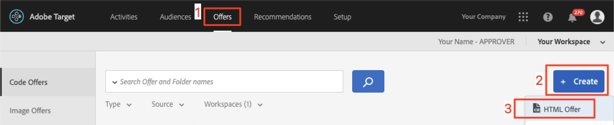

# Création d’audiences et d’offres dans Adobe Target

Dans cette leçon, nous allons passer à l’interface [!DNL Target] et créer des audiences et des offres pour les trois emplacements que nous avons implémentés dans les leçons précédentes.

## Objectifs d’apprentissage

À la fin de cette leçon, vous serez en mesure de :

* Création d’audiences dans Adobe Target
* Créer des offres dans Adobe Target

Plus précisément, dans cette leçon, nous allons créer les audiences et les offres nécessaires pour réaliser les cas d’utilisation de la personnalisation définis au début du tutoriel. Nous voulons utiliser les écrans Accueil et Recherche pour aider les utilisateurs de l’application à réserver leurs voyages, et nous voulons utiliser l’écran de remerciement pour afficher certaines promotions pertinentes en fonction de la destination de l’utilisateur. Voici un tableau représentant ce que nous allons créer dans cette leçon pour chaque emplacement :

| Emplacement | Public | Offre |
| --- | --- | --- |
| wetravel_engage_home | Nouveaux utilisateurs d’applications mobiles | &quot;Sélectionnez votre origine et votre destination pour rechercher les itinéraires de bus disponibles&quot; |
| wetravel_engage_search | Nouveaux utilisateurs d’applications mobiles | &quot;Utiliser des filtres pour affiner vos résultats de recherche&quot; |
| wetravel_engage_home | Renvoi d’utilisateurs d’applications mobiles | &quot;Bienvenue de retour ! Utilisez le code promotionnel BACK30 lors du passage en caisse pour bénéficier d’une remise de 10 %.&quot; |
| wetravel_engage_search | Renvoi d’utilisateurs d’applications mobiles | contenu par défaut |
| wetravel_context_dest | Destination : San Diego | &quot;DJ&quot; |
| wetravel_context_dest | Destination : Los Angeles | &quot;Universel&quot; |

## Sélectionner votre espace de travail

Si votre entreprise utilise les propriétés et les espaces de travail pour établir des limites de personnalisation des applications et des sites web (et que vous avez implémenté le paramètre at_property dans la dernière leçon), vous devez d’abord vous assurer que vous êtes dans l’espace de travail approprié avant de poursuivre cette leçon. Si vous n’utilisez pas Propriétés et espaces de travail, ignorez simplement cette étape. Sélectionnez l’ espace de travail que vous avez utilisé dans la leçon précédente pour copier la valeur at_property :

## Création d’audiences

Maintenant, créons les audiences que nous utiliserons pour personnaliser l’application.

### Création d’une audience pour les nouveaux utilisateurs

Les audiences Adobe Target permettent d’identifier des groupes de visiteurs spécifiques. Les offres peuvent ensuite être ciblées sur ces groupes spécifiques. Pour les deux premiers emplacements, nous utiliserons une audience &quot;Nouveaux utilisateurs&quot; :

1. Cliquez sur **[!UICONTROL Audiences]** dans le volet de navigation supérieur.
1. Cliquez sur le bouton **[!UICONTROL Créer une audience]** .
   

1. Saisissez **[!UICONTROL Nouveaux utilisateurs d’applications mobiles]** comme nom d’audience.
1. Sélectionnez **[!UICONTROL Ajouter une règle]**.
1. Sélectionnez une règle **[!UICONTROL Personnalisée]**.
   

1. Sélectionnez **[!UICONTROL a.Launches]**.
1. Sélectionnez **[!UICONTROL est inférieur à]**.
1. Saisissez **5**.
1. Enregistrez la nouvelle audience.
   

### Création d’une audience pour les utilisateurs récurrents

Suivez les mêmes étapes que celles répertoriées ci-dessus pour créer une audience destinée aux utilisateurs récurrents.

1. Nommez l’audience _Utilisateurs de l’application mobile récurrents_.
1. Utilisez **[!UICONTROL a.Launches est supérieur ou égal à 5]** comme règle personnalisée.
1. Enregistrez la nouvelle audience.

   

>[!NOTE]
>
>Toutes les mesures et dimensions de cycle de vie collectées dans le SDK mobile [!DNL Target] sont précédées de &quot;a&quot; (par exemple, a.Launches) et sont disponibles dans l’option &quot;Personnalisé&quot; du menu déroulant et peuvent être utilisées pour créer des audiences.

### Créer une audience pour les utilisateurs réservant un voyage à San Diego

Nous allons ensuite créer quelques audiences pour certaines des destinations proposées par l’application We.Travel. Dans la dernière leçon, nous avons transmis la destination en tant que paramètre d’emplacement dans la demande d’emplacement wetravel_context_dest. Ce paramètre est disponible dans l’option &quot;Personnalisé&quot; du menu déroulant.

>[!NOTE]
>
>Si un paramètre que vous prévoyez de voir dans la liste déroulante Personnalisé n’apparaît pas dans l’interface [!DNL Target], vérifiez qu’il est bien transmis dans la requête. Si vous avez vérifié que figure dans la requête, mais que n’a pas été chargé de manière différée dans l’interface [!DNL Target] , vous pouvez simplement saisir le nom du paramètre et appuyer sur Entrée pour continuer à définir votre audience.

1. Nommez l’audience _Destination : San Diego_.
1. Utilisez une règle personnalisée avec cette définition : _locationDest contient San Diego_.
1. Enregistrez la nouvelle audience.

   

### Créer une audience pour les utilisateurs réservant un voyage à Los Angeles

1. Nommez l’audience _Destination : Los Angeles_
1. Utilisez une règle personnalisée avec cette définition : _locationDest contient Los Angeles_
1. Enregistrez la nouvelle audience.

## Création d’offres

Maintenant, créons des offres pour afficher ces messages. Pour rappel, les offres sont des fragments de code/contenu, qui sont fournis dans la réponse [!DNL Target]. Elles sont le plus souvent créées dans l’interface utilisateur [!DNL Target], mais peuvent également être créées via l’API ou à l’aide de l’intégration des fragments d’expérience avec Adobe Experience Manager. Dans les applications mobiles, les offres JSON sont courantes. Dans ce tutoriel, nous utiliserons des offres de HTML, qui peuvent être utilisées pour diffuser n’importe quel contenu en texte brut (y compris JSON) dans l’application.

### Création de l’offre pour les nouveaux utilisateurs

Commençons par créer des offres pour les messages destinés aux nouveaux utilisateurs :

1. Cliquez sur **[!UICONTROL Offres]** dans le volet de navigation supérieur.
1. Cliquez sur **[!UICONTROL Créer]**.
1. Sélectionnez **[!UICONTROL Offre de HTML]**.

   

1. Nommez l&#39;offre _Accueil : Interagir avec les nouveaux utilisateurs_.
1. Saisissez _Sélectionnez Source et destination pour rechercher les bus disponibles_ comme code.
1. Enregistrez la nouvelle offre.

   

### Création de l’offre pour les utilisateurs récurrents

Maintenant, créons l’offre unique pour les utilisateurs récurrents (la deuxième offre sera le contenu par défaut, qui ne s’affichera en rien) :

1. Nommez l&#39;offre _Accueil : Utilisateurs récurrents_.
1. Entrez _Bienvenue de retour ! Utilisez le code promotionnel BACK30 lors du passage en caisse pour obtenir une remise de 10 %._ comme code de HTML.
1. Enregistrez la nouvelle offre.

   

### Création de l’offre San Diego

Lorsque &quot;DJ&quot; est renvoyé à l’activité ThankYou, la logique de la fonction filterRecommendationsBasedOnOffer() affiche une bannière pour &quot;Rock Night with DJ SAM&quot; :

1. Nommez l’offre _Promotion pour San Diego_.
1. Saisissez _DJ_ comme code de HTML.
1. Enregistrez la nouvelle offre.

### Créer une offre pour les utilisateurs se rendant à Los Angeles

Lorsque &quot;Universal&quot; est renvoyé à l’activité ThankYou, la logique de la fonction filterRecommendationsBasedOnOffer() affiche une bannière pour &quot;Universal Studios&quot; s’affiche :

1. Nommez l’offre _Promotion pour Los Angeles_.
1. Saisissez _Universal_ comme code de HTML.
1. Enregistrez la nouvelle offre.

## Conclusion

Nous avons maintenant nos audiences et nos offres. Dans la leçon suivante, nous allons créer des activités qui lient les emplacements, les audiences et les offres afin de créer les expériences personnalisées.

**[SUIVANT : &quot;Personnaliser les mises en page&quot; >](personalize-layouts.md)**
