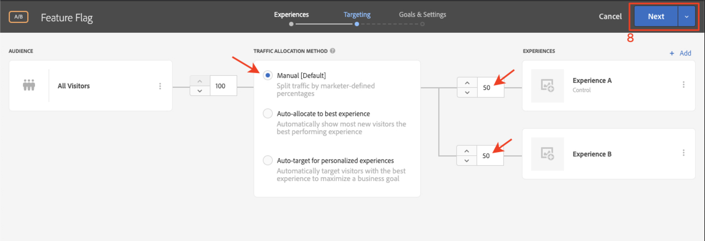

# Marquage des fonctionnalités

Les propriétaires de produits d’applications mobiles ont besoin de la flexibilité nécessaire pour déployer de nouvelles fonctionnalités dans leur application sans avoir à investir dans plusieurs versions d’applications. Il peut également souhaiter déployer progressivement les fonctionnalités sur un pourcentage de la base d’utilisateurs, afin de tester l’efficacité. Adobe Target peut être utilisé pour tester des fonctionnalités de l’expérience utilisateur telles que la couleur, la copie, les boutons, le texte et les images, et fournir ces fonctionnalités à des audiences spécifiques.

Dans cette leçon, nous allons créer une offre &quot;indicateur de fonctionnalité&quot; qui peut être utilisée comme déclencheur pour activer des fonctionnalités d’application spécifiques.

## Objectifs d’apprentissage

À la fin de cette leçon, vous serez en mesure de :

* Ajout d’un nouvel emplacement à la requête de prérécupération par lots
* Créez une activité [!DNL Target] avec une offre qui sera utilisée comme indicateur de fonctionnalité.
* Chargement et validation de l’offre d’indicateur de fonctionnalité dans votre application

## Ajout d’un nouvel emplacement à la requête de prérécupération dans l’activité d’accueil

Dans l’application de démonstration de nos leçons précédentes, nous allons ajouter un nouvel emplacement appelé &quot;wetravel_feature_flag_recs&quot; à la requête de prérécupération dans l’activité d’accueil et la charger à l’écran avec une nouvelle méthode Java.

>[!NOTE]
>
>L’un des avantages de l’utilisation d’une requête de prérécupération est que l’ajout d’une nouvelle requête n’ajoute aucune surcharge réseau supplémentaire et n’entraîne pas de charge supplémentaire, car la requête est incluse dans la requête de prérécupération.

Vérifiez tout d’abord que la constante wetravel_feature_flag_recs est ajoutée dans le fichier Constant.java :


Voici le code :

```java
public static final String wetravel_feature_flag_recs = "wetravel_feature_flag_recs";
```

Ajoutez maintenant l’emplacement à la requête de prérécupération et chargez une nouvelle fonction appelée `processFeatureFlags()` :


Voici le code complet mis à jour :

```java
public void targetPrefetchContent() {
    List<TargetPrefetchObject> prefetchList = new ArrayList<>();

    Map<String, Object> params1;
    params1 = new HashMap<String, Object>();
    params1.put("at_property", "7962ac68-17db-1579-408f-9556feccb477");

    prefetchList.add(Target.createTargetPrefetchObject(Constant.wetravel_engage_home, params1));
    prefetchList.add(Target.createTargetPrefetchObject(Constant.wetravel_engage_search, params1));
    prefetchList.add(Target.createTargetPrefetchObject(Constant.wetravel_feature_flag_recs, params1));

    Target.TargetCallback<Boolean> prefetchStatusCallback = new Target.TargetCallback<Boolean>() {
        @Override
        public void call(final Boolean status) {
            HomeActivity.this.runOnUiThread(new Runnable() {
                @Override
                public void run() {
                    String cachingStatus = status ? "YES" : "NO";
                    System.out.println("Received Response from prefetch : " + cachingStatus);
                    engageMessage();
                    processFeatureFlags();
                    setUp();

                }
            });
        }};
    Target.prefetchContent(prefetchList, null, prefetchStatusCallback);
}

public void processFeatureFlags() {
    Target.loadRequest(Constant.wetravel_feature_flag_recs, "", null, null, null,
            new Target.TargetCallback<String>(){
                @Override
                public void call(final String s) {
                    runOnUiThread(new Runnable() {
                        @Override
                        public void run() {
                            System.out.println("Feature Flags : " + s);
                            if(s != null && !s.isEmpty()) {
                                //enable or disable features
                            }
                        }
                    });
                }
            });
}
```

### Validation de la requête d’indicateur de fonctionnalité

Une fois le code ajouté, exécutez l’émulateur sur l’activité d’accueil et regardez Logcat pour la réponse mise à jour :


## Création d’une offre JSON d’indicateur de fonctionnalité

Nous allons maintenant créer une offre JSON simple qui servira d’indicateur ou de déclencheur pour une audience spécifique : l’audience qui recevra le déploiement de la fonctionnalité dans son application. Dans l’interface [!DNL Target], créez une offre :


Nommons-le &quot;Feature Flag v1&quot; avec la valeur {&quot;enable&quot;:1}


## Création d’une activité

Créons maintenant une activité de test A/B avec cette offre. Pour obtenir des instructions détaillées sur la création d’une activité, reportez-vous à la leçon précédente. L’activité n’aura besoin que d’une seule audience pour cet exemple. Dans un scénario actif, vous pouvez créer des audiences personnalisées spécifiques pour des déploiements de fonctionnalités spécifiques, puis définir l’activité pour utiliser ces audiences. Dans cet exemple, nous allons simplement affecter le trafic 50/50 (50 % aux visiteurs qui verraient les mises à jour des fonctionnalités et 50 % aux visiteurs qui verraient une expérience standard). Voici la configuration de l’activité :

1. Nommez l’activité &quot;Indicateur de fonctionnalité&quot;.
1. Sélectionnez l’emplacement &quot;wetravel_feature_flag_recs&quot;
1. Remplacez le contenu par l’offre JSON &quot;Feature Flag v1&quot;

   

1. Cliquez sur **[!UICONTROL Add Experience]** pour ajouter l’expérience B.
1. Laissez l’emplacement &quot;wetravel_feature_flag_recs&quot;
1. Laissez **[!UICONTROL Default Content]** pour le contenu
1. Cliquez sur **[!UICONTROL Next]** pour accéder à l’écran [!UICONTROL Targeting].

   

1. Sur l’écran [!UICONTROL Targeting], vérifiez que la méthode [!UICONTROL Traffic Allocation] est définie sur le paramètre par défaut (Manuel) et que chaque expérience possède l’allocation de 50 % par défaut. Sélectionnez **[!UICONTROL Next]** pour passer à **[!UICONTROL Goals & Settings]**.

   

1. Définissez le **[!UICONTROL Primary Goal]** sur **[!UICONTROL Conversion]**.
1. Définissez l’action sur **[!UICONTROL Viewed an Mbox]**. Nous utiliserons l’emplacement &quot;wetravel_context_dest&quot; (puisque cet emplacement se trouve sur l’écran de confirmation, nous pouvons l’utiliser pour voir si la nouvelle fonctionnalité génère plus de conversions).
1. Cliquez sur **[!UICONTROL Save & Close]**.

   

activer l’activité ;

## Validation de l’activité d’indicateur de fonctionnalité

Maintenant, utilisez l’émulateur pour vérifier la requête. Puisque nous définissons le ciblage à 50 % des utilisateurs, 50 % des utilisateurs verront la réponse de l’indicateur de fonctionnalité contenir la valeur `{enable:1}`.


Si vous ne voyez pas la valeur `{enable:1}`, cela signifie que vous n’avez pas été ciblé pour l’expérience. En tant que test temporaire, pour forcer l’affichage de l’offre, vous pouvez :

1. Désactivez l’activité.
1. Remplacez l’affectation du trafic par 100 % sur la nouvelle expérience de fonctionnalité.
1. Enregistrez et réactivez.
1. Effacez les données de votre émulateur, puis redémarrez l’application.
1. L’offre doit maintenant renvoyer la valeur `{enable:1}`.

Dans un scénario en direct, la réponse `{enable:1}` peut être utilisée pour activer une logique plus personnalisée dans votre application afin d’afficher l’ensemble de fonctionnalités spécifique que vous souhaitez afficher pour votre audience cible.

## Conclusion

Beau travail ! Vous disposez désormais des compétences nécessaires pour déployer des fonctionnalités vers des audiences d’utilisateurs spécifiques.
