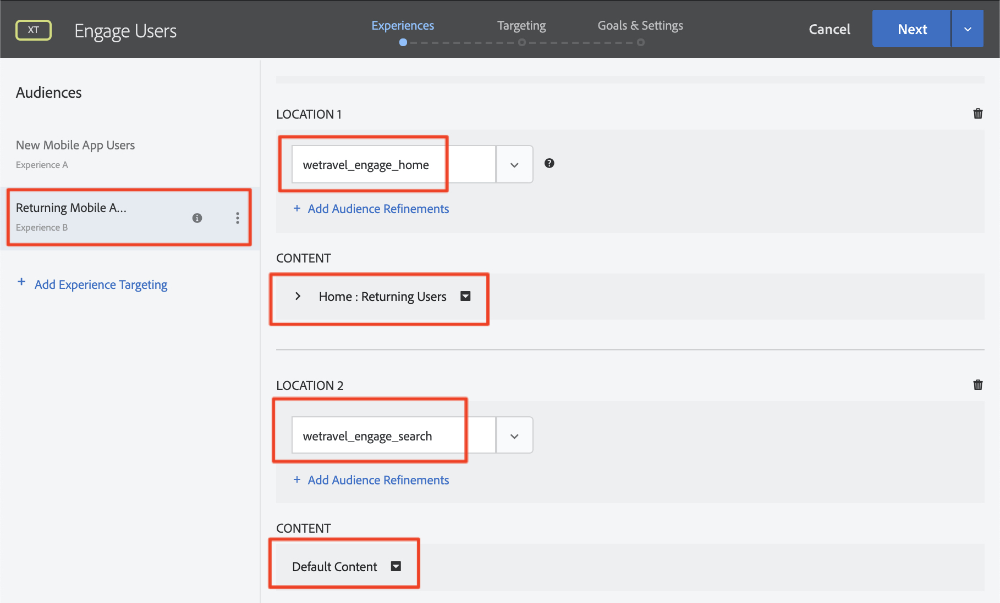
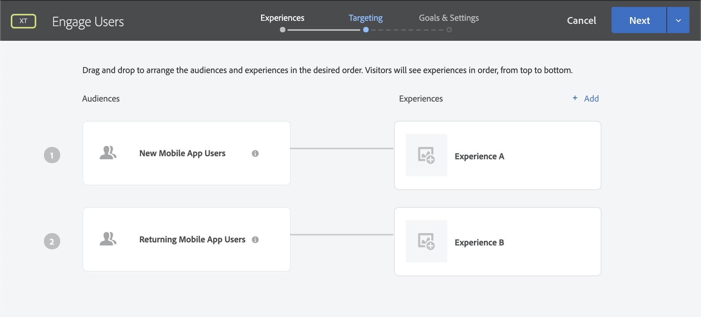
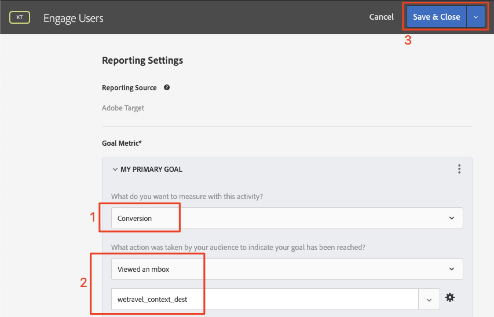
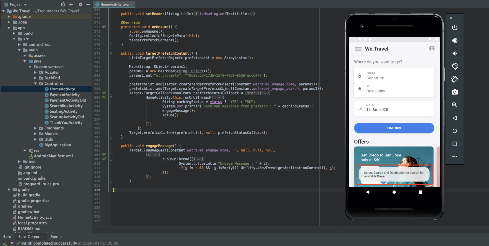

# Personnalisation des mises en page

Il est maintenant temps de tout rassembler et créer des expériences personnalisées. Une _activité_ est le mécanisme [!DNL Target] qui relie les emplacements, les audiences et les offres ensemble, de sorte que lorsque la demande est effectuée à partir de l’application, [!DNL Target] répond avec le contenu personnalisé. Nous allons créer deux activités de personnalisation dans [!DNL Target] et valider que le contenu personnalisé s’affiche pour le bon utilisateur au bon moment et au bon emplacement.

## Objectifs d’apprentissage

À la fin de cette leçon, vous serez en mesure de :

* Création d’activités dans Adobe Target
* Validation des activités dans l’exemple d’application

## Création d’activités dans Adobe Target

Découvrez comment créer des activités Interagir avec les utilisateurs et Offres contextuelles .

### Première activité - &quot;Interagir avec les utilisateurs&quot;

Voici un résumé de l’activité que nous allons créer :

| Public | Emplacements | Offres |
|---|---|---|
| Nouveaux utilisateurs d’applications mobiles | wetravel_engage_home, wetravel_engage_search | Accueil : Engager de nouveaux utilisateurs, Rechercher : impliquer de nouveaux utilisateurs |
| Renvoi d’utilisateurs d’applications mobiles | wetravel_engage_home, wetravel_engage_search | Accueil : utilisateurs récurrents, default_content |

Dans l&#39;interface [!DNL Target], procédez comme suit :

1. Sélectionnez **[!UICONTROL Activities]** > **[!UICONTROL Create Activity]** > **[!UICONTROL Experience Targeting]**.

   

1. Cliquez sur **[!UICONTROL Mobile App]**.
1. Sélectionnez le **[!UICONTROL Form composer]**.
1. Sélectionnez votre espace de travail (le même espace de travail que celui utilisé dans les leçons précédentes).
1. Sélectionnez votre propriété (la même propriété que celle utilisée dans les leçons précédentes).
1. Cliquez sur **[!UICONTROL Next]**.

   

1. Remplacez le titre de l’activité par **[!UICONTROL Engage Users]**.
1. Sélectionnez **[!UICONTROL ellipsis]** > **[!UICONTROL Change Audience]**.
   
1. Définissez l’audience sur **[!UICONTROL New Mobile App Users]**.
1. Cliquez sur **[!UICONTROL Done]**.
   

1. Remplacez l’emplacement par _wetravel_engage_home_.
1. Sélectionnez la flèche de liste déroulante en regard de Contenu par défaut et sélectionnez **[!UICONTROL Change HTML Offer]**.

   

1. Sélectionnez l’offre **[!UICONTROL Home: Engage New Users]**.
1. Sélectionnez **[!UICONTROL Done]**.

   

1. Sélectionnez **[!UICONTROL Add Location]**.
   

1. Sélectionnez l’emplacement _wetravel_engage_search_.
1. Modifiez l’offre d’HTML.

   

1. Sélectionnez l’offre **[!UICONTROL Search: Engage New Users]**.
1. Cliquez sur **[!UICONTROL Done]**.

   

Vous venez de connecter une audience à des emplacements et des offres, créant ainsi l’expérience personnalisée pour les nouveaux utilisateurs de l’application mobile. L’expérience doit maintenant se présenter comme suit :

Créez maintenant une expérience pour les utilisateurs de l’application mobile récurrents :

1. Sélectionnez **[!UICONTROL Add Experience Targeting]** à gauche.
1. Sélectionnez l&#39;audience **[!UICONTROL Returning Mobile App Users]**.
1. Sélectionnez **[!UICONTROL Done]**.
   

Maintenant, utilisez le même processus que précédemment pour configurer la nouvelle expérience. La configuration de l’expérience Utilisateurs d’applications mobiles récurrents doit se présenter comme suit :

Passons à l’écran suivant de la configuration :

1. Cliquez sur **[!UICONTROL Next]** pour accéder à l’écran **[!UICONTROL Targeting]**.
1. Utilisez les paramètres par défaut pour le ciblage. Si des expériences pour des audiences qui se chevauchaient (par exemple, _New York Users_ et _First Time Users_), vous pouvez organiser l’ordre de priorité sur cet écran.
1. Cliquez sur **[!UICONTROL Next]** pour accéder à **[!UICONTROL Goals & Settings]**.

   

Terminons maintenant la configuration de l’activité :

1. Définissez le **[!UICONTROL Primary Goal]** sur **[!UICONTROL Conversion]**.
1. Définissez l’action sur **[!UICONTROL Viewed an mbox]** > _wetravel_context_dest_ (Puisque cet emplacement se trouve sur l’écran de confirmation, nous pouvons l’utiliser pour mesurer les conversions).

   

1. Conservez les valeurs par défaut de tous les autres paramètres de l’écran.
1. Cliquez sur **[!UICONTROL Save & Close]** pour enregistrer l’activité.
1. Activez le **[!UICONTROL Activity]** sur l’écran suivant.

Notre première activité est maintenant en ligne et prête à être testée !

### Deuxième activité - &quot;Offres contextuelles&quot;

Voici un résumé de la seconde activité que nous allons créer :

| Public | Emplacement | Offres |
| --- | --- | --- |
| Destination : San Diego | wetravel_context_dest | Promotion pour San Diego |
| Destination : Los Angeles | wetravel_context_dest | Promotion pour Los Angeles |

Répétez la même procédure que ci-dessus pour l’activité suivante : &quot;Offres contextuelles&quot;. La configuration finale des deux expériences est présentée ci-dessous :

#### San Diego

#### Los Angeles

À l’étape Objectifs et paramètres , nous allons modifier l’objectif de Principal en l’emplacement sur l’écran de confirmation de réservation :

1. Sous le **[!UICONTROL Reporting Settings]**, définissez le **[!UICONTROL Primary Goal]** sur **[!UICONTROL Conversion]**.
1. Définissez l’action sur **[!UICONTROL Viewed an mbox]** > _wetravel_context_dest_ (dans cette activité, cette mesure n’a pas de sens, car il s’agit également du même emplacement que celui qui fournit l’expérience).
1. Cliquez sur **[!UICONTROL Save & Close]**.

Activez l’activité dans l’écran suivant.

Maintenant, notre seconde activité est en ligne et prête à être testée !

## Validation de l’offre d’accueil

Exécutez l’émulateur et recherchez la première offre à afficher en bas de l’écran d’accueil. Si vous êtes un utilisateur récurrent avec 5 lancements d’applications ou plus, l’offre _welcome back_ s’affiche. Si vous êtes un nouvel utilisateur (moins de 5 lancements d’applications), le message _nouvel utilisateur_ devrait s’afficher :

Si la nouvelle offre utilisateur ne s’affiche pas, essayez d’effacer les données de votre émulateur. Cela réinitialise le lancement de l’application sur 1 lors de votre prochain lancement. Cette opération est effectuée sous **[!UICONTROL Tools]** > **[!UICONTROL AVD Manager]**. Vous devrez peut-être également redémarrer Android Studio si Logcat ne fonctionne pas correctement :

Vous pouvez également valider la réponse dans Logcat en filtrant pour _wetravel_engage_home_ :

## Validation de l’offre de recherche

Sélectionnez **[!UICONTROL San Jose]** comme **[!UICONTROL Departure]** et **[!UICONTROL San Diego]** comme **[!UICONTROL Destination]** et cliquez sur **[!UICONTROL Find Bus]** pour rechercher les bus disponibles.

Sur l’écran des résultats, le message _utiliser les filtres_ devrait s’afficher. Si vous êtes un utilisateur récurrent avec 5 lancements d’applications ou plus, aucun message n’apparaît ici puisque le contenu par défaut est défini pour cet emplacement (qui est vide) :

## Validation des offres contextuelles sur l’écran de remerciement

Poursuivez maintenant le processus de réservation :

* Sélectionnez un bus dans l’écran des résultats.
* Sélectionnez un siège dans l’écran de passage en caisse.
* Sélectionnez **[!UICONTROL Credit Card]** sur l’écran de paiement (laissez les informations de paiement vides - aucune réservation réelle n’aura lieu).

Comme San Diego a été sélectionné comme destination, la bannière d’offre _DJ SAM_ devrait s’afficher sur l’écran de confirmation :

Sélectionnez maintenant **[!UICONTROL Done]** et essayez une autre réservation avec Los Angeles comme destination. L’écran de confirmation doit afficher la bannière _Universal Studios_ :

## Conclusion

Félicitations ! Ceci termine la partie principale du tutoriel Adobe Target SDK 4.x pour Android. Vous disposez désormais des compétences nécessaires pour mettre en oeuvre la personnalisation dans les applications Android. Vous pouvez vous référer à cette documentation et application de démonstration comme référence pour vos projets futurs.

Suivant : le balisage des fonctionnalités est une autre fonctionnalité qui peut être implémentée avec Adobe Target dans Android. Pour en savoir plus sur le marquage des fonctionnalités, consultez la leçon suivante.

**[NEXT : Marquage des fonctionnalités >](feature-flagging.md)**
