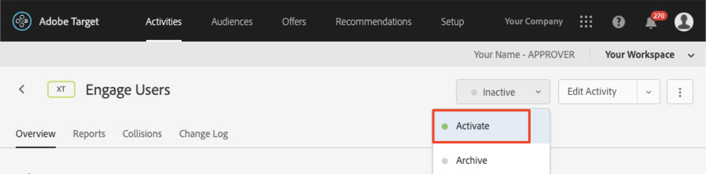

# Personnaliser les mises en page

Il est maintenant temps de tout rassembler et de créer des expériences personnalisées. Une _Activité_ est le mécanisme [!DNL Target] qui relie les emplacements, les audiences et les offres ensemble, de sorte que lorsque la demande est effectuée à partir de l’application, [!DNL Target] répond avec le contenu personnalisé. Nous allons créer deux activités de personnalisation dans [!DNL Target] et valider que le contenu personnalisé s’affiche pour l’utilisateur approprié au bon moment et au bon emplacement.

## Objectifs d&#39;apprentissage

À la fin de cette leçon, vous pourrez :

* Création d’Activités dans Adobe Target
* Validation des Activités dans l’exemple d’application

## Créer des Activités dans Adobe Target

Découvrez comment créer des activités d’interaction avec les utilisateurs et les Offres contextuelles.

### Première Activité - &quot;Interagir avec les utilisateurs&quot;

Voici un résumé de l&#39;activité que nous allons construire :

| Public | Emplacements | Offres |
|---|---|---|
| Nouveaux utilisateurs d’applications mobiles | wetravel_engage_home, wetravel_engage_search | Accueil : Engager de nouveaux utilisateurs, Rechercher : Engager de nouveaux utilisateurs |
| Renvoi d’utilisateurs d’applications mobiles | wetravel_engage_home, wetravel_engage_search | Accueil : Utilisateurs récurrents, default_content |

Dans l&#39;interface [!DNL Target], procédez comme suit :

1. Sélectionnez **[!UICONTROL Activités]** > **[!UICONTROL Créer une Activité]** > **[!UICONTROL Ciblage d’expérience]**.

   

1. Cliquez sur **[!UICONTROL Application mobile]**.
1. Sélectionnez le **[!UICONTROL compositeur de formulaire]**.
1. Sélectionnez l’espace de travail (l’espace de travail que vous avez utilisé dans les leçons précédentes).
1. Sélectionnez votre propriété (la même que celle que vous avez utilisée dans les leçons précédentes).
1. Cliquez sur **[!UICONTROL Suivant]**.

   

1. Remplacez le titre de l’activité par **[!UICONTROL Interagir avec les utilisateurs]**.
1. Sélectionnez **[!UICONTROL ellipses]** > **[!UICONTROL Modifier l&#39;Audience]**.
   
1. Définissez l’audience sur **[!UICONTROL Nouveaux utilisateurs d’applications mobiles]**.
1. Cliquez sur **[!UICONTROL Terminé]**.
   

1. Modifiez l’emplacement en _wetravel_engage_home_.
1. Sélectionnez la flèche de liste déroulante en regard de Contenu par défaut et sélectionnez **[!UICONTROL Modifier l’Offre HTML]**.

   

1. Sélectionnez **[!UICONTROL Accueil : Interagir avec les nouveaux utilisateurs]** offre.
1. Sélectionnez **[!UICONTROL Terminé]**.

   

1. Sélectionnez **[!UICONTROL Ajouter l&#39;emplacement]**.
   

1. Sélectionnez l’emplacement _wetravel_engage_search_.
1. Modifiez l’offre HTML.

   

1. Sélectionnez **[!UICONTROL Rechercher : Interagir avec les nouveaux utilisateurs]** offre.
1. Cliquez sur **[!UICONTROL Terminé]**.

   

Vous venez de connecter une audience à des emplacements et des offres, créant ainsi une expérience personnalisée pour les nouveaux utilisateurs d’applications mobiles ! L’expérience doit maintenant se présenter comme suit :

Créez maintenant une expérience pour le renvoi d’utilisateurs d’applications mobiles :

1. Sélectionnez **[!UICONTROL Ajouter le ciblage d’expérience]** à gauche.
1. Sélectionnez l’Audience **[!UICONTROL Utilisateurs d’applications mobiles renvoyés]**.
1. Sélectionnez **[!UICONTROL Terminé]**.
   

Maintenant, utilisez le même processus que celui utilisé précédemment pour configurer la nouvelle expérience. La configuration pour l’expérience Utilisateurs d’applications mobiles récurrents doit se présenter comme suit :

Passons à l’écran suivant de la configuration :

1. Cliquez sur **[!UICONTROL Suivant]** pour passer à l’écran **[!UICONTROL Ciblage]**.
1. Utilisez les paramètres par défaut pour le ciblage. Si vous aviez des expériences pour des audiences qui se chevauchaient (ex. _Utilisateurs de New York_ et _Nouveaux utilisateurs_), vous pouvez classer l’ordre de priorité dans cet écran.
1. Cliquez sur **[!UICONTROL Suivant]** pour passer à **[!UICONTROL Objectifs et paramètres]**.

   

Terminons maintenant la configuration des activités :

1. Définissez **[!UICONTROL Objectif Principal]** sur **[!UICONTROL Conversion]**.
1. Définissez l’action sur **[!UICONTROL Affichage d’une mbox]** > _wetravel_context_dest_ (cet emplacement se trouvant dans l’écran de confirmation, nous pouvons l’utiliser pour mesurer les conversions).

   

1. Conservez les valeurs par défaut de tous les autres paramètres à l’écran.
1. Cliquez sur **[!UICONTROL Enregistrer et fermer]** pour enregistrer l&#39;Activité.
1. Activez l&#39;**[!UICONTROL Activité]** dans l&#39;écran suivant.

Notre première activité est maintenant en vie et prête à être testée !

### Deuxième Activité - &quot;Offres contextuelles&quot;

Voici un résumé de la deuxième activité que nous allons construire :

| Public | Emplacement | Offres |
| --- | --- | --- |
| Destination : San Diego | wetravel_context_dest | Promotion pour San Diego |
| Destination : Los Angeles | wetravel_context_dest | Promotion pour Los Angeles |

Répétez le même processus que ci-dessus pour la prochaine Activité - &quot;Offres contextuelles&quot;. La configuration finale des deux expériences est présentée ci-dessous :

#### San Diego

#### Los Angeles

À l’étape Objectifs et paramètres, nous allons modifier l’objectif Principal en emplacement sur l’écran de confirmation de réservation :

1. Sous **[!UICONTROL Paramètres du Rapports]**, définissez **[!UICONTROL Principal Objectif]** sur **[!UICONTROL Conversion]**.
1. Définissez l’action sur **[!UICONTROL Affichage d’une mbox]** > _wetravel_context_dest_ (dans cette activité, cette mesure n’a pas de signification car il s’agit également du même emplacement qui fournit l’expérience).
1. Cliquez sur **[!UICONTROL Enregistrer et fermer]**.

Activez l’Activité dans l’écran suivant.

Maintenant notre deuxième activité est en direct et prête à être testée !

## Validation de l’Offre d’accueil

Exécutez l’émulateur et attendez que la première offre s’affiche en bas de l’écran d’accueil. Si vous êtes un utilisateur récurrent avec 5 lancements d’application ou plus, l’offre _welcome back_ s’affiche. Si vous êtes un nouvel utilisateur (moins de 5 lancements d’application), le message _nouvel utilisateur_ doit s’afficher :

Si la nouvelle offre utilisateur ne s’affiche pas, essayez d’effacer les données de votre émulateur. La prochaine fois que vous lancez l’application, elle est réinitialisée à 1. Cette opération est effectuée sous **[!UICONTROL Outils]** > **[!UICONTROL Gestionnaire AVD]**. Vous devrez peut-être redémarrer Android Studio, si Logcat ne fonctionne pas correctement :

Vous pouvez également valider la réponse dans Logcat en filtrant _wetravel_engage_home_ :

## Valider l&#39;Offre de recherche

Sélectionnez **[!UICONTROL San Jose]** comme **[!UICONTROL Départ]** et **[!UICONTROL San Diego]** comme **[!UICONTROL destination]** et cliquez sur **[!UICONTROL Rechercher un bus]** pour rechercher les bus disponibles.

Dans l’écran des résultats, le message _use filtres_ s’affiche. Si vous êtes un utilisateur récurrent avec 5 lancements d’application ou plus, aucun message n’apparaît ici puisque le contenu par défaut est défini pour cet emplacement (vide) :

## Validation des Offres contextuelles sur l’écran de remerciement

Passez maintenant à la procédure de réservation :

* Sélectionnez un bus dans l’écran des résultats.
* Sélectionnez un siège sur l&#39;écran de passage en caisse.
* Sélectionnez **[!UICONTROL Carte de crédit]** sur l&#39;écran de paiement (laissez les informations de paiement vides - aucune réservation réelle n&#39;aura lieu).

Comme San Diego a été sélectionné comme destination, la bannière d&#39;offre _DJ SAM_ doit s&#39;afficher sur l&#39;écran de confirmation :

Sélectionnez maintenant **[!UICONTROL Terminé]** et essayez une autre réservation avec Los Angeles comme destination. L’écran de confirmation doit afficher la bannière _Universal Studios_ :

## Conclusion

Félicitations ! Ceci termine la partie principale du kit SDK 4.x Adobe Target pour Android Tutorial. Vous disposez désormais des compétences nécessaires pour mettre en oeuvre la personnalisation dans les applications Android ! Vous pouvez vous référer à cette documentation et à cette application de démonstration comme référence pour vos futurs projets.

Suivant : Le marquage des fonctionnalités est une autre fonctionnalité qui peut être implémentée avec Adobe Target dans Android. Pour en savoir plus sur le marquage des fonctionnalités, consultez la leçon suivante.

**[SUIVANT : Marquage des fonctionnalités >](feature-flagging.md)**
