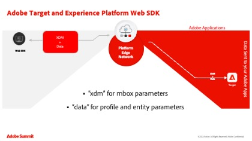

# Tutoriels Adobe Target

[!DNL Adobe Target] est la solution [!DNL Adobe Experience Cloud] qui fournit tout ce dont vous avez besoin pour personnaliser l’expérience de vos clients. [!DNL Target] vous aide à maximiser les recettes de vos sites web et mobiles, de vos applications, de vos médias sociaux et de vos autres canaux numériques. Utilisez ces vidéos et tutoriels pour découvrir les nombreux composants de [!DNL Adobe Target].

>[!NOTE]
>
>En plus de ce guide, les guides [!DNL Adobe Target] suivants sont également disponibles :
>
>* *[Guide du spécialiste d’Adobe Target](https://experienceleague.adobe.com/docs/target/using/target-home.html?lang=fr){target=_blank}*
>
>* *[Guide du développeur d’Adobe Target](https://experienceleague.adobe.com/docs/target-dev/developer/overview.html?lang=fr){target=_blank}*

## Sélection du personnel

<table style="margin-top: 0 !important">
<tr>
  <td>
    
    

      <a href="https://experienceleague.adobe.com/docs/platform-learn/migrate-target-to-websdk/introduction.html?lang=fr">
    <strong>Migration de Target d’at.js vers Platform Web SDK</strong>
    </a>
    

    

    <em>Découvrez comment migrer votre implémentation at.js vers Adobe Experience Platform Web SDK.</em>
    

  </td>
  <td>
    
    

      <a href="https://experienceleague.adobe.com/docs/platform-learn/implement-in-websites/implement-solutions/target.html">
    <strong>Implémentation de Target avec les balises Adobe Experience Platform</strong>
    </a>
    

    

    <em>Découvrez comment implémenter l’extension Adobe Target avec une requête de chargement de page et des paramètres personnalisés.</em>
    

  </td>
   <td>
    
    

    <a href="https://experienceleague.adobe.com/docs/target-learn/tutorials/implementation/implement-atjs-20-in-a-single-page-application.html">
    <strong>Implémentation d’at.js 2.0 dans une SPA</strong>
    </a>
    

    

    <em> Découvrez comment implémenter Adobe Target at.js 2.0 (et versions ultérieures) dans les applications d’une seule page (SPA).</em>
    

  </td>
</tr>
</table>