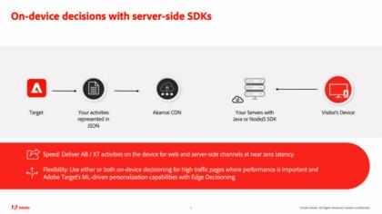
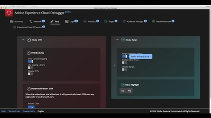

# Découvrez comment utiliser Adobe Target

[!DNL Adobe Target] est la valeur [!DNL Adobe Experience Cloud] solution qui fournit tout ce dont vous avez besoin pour personnaliser l’expérience de vos clients. [!DNL Target] vous aide à maximiser les recettes de vos sites web et mobiles, de vos applications, de vos médias sociaux et de vos autres canaux numériques. Utilisez ces vidéos et tutoriels pour découvrir les nombreux composants de [!DNL Adobe Target].

>[!NOTE]
>
>En plus de ce guide, les éléments suivants [!DNL Adobe Target] des guides sont également disponibles :
>
>* *[Guide du spécialiste d’Adobe Target](https://experienceleague.adobe.com/docs/target/using/target-home.html?lang=fr){target=_blank}*
>
>* *[Guide du développeur d’Adobe Target](https://experienceleague.adobe.com/docs/target-dev/developer/overview.html){target=_blank}*

## Nouveautés

Les ressources suivantes sont nouvelles :

* **[Configuration de rapports A4T dans [!DNL Analysis Workspace] pour [!DNL Auto-Allocate] activités](integrations/set-up-a4t-reports-in-analysis-workspace-for-auto-allocate-activities.md){target=_blank}**

   *Pour les professionnels : Le [!UICONTROL Analytics pour Target] Intégration (A4T) pour [!UICONTROL Affectation automatique] vous permet d’afficher vos données de création de rapports dans [!DNL Adobe Analytics]et vous pouvez même optimiser les événements personnalisés ou les mesures définies dans [!DNL Analytics].*

* **[Configuration de rapports A4T dans  [!DNL Analysis Workspace]  pour les activités de [!UICONTROL ciblage automatique]](integrations/set-up-a4t-reports-in-analysis-workspace-for-auto-target-activities.md){target=_blank}**

   *Pour les professionnels : Utilisez-vous A4T pour [!UICONTROL Ciblage automatique]? Pour configurer des rapports A4T dans , procédez comme suit : [!DNL Analysis Workspace] pour vous assurer d’obtenir les résultats attendus lors de l’exécution [!UICONTROL Ciblage automatique] activités.*

* **[Prise de décision sur l’appareil](implementation/on-device-decisioning-overview.md)**

   *Pour les architectes : Prise en main d’ [!UICONTROL prise de décision sur appareil] pour offrir des expériences de latence proches de zéro à vos clients.*

* **[Migrer [!DNL Target] d’at.js 2.x à [!DNL Platform Web SDK]](https://experienceleague.adobe.com/docs/platform-learn/migrate-target-to-websdk/introduction.html?lang=fr){target=_blank}**

   *Découvrez comment migrer une [!DNL Target] Implémentation d’at.js vers [!DNL Adobe Experience Platform Web SDK].*

## Vidéos les plus populaires

<table>
<tr>
  <td>
    
    

      <a href="https://experienceleague.adobe.com/docs/target-dev/developer/server-side/on-device-decisioning/overview.html">
    <strong>Présentation de la prise de décision sur l’appareil</strong>
    </a>
    

    <!--- 

    <em>Learn how to implement the Adobe Target extension with a page load request and custom parameters.</em>
    
 --->
  </td>
   <td>
    
    

    <a href="https://experienceleague.adobe.com/docs/target-learn/tutorials/implementation/2.1-intro-to-target-implementation.html">
    <strong>Présentation de la mise en oeuvre d’Adobe Target</strong>
    </a>
    

    <!--- 

    <em> Learn how to implement at.js 2.0 (and later) in SPAs.</em>
    
 --->
  </td>
  <td>
    
    

      <a href="https://experienceleague.adobe.com/docs/target-learn/tutorials/audiences/create-profile-scripts.html">
    <strong>Création de scripts de profil dans Adobe Target</strong>
    </a>
    

    <!--- 

    <em>Learn how to use the Adobe Experience Cloud Debugger to understand your [!DNL Target] implementation. Learn how to quickly view your library configuration, examine requests to make sure that your custom parameters are being passed correctly, turn on console logging, and disable all [!DNL Target] requests, and use the Mbox Trace tool.</em>
    
 --->
  </td>
</tr>
</table>

## Sélections du personnel

<table>
<tr>
  <td>
    
    

      <a href="https://experienceleague.adobe.com/docs/platform-learn/implement-in-websites/implement-solutions/target.html">
    <strong>Mise en oeuvre de Target avec des balises Adobe Experience Platform</strong>
    </a>
    

    

    <em>Découvrez comment mettre en oeuvre l’extension Adobe Target avec une requête de chargement de page et des paramètres personnalisés.</em>
    

  </td>
   <td>
    
    

    <a href="https://experienceleague.adobe.com/docs/target-learn/tutorials/implementation/implement-atjs-20-in-a-single-page-application.html">
    <strong>Implémentation d'at.js 2.0 dans une application d’une seule page</strong>
    </a>
    

    

    <em> Découvrez comment mettre en oeuvre Adobe Target avec at.js 2.0 (et versions ultérieures) dans les applications d’une seule page (SPA).</em>
    

  </td>
  <td>
    
    

      <a href="https://experienceleague.adobe.com/docs/target-learn/tutorials/troubleshooting/troubleshoot-with-the-experience-cloud-debugger.html">
    <strong>Résolution des problèmes liés à Target avec l’Experience Cloud Debugger</strong>
    </a>
    

    

    <em>Découvrez comment utiliser Adobe Experience Cloud Debugger pour comprendre votre [!DNL Target] implémentation.</em>
    

  </td>
</tr>
</table>