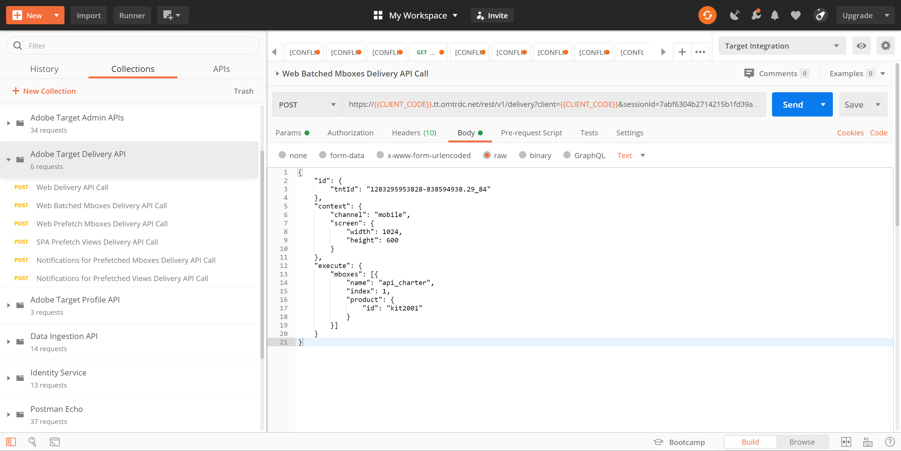
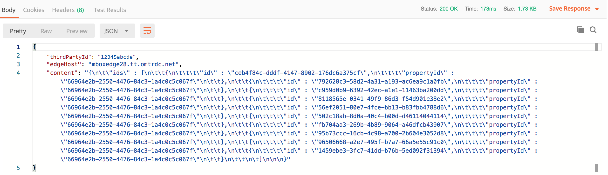

# Récupération [!DNL Recommendations] avec l’API de diffusion

Adobe Target et Adobe Target [!DNL Recommendations] Les API peuvent être utilisées pour envoyer des réponses aux pages web, mais également dans des expériences non basées sur des HTMLS, notamment des applications, des écrans, des consoles, des emails, des kiosques et d’autres périphériques d’affichage. En d’autres termes, lorsque [!DNL Target] Les bibliothèques et JavaScript ne peuvent pas être utilisés, la variable **[!DNL Target]API de diffusion** nous permet toujours d’accéder à l’ensemble des [!DNL Target] pour offrir des expériences personnalisées.

>[!NOTE]
>
> Lorsque vous demandez du contenu contenant des recommandations réelles (produits ou éléments recommandés), utilisez la variable [!DNL Target] API de diffusion.

Pour récupérer les recommandations, envoyez un appel du POST de l’API de diffusion Adobe Target avec les informations contextuelles appropriées, qui peuvent inclure un ID utilisateur (à utiliser avec des recommandations spécifiques au profil telles que les éléments récemment consultés par l’utilisateur), le nom de mbox approprié, les paramètres de mbox, les paramètres de profil ou d’autres attributs. La réponse comprend les entity.ids recommandés (et peut inclure d’autres données d’entité) au format JSON ou HTML, qui peuvent ensuite être affichés sur l’appareil.

Le [API de diffusion](https://developer.adobe.com/target/implement/delivery-api/){target=_blank} pour Adobe Target expose toutes les fonctionnalités existantes d’une norme [!DNL Target] fournit des requêtes.

>[!NOTE]
>L’API de diffusion :
>* Permet de récupérer des expériences ou des offres pour un emplacement et une audience d’une manière RESTful.
>* Ne nécessite aucune authentification.
>* Publications uniquement.
>* Ne traite pas les cookies ni les appels de redirection.
>* Ne nécessite ni ne reconnaît les &quot;rôles utilisateur&quot;. Il récupère simplement du contenu ou signale des événements sur . [!DNL Target] serveurs Edge.

Pour utiliser l’API de diffusion à diffuser [!DNL Target] les expériences, y compris les recommandations, procédez comme suit :

1. Créez un [!DNL Target] activité (A/B, XT, AP ou [!DNL Recommendations]) à l’aide du compositeur d’après les formulaires (et non du compositeur d’expérience visuelle).
2. Utilisez l’API de diffusion pour obtenir une réponse aux requêtes générées par la variable [!DNL Target] activité que vous venez de créer.

<!-- Q: Why are BOTH steps necessary for this? If you have a Form-based recommendation defined for an mbox, what's the point/benefit of ALSO having the Delivery API step in to retrieve results? Why can't you just have the Form-based Rec deliver the results in the destination device...?? A: See use case below... it's when you want to "intercept" the pending results in order to do more stuff prior to displaying the results. Things like real-time comparisons to inventory levels. -->

## Création d’une recommandation à l’aide du compositeur d’expérience d’après les formulaires

Pour créer des recommandations qui peuvent être utilisées avec l’API de diffusion, utilisez la méthode [Compositeur d’après les formulaires](https://experienceleague.adobe.com/docs/target/using/experiences/form-experience-composer.html?lang=en).

1. Tout d’abord, créez et enregistrez une conception basée sur JSON à utiliser dans votre recommandation. Pour obtenir un exemple de code JSON, ainsi que des informations d’arrière-plan sur la manière dont les réponses JSON peuvent être renvoyées lors de la configuration d’une activité basée sur un formulaire, consultez la documentation sur [Création de conceptions de recommandations](https://experienceleague.adobe.com/docs/target/using/recommendations/recommendations-design/create-design.html?lang=en). Dans cet exemple, la conception est nommée *JSON simple.*

   

2. Dans [!DNL Target], accédez à **[!UICONTROL Activités] > [!UICONTROL Création d’une activité] > [!UICONTROL Recommendations]**, puis sélectionnez **[!UICONTROL Formulaire]**.

   

3. Sélectionnez une propriété, puis cliquez sur **[!UICONTROL Suivant]**.
4. Définissez l’emplacement où vous souhaitez que les utilisateurs reçoivent la réponse de la recommandation. L’exemple ci-dessous utilise un emplacement nommé *api_charter*. Sélectionnez votre conception basée sur JSON, créée précédemment, nommée *JSON simple.*
   
5. Enregistrez et activez la recommandation. Cela produira des résultats. [Une fois les résultats prêts](https://experienceleague.adobe.com/docs/target/using/recommendations/recommendations-activity/previewing-and-launching-your-recommendations-activity.html?lang=en), vous pouvez utiliser l’ API de diffusion pour les récupérer.

## Utilisation de l’API de diffusion

La syntaxe de la variable [API de diffusion](https://developer.adobe.com/target/implement/delivery-api/#tag/Delivery-API){target=_blank} est :

`POST https://{{CLIENT_CODE}}.tt.omtrdc.net/rest/v1/delivery`

1. Notez que le code client est requis. Pour rappel, votre code client peut être trouvé dans Adobe Target en accédant à **[!UICONTROL Recommendations] > [!UICONTROL Paramètres]**. Notez que **[!UICONTROL Code client]** dans la variable **[!UICONTROL Jeton d’API de recommandation]** .
   
1. Une fois que vous disposez de votre code client, créez votre appel API de diffusion. L’exemple ci-dessous commence par le **[!UICONTROL Appel de l’API de diffusion des mbox mises en cache web]** fourni dans la variable [Collection Postman des API de diffusion](https://developers.adobetarget.com/api/delivery-api/#section/Getting-Started/Postman-Collection), en effectuant des modifications pertinentes. Par exemple :
   * la valeur **browser** et **address** ont été supprimés des objets **Corps**, puisqu’elles ne sont pas requises pour les cas d’utilisation non HTMLS
   * *api_charter* est répertorié comme nom de l’emplacement dans cet exemple.
   * entity.id est spécifié, car cette recommandation est basée sur la similarité de contenu, qui nécessite qu’une clé d’élément actif soit transmise à . [!DNL Target].
      
Pensez à configurer correctement vos paramètres de requête. Par exemple, veillez à spécifier 
`{{CLIENT_CODE}}` si nécessaire. <!--Q: In the updated call syntax, entity.id is listed as a profileParameter instead of an mboxParameter as in older versions. --> <!--Q: Old image  Old accompanying text: "Note this recommendation is based on Content Similar products based on the entity.id sent via mboxParameters." -->
      
1. Envoyez la requête. Cette opération s’exécute sur la propriété *api_charter* emplacement, sur lequel une recommandation principale est exécutée, défini avec votre conception JSON, qui génère une liste d’entités recommandées.
1. Recevez une réponse basée sur la conception JSON.
   
La réponse comprend l’identifiant de clé, ainsi que les identifiants d’entité des entités recommandées.

Utilisation de l’API de diffusion avec [!DNL Recommendations] ainsi, vous pouvez effectuer des étapes supplémentaires avant d’afficher des recommandations au visiteur sur un périphérique autre que HTML. Par exemple, vous pouvez utiliser la réponse de l’API de diffusion pour effectuer une recherche supplémentaire en temps réel des détails d’attribut d’entité (inventaire, prix, évaluation, etc.) à partir d’un autre système (tel qu’une plateforme CMS, PIM ou eCommerce), avant d’afficher les résultats finaux.

En utilisant l’approche décrite dans ce tutoriel, vous pouvez obtenir n’importe quelle application pour exploiter la réponse de [!DNL Target] pour fournir des recommandations personnalisées.

## Exemple de mises en œuvre

Les ressources suivantes fournissent des exemples de différentes mises en oeuvre non axées sur les HTMLS. Gardez à l’esprit que chaque mise en oeuvre sera unique en raison du système et des périphériques impliqués.

| Ressource | Détails |
| --- | --- |
| [Adobe Target partout : implémentation côté serveur ou dans IoT](https://expleague.azureedge.net/labs/L733/index.html) | Adobe Summit 2019 Lab qui offre une expérience pratique pour une application React qui tire parti des API côté serveur Adobe Target. |
| [Adobe Target dans une application mobile sans SDK Adobe](https://community.tealiumiq.com/t5/Universal-Data-Hub/Adobe-Target-in-a-Mobile-App-Without-the-Adobe-SDK/ta-p/26753) | Ce guide explique comment configurer Adobe Target dans votre application mobile sans installer le SDK Adobe. Cette solution utilise l’affichage web du SDK Tealium et le module Commandes distantes pour envoyer et recevoir des requêtes à l’API visiteur Adobe (Experience Cloud) et à l’API Adobe Target. |
| [Fonctionnement d’Adobe Target dans les applications mobiles](https://experienceleague.adobe.com/docs/target/using/implement-target/mobile-apps/mobile-how-target-works-mobile-apps.html?lang=en) | Comment [!DNL Target] fonctionne avec le SDK Mobile. |
| [Configuration de la variable [!DNL Target] extension dans Experience Platform Launch et implémentation [!DNL Target] API](https://aep-sdks.gitbook.io/docs/using-mobile-extensions/adobe-target) | Étapes de configuration du [!DNL Target] dans Experience Platform Launch, en ajoutant la variable [!DNL Target] Extension à votre application et implémentation [!DNL Target] API pour demander des activités, prérécupérer des offres et passer en mode aperçu visuel. |
| [Client de noeud Adobe Target](https://www.npmjs.com/package/@adobe/target-nodejs-sdk) | Open Source [!DNL Target] SDK Node.js v1.0 |
| [Présentation côté serveur](https://experienceleague.adobe.com/docs/target/using/implement-target/server-side/api-and-sdk-overview.html?lang=en) | Informations sur les API de diffusion côté serveur Adobe Target, les API de diffusion par lots côté serveur, le SDK Node.js et Adobe Target [!DNL Recommendations] API. |
| [Recommendations de contenu Adobe Campaign dans Email](https://medium.com/adobetech/adobe-campaign-content-recommendations-in-email-b51ced771d7f) | Blog qui décrit comment exploiter les recommandations de contenu dans les emails via Adobe Target et Adobe I/O Runtime dans Adobe Campaign. |

## Gestion [!DNL Recommendations] Configuration avec les API

La plupart du temps, les recommandations sont configurées dans l’interface utilisateur d’Adobe Target, puis utilisées ou accessibles via le [!DNL Target] API, pour des raisons telles que celles mentionnées dans les sections ci-dessus. Cette coordination entre l’interface utilisateur et l’API est courante. Cependant, il arrive parfois que les utilisateurs souhaitent effectuer toutes les actions via les API (configuration, ainsi que l’utilisation des résultats). Bien que beaucoup moins courant, les utilisateurs peuvent absolument configurer, exécuter, *et* tirer parti des résultats des recommandations entièrement à l’aide des API.

Nous avons appris dans une [section précédente](https://developer.adobe.com/target/before-administer/recs-api/manage-catalog/){target=_blank} comment gérer les entités Recommendations Adobe Target et les diffuser côté serveur. De même, Adobe I/O vous permet de gérer les critères, les promotions, les collections et les modèles de conception sans avoir à vous connecter à Adobe Target. Une liste complète de tous les [!DNL Recommendations] API disponibles [here](https://developers.adobetarget.com/api/recommendations/), mais voici un résumé à titre de référence.

| Ressource | Détails |
| --- | --- |
| [Collections](https://developers.adobetarget.com/api/recommendations/#tag/Collections) | Répertorier, créer, obtenir, modifier et supprimer des collections |
| [Critères](https://developers.adobetarget.com/api/recommendations/#tag/Criteria) | Listez et obtenez des critères. |
| [Conceptions](https://developers.adobetarget.com/api/recommendations/#tag/Designs) | Répertorier, créer, obtenir, modifier, supprimer et valider des conceptions. |
| [Entités](https://developers.adobetarget.com/api/recommendations/#tag/Entities) | Enregistrez, supprimez et obtenez des entités. |
| [Promotions](https://developers.adobetarget.com/api/recommendations/#tag/Promotions) | Répertorier, créer, obtenir, modifier et supprimer des promotions. |
| [Critères de catégorie](https://developers.adobetarget.com/api/recommendations/#tag/Category-Criteria) | Répertorier, créer, obtenir, modifier et supprimer des critères de catégorie. |
| [Critères personnalisés](https://developers.adobetarget.com/api/recommendations/#tag/Custom-Criteria) | Répertorier, créer, obtenir, modifier et supprimer des critères personnalisés. |
| [Critères d’élément](https://developers.adobetarget.com/api/recommendations/#tag/Item-Criteria) | Répertorier, créer, obtenir, modifier et supprimer des critères d’élément. |
| [Critères de popularité](https://developers.adobetarget.com/api/recommendations/#tag/Popularity-Criteria) | Répertorier, créer, obtenir, modifier et supprimer des critères de popularité. |
| [Critères d’attribut de profil](https://developers.adobetarget.com/api/recommendations/#tag/Profile-Attribute-Criteria) | Répertorier, créer, obtenir, modifier et supprimer des critères d’attribut de profil. |
| [Critères récents](https://developers.adobetarget.com/api/recommendations/#tag/Recent-Criteria) | Répertorier, créer, obtenir, modifier et supprimer des critères récents. |
| [Critères de séquence](https://developers.adobetarget.com/api/recommendations/#tag/Sequence-Criteria) | Lister, créer, obtenir, modifier et supprimer des critères de séquence. |

## Documentation de référence

* [Documentation de l’API d’administration Adobe Target](https://developer.adobe.com/target/administer/admin-api/){target=_blank}
* [API de diffusion Adobe Target](https://developer.adobe.com/target/implement/delivery-api/){target=_blank}
* [Intégration de  [!DNL Recommendations]  aux e-mails](https://experienceleague.adobe.com/docs/target/using/recommendations/recommendations-faq/integrating-recs-email.html)

## Résumé et révision

Félicitations ! En terminant ce tutoriel, vous avez appris à :
* [Gestion de votre catalogue à l’aide de l’API Recommendations](https://developer.adobe.com/target/before-administer/recs-api/manage-catalog/){target=_blank}
* [Gestion des critères personnalisés à l’aide de l’API Recommendations](https://developer.adobe.com/target/before-administer/recs-api/manage-custom-criteria/){target=_blank}
* [Utilisation de l’API de diffusion avec Recommendations](https://developer.adobe.com/target/before-administer/recs-api/fetch-recs-server-side-delivery-api/){target=_blank}
