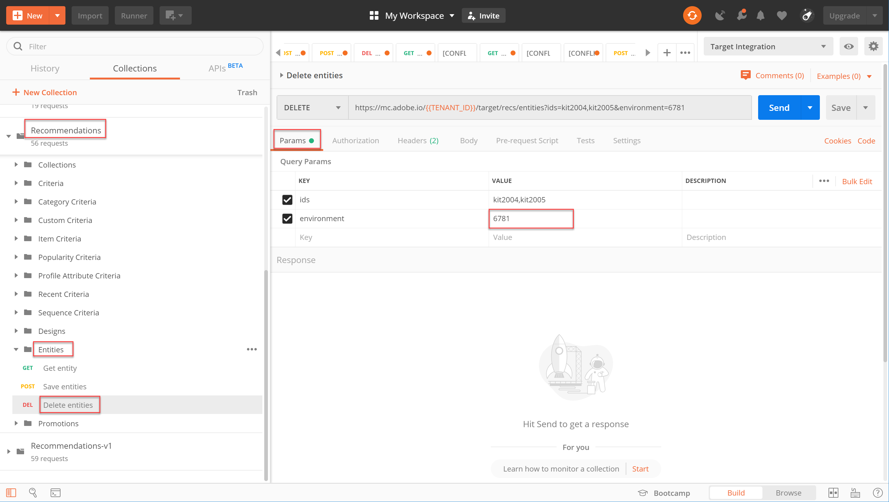

# Gestion de votre [!DNL Recommendations] catalogue à l’aide d’API

À ce stade, vous avez appris à générer un jeton d&#39;accès, à l’aide du flux d’authentification JWT, pour utiliser les API d’administration Adobe Target avec les E/S d’Adobe.

Vous pouvez utiliser les API [](https://developers.adobetarget.com/api/recommendations/) Recommendations pour ajouter, mettre à jour ou supprimer des éléments de votre catalogue de recommandations. Comme pour le reste des API d’administration Adobe Target, les [!DNL Recommendations] API requièrent une authentification.

>[!TIP]
>
>Envoyer le **[!UICONTROL SGI : JWT Generate + Auth via la demande de jeton]** utilisateur chaque fois que vous devez actualiser votre jeton d&#39;accès pour l’authentification, puisqu’il expire après 24 heures. Voir [Configuration de l’authentification](../apis/configure-io-target-integration.md) de l’API d’Adobe pour obtenir des instructions.


>[!NOTE]
>
>Avant de continuer, obtenez la collection [](https://developers.adobetarget.com/api/recommendations/#section/Postman)Recommendations Postman.

## Création et mise à jour d&#39;éléments à l&#39;aide de l&#39;API Enregistrer les entités

Pour renseigner la base de données de vos [!DNL Recommendations] produits à l’aide de l’API plutôt que d’un flux de produits CSV ou de [!DNL Target] demandes qui se déclenchent sur les pages de produits, utilisez l’API [](https://developers.adobetarget.com/api/recommendations/#operation/saveEntities)Enregistrer les entités. Cette demande ajoute ou met à jour un élément dans un seul [!DNL Target] environnement. La syntaxe est la suivante :

```
POST https://mc.adobe.io/{{TENANT_ID}}/target/recs/entities
```

Par exemple, les entités d&#39;enregistrement peuvent être utilisées pour mettre à jour des articles chaque fois que certains seuils sont atteints (seuils d&#39;inventaire ou de prix, par exemple) afin de les marquer et de les empêcher d&#39;être recommandés.

1. Accédez à **[!DNL Target]>[!UICONTROL Configuration]>[!UICONTROL Hôtes]>[!UICONTROL Environnements]** pour obtenir l’ID d’Environnement  dans lequel vous souhaitez ajouter ou mettre à jour un élément.[!DNL Target]

   

2. Vérifiez `TENANT_ID` et `API_KEY` référencez les variables d&#39;environnement Postman établies précédemment. Utilisez l&#39;image ci-dessous pour la comparaison. Si nécessaire, modifiez les en-têtes et le chemin d’accès dans votre requête d’API pour qu’ils correspondent à ceux de l’image ci-dessous.

   

3. Saisissez votre code JSON comme code **brut** dans le **corps**. N’oubliez pas de spécifier votre ID d’environnement en utilisant la `environment` variable. (Dans l’exemple ci-dessous, l’ID d’environnement est 6781.)

   

   >!![NOTE]
   Vous trouverez ci-dessous un exemple de fichier JSON qui ajoute entity.id kit2001 avec les valeurs d’entité associées pour un produit Four de grille-pain, dans l’environnement 6781.

   ```
      {
      "entities": [{
              "name": "Toaster Oven",
              "id": "kit2001",
              "environment": 6781,
              "categories": [
                  "housewares:appliances"
              ],
              "attributes": {
                  "inventory": 77,
                  "margin": 23,
                  "message": "crashing helicopter",
                  "pageUrl": "www.foobar.foo.com/helicopter.html",
                  "thumbnailUrl": "www.foobar.foo.com/helicopter.jpg",
                  "value": 19.2
              }
          }]
      }
   ```

4. Cliquez sur **Envoyer**. Vous devriez recevoir la réponse suivante.

   

L’objet JSON peut être mis à l’échelle pour envoyer plusieurs produits. Par exemple, ce fichier JSON spécifie deux entités.

```
    {
        "entities": [{
                "name": "Toaster Oven",
                "id": "kit2001",
                "environment": 6781,
                "categories": [
                    "housewares:appliances"
                ],
                "attributes": {
                    "inventory": 89,
                    "margin": 11,
                    "message": "Toaster Oven",
                    "pageUrl": "www.foobar.foo.com/helicopter.html",
                    "thumbnailUrl": "www.foobar.foo.com/helicopter.jpg",
                    "value": 102.5
                }
            },
            {
                "name": "Blender",
                "id": "kit2002",
                "environment": 6781,
                "categories": [
                    "housewares:appliances"
                ],
                "attributes": {
                    "inventory": 36,
                    "margin": 5,
                    "message": "Blender",
                    "pageUrl": "www.foobar.foo.com/helicopter.html",
                    "thumbnailUrl": "www.foobar.foo.com/helicopter.jpg",
                    "value": 54.5
                }
            }
        ]
    }
```

1. Maintenant c&#39;est ton tour ! Utilisez l&#39;API **Enregistrer les entités** pour ajouter les éléments suivants à votre catalogue. Utilisez l’exemple JSON ci-dessus comme point de départ. (Vous devez étendre le fichier JSON pour inclure d’autres entités.)

   

Oups, on dirait que ces deux derniers éléments n&#39;ont pas leur place. Examinons-les à l&#39;aide de l&#39;API **Get Entity** et, si nécessaire, supprimons-les à l&#39;aide de l&#39;API **Delete Entities** .

## Obtention des détails de l&#39;élément avec l&#39;API Get Entity

Pour récupérer les détails d&#39;un élément existant, utilisez l&#39;API [](https://developers.adobetarget.com/api/recommendations/#operation/getEntity)Get Entity. La syntaxe est la suivante :

```
GET https://mc.adobe.io/{{TENANT_ID}}/target/recs/entities/[entity.id]
```

Les détails d&#39;entité ne peuvent être récupérés que pour une seule entité à la fois. Vous pouvez utiliser l’option Obtenir l’entité pour confirmer que des mises à jour ont été effectuées dans le catalogue comme prévu ou pour contrôler le contenu du catalogue.

1. Dans la demande d’API, spécifiez l’ID d’entité à l’aide de la variable `entityId`. L&#39;exemple suivant renvoie des détails pour l&#39;entité dont entityId=kit2004.

   

2. Vérifiez `TENANT_ID` et `API_KEY` référencez les variables d&#39;environnement Postman établies précédemment. Utilisez l&#39;image ci-dessous pour la comparaison. Si nécessaire, modifiez les en-têtes et le chemin d’accès dans votre requête d’API pour qu’ils correspondent à ceux de l’image ci-dessous.

   

3. Envoyez la demande.

   Si vous recevez une erreur indiquant que l&#39;entité est introuvable, comme indiqué dans l&#39;exemple ci-dessus, vérifiez que vous envoyez la demande à l&#39; [!DNL Target] environnement correct.

   >[!NOTE]
   Si aucun environnement n&#39;est explicitement spécifié, Get Entity tente d&#39;obtenir l&#39;entité à partir de votre environnement [](https://docs.adobe.com/content/help/en/target/using/administer/hosts.html#section_4F8539B07C0C45E886E8525C344D5FB0) par défaut uniquement. Si vous souhaitez extraire de n’importe quel environnement autre que votre environnement par défaut, vous devez spécifier l’identifiant d’environnement.

4. Si nécessaire, ajoutez le `environmentId` paramètre et réenvoyez la demande.

   

5. Envoyez une autre demande **Get Entity** , cette fois pour inspecter l&#39;entité dont entityId=kit2005.

   

Supposons que vous décidiez que ces entités doivent être supprimées de votre catalogue. Utilisons l&#39;API **Supprimer des entités** .

## Suppression d&#39;éléments à l&#39;aide de l&#39;API Supprimer des entités

Pour supprimer des articles de votre catalogue, utilisez l&#39;API [](https://developers.adobetarget.com/api/recommendations/#operation/deleteEntities)Supprimer des entités. La syntaxe est la suivante :

```
DELETE https://mc.adobe.io/{{TENANT_ID}}/target/recs/entities?ids=[comma-delimited-entity-ids]&environment=[environmentId]
```

>[!WARNING]
Cette API supprime les entités référencées par les identifiants que vous spécifiez.
Si aucun ID d&#39;entité n&#39;est fourni, toutes les entités de l&#39;environnement donné sont supprimées. Si aucun ID d&#39;environnement n&#39;est donné, les entités seront supprimées de tous les environnements. Faites attention à ceci !

1. Accédez à **[!DNL Target]>[!UICONTROL Configuration]>[!UICONTROL Hôtes]>[!UICONTROL Environnements]** pour obtenir l’ID d’Environnement  à partir duquel vous souhaitez supprimer des éléments.[!DNL Target]

   

2. Dans la demande d&#39;API, spécifiez les ID d&#39;entité des entités que vous souhaitez supprimer, en utilisant la syntaxe `&ids=[comma-delimited-entity-ids]` (un paramètre de requête). Lors de la suppression de plusieurs entités, séparez les identifiants à l’aide de virgules.

   

3. Spécifiez l’ID d’environnement en utilisant la syntaxe `&environment=[environmentId]`, sinon les entités de tous les environnements seront supprimées.

   

4. Vérifiez `TENANT_ID` et `API_KEY` référencez les variables d&#39;environnement Postman établies précédemment. Utilisez l&#39;image ci-dessous pour la comparaison. Si nécessaire, modifiez les en-têtes et le chemin d’accès dans votre requête d’API pour qu’ils correspondent à ceux de l’image ci-dessous.

   

5. Envoyez la demande.

   

6. Vérifiez vos résultats à l&#39;aide de **Get Entity**, qui doit maintenant indiquer que les entités supprimées sont introuvables.

   

   

Félicitations ! Vous pouvez désormais utiliser les [!DNL Recommendations] API pour créer, mettre à jour, supprimer et obtenir des détails sur les entités de votre catalogue. Dans la section suivante, vous apprendrez comment gérer les critères personnalisés.

[Suivant : &quot;Gérer les critères personnalisés&quot; >](manage-custom-criteria.md)
