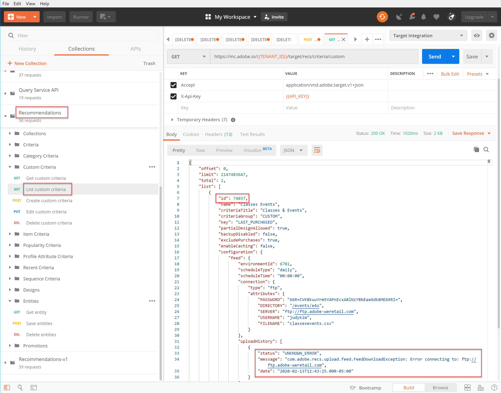

# Gestion des critères personnalisés

Parfois, les algorithmes fournis par [!DNL Recommendations] ne peuvent pas faire apparaître des éléments spécifiques que vous souhaitez promouvoir. Dans ce cas, les critères personnalisés vous permettent de fournir un ensemble spécifique d’éléments recommandés pour un élément ou une catégorie clé donnée. Vous définissez le mappage entre l’élément clé ou la catégorie et les éléments recommandés, et importez ce mappage sous la forme de critères personnalisés. Ce processus est décrit dans la section [documentation sur les critères personnalisés](https://experienceleague.adobe.com/docs/target/using/recommendations/criteria/recommendations-csv.html?lang=en). Comme indiqué dans cette documentation, vous pouvez créer, modifier et supprimer des critères personnalisés via le [!DNL Target] interface utilisateur (IU). Cependant, [!DNL Target] fournit également un ensemble d’API de critères personnalisés qui permettent une gestion plus détaillée de vos critères personnalisés.

>[!IMPORTANT]
>
>Suivez cette directive d’utilisation pour les critères personnalisés :
>
> Pour un critère personnalisé donné à l’aide des API, vous pouvez tout (créer, modifier, supprimer) ou tout (créer, modifier, supprimer) à l’aide de l’interface utilisateur. La gestion de vos critères personnalisés par le biais d’une combinaison de l’interface utilisateur et de l’API peut entraîner des informations conflictuelles ou des résultats inattendus. Par exemple, la création d’un critère personnalisé dans l’interface utilisateur, mais sa modification via l’API, ne reflétera pas vos mises à jour dans l’interface utilisateur, même si elles seront mises à jour dans le serveur principal, comme visible via l’API.

## Création de critères personnalisés

Pour créer des critères personnalisés à l’aide de la variable [Création d’une API de critères personnalisés](https://developers.adobetarget.com/api/recommendations/#operation/createCriteriaCustom), la syntaxe est la suivante :

`POST https://mc.adobe.io/{{TENANT_ID}}/target/recs/criteria/custom`

>[!WARNING]
>
>Les critères personnalisés créés à l’aide de l’API Créer des critères personnalisés, comme décrit dans cet exercice, s’affichent dans l’interface utilisateur, où ils sont conservés. Vous ne pourrez pas les modifier ni les supprimer de l’interface utilisateur. Vous pouvez les modifier ou les supprimer. **via l’API**, mais dans les deux cas, elles continueront à apparaître dans la variable [!DNL Target] Interface utilisateur. Pour conserver l’option de modification ou de suppression de l’interface utilisateur, créez les critères personnalisés à l’aide de l’interface utilisateur par [la documentation](https://experienceleague.adobe.com/docs/target/using/recommendations/criteria/recommendations-csv.html?lang=en), plutôt que d’utiliser l’API Créer des critères personnalisés .

Suivez ce tutoriel uniquement lorsque vous avez lu l’avertissement ci-dessus et que vous êtes à l’aise avec la création de critères personnalisés qui ne peuvent pas être supprimés ultérieurement de l’interface utilisateur.

1. Vérifier `TENANT_ID` et `API_KEY` pour **Création de critères personnalisés** référencez les variables d’environnement Postman établies précédemment. Utilisez l’image ci-dessous à des fins de comparaison.

   

2. Ajoutez vos **Corps** as **raw** JSON qui définit l’emplacement de votre fichier CSV de critères personnalisés. Utilisez l’exemple fourni dans la section [Création d’une API de critères personnalisés](https://developers.adobetarget.com/api/recommendations/#operation/getAllCriteriaCustom) la documentation en tant que modèle, qui fournit votre `environmentId` et d’autres valeurs si nécessaire. Pour cet exemple, nous utilisons LAST_PURCHASED comme clé.

   

3. Envoyez la requête et observez la réponse, qui contient les détails des critères personnalisés que vous venez de créer.

   

4. Pour vérifier que vos critères personnalisés ont été créés, accédez dans Adobe Target à **[!UICONTROL Recommendations] > [!UICONTROL Critères]** et recherchez vos critères par nom, ou utilisez la variable **API Lister des critères personnalisés** à l’étape suivante.

   

Dans ce cas, nous avons une erreur. Examinons l’erreur en examinant de plus près les critères personnalisés, en utilisant la variable **API Lister des critères personnalisés**.

## Liste des critères personnalisés

Pour récupérer une liste de tous vos critères personnalisés avec des détails pour chacun d’eux, utilisez la variable [API Lister des critères personnalisés](https://developers.adobetarget.com/api/recommendations/#operation/getAllCriteriaCustom). La syntaxe est la suivante :

`GET https://mc.adobe.io/{{TENANT_ID}}/target/recs/criteria/custom`

1. Vérifier `TENANT_ID` et `API_KEY` comme auparavant, et envoyez la demande. Dans la réponse, notez l’identifiant de critère personnalisé, ainsi que les détails concernant le message d’erreur mentionné précédemment.
   

Dans ce cas, l’erreur s’est produite car les informations du serveur sont incorrectes, ce qui signifie que [!DNL Target] ne peut pas accéder au fichier CSV contenant la définition de critères personnalisés. Modifions les critères personnalisés pour corriger ce problème.

## Modifier des critères personnalisés

Pour modifier les détails d’une définition de critère personnalisée, utilisez le [Modifier l’API de critères personnalisés](https://developers.adobetarget.com/api/recommendations/#operation/updateCriteriaCustom). La syntaxe est la suivante :

`POST https://mc.adobe.io/{{TENANT_ID}}/target/recs/criteria/custom/:criteriaId`

1. Vérifier `TENANT_ID` et `API_KEY`, comme auparavant.
   

1. Indiquez l’identifiant du critère personnalisé (unique) que vous souhaitez modifier.
   

1. Dans le corps, fournissez le JSON mis à jour avec les informations correctes du serveur. (Pour cette étape, spécifiez l’accès FTP à un serveur auquel vous pouvez accéder.)
   

1. Envoyez la requête et notez la réponse.
   

Vérifions le succès des critères personnalisés mis à jour, en utilisant la variable **Obtention de l’API de critères personnalisés**.

## Obtenir des critères personnalisés

Pour afficher les détails d’un critère personnalisé spécifique, utilisez le [Obtention de l’API de critères personnalisés](https://developers.adobetarget.com/api/recommendations/#operation/getCriteriaCustom). La syntaxe est la suivante :

`GET https://mc.adobe.io/{{TENANT_ID}}/target/recs/criteria/custom/:criteriaId`

1. Indiquez l’identifiant du critère personnalisé dont vous souhaitez obtenir les détails. Envoyez la requête et passez en revue la réponse.
   
1. Vérifiez la réussite. (Dans notre cas, vérifiez qu’il n’y a pas d’autres erreurs FTP.)
   
1. (Facultatif) Vérifiez que la mise à jour s’affiche avec précision dans l’interface utilisateur.
   

## Suppression de critères personnalisés

À l’aide de l’ID de critère indiqué précédemment, supprimez vos critères personnalisés à l’aide de la variable [Supprimer l’API de critères personnalisés](https://developers.adobetarget.com/api/recommendations/#operation/deleteCriteriaCustom). La syntaxe est la suivante :

`DELETE https://mc.adobe.io/{{TENANT_ID}}/target/recs/criteria/custom/:criteriaId`

1. Indiquez l’identifiant du critère personnalisé (unique) que vous souhaitez supprimer. Cliquez sur **Envoyer**.
   

1. Vérifiez que les critères ont été supprimés à l’aide de l’option Obtenir des critères personnalisés.
   
Dans ce cas, l’erreur 404 attendue indique que les critères supprimés sont introuvables.

>[!NOTE]
>Pour rappel, les critères ne sont pas supprimés de la variable [!DNL Target] L’interface utilisateur, même si elle a été supprimée, car elle a été créée à l’aide de l’API Créer des critères personnalisés .

Félicitations ! Vous pouvez désormais créer, répertorier, modifier, supprimer et obtenir des détails sur les critères personnalisés, à l’aide de la variable [!DNL Recommendations] API. Dans la section suivante, vous allez utiliser la variable [!DNL Target] API de diffusion pour récupérer les recommandations.

[Suite : &quot;Récupération de Recommendations avec l’API de diffusion côté serveur&quot; >](https://developer.adobe.com/target/before-administer/recs-api/fetch-recs-server-side-delivery-api/){target=&quot;_blank&quot;}
